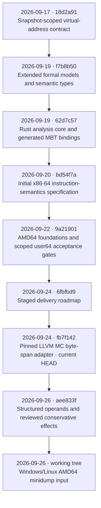
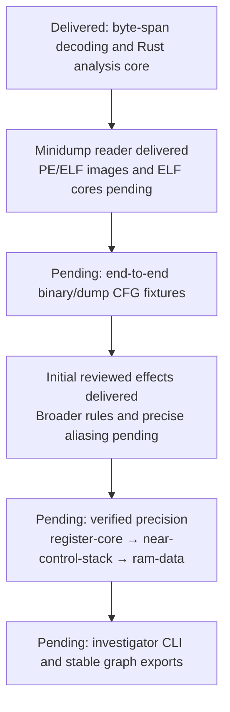

# Ariadne checkpoints

Recorded on **2026-09-26 (Asia/Shanghai)** against HEAD **`aee833f`**,
with minidump input delivered as an uncommitted working-tree change.
Dates in the flow below are commit dates; validation dates are stated separately.

## Current delivery checkpoint

The Rust core recovers a local instruction-level CFG, computes may-reaching
definitions, and builds a backward data slice from an immutable, validated
request. Calls remain visible in the graph while local discovery and data flow
follow summary edges. Missing bytes, decode failures, and incomplete targets
remain explicit obligations.

The optional LLVM MC **20.1.2** adapter now connects caller-provided byte spans
to that core through `ByteSnapshot::to_request()`. It supplies instruction
lengths and conservative control-flow summaries, preserves captured-byte
precedence, requires explicit trust for dump/file fallback, and retains
unresolved indirect targets. The legacy `to_request()` interface treats every
successfully decoded instruction as reading/may-writing all caller-tracked
locations, with no must-writes. These summaries
do not certify precise architectural effects or verified instruction steps.

`ByteSnapshot::prepare()` now supplies reviewed normal-continuation summaries
for 137 exact LLVM opcode identities, byte-level register aliases, and per-site
evidence. Memory remains coarse and calls remain opaque. See the
[effect validation record](docs/Ariadne/operand-effects-validation.md).

Windows/Linux AMD64 minidump input is delivered in [input/](input/README.md).
PE/ELF image and ELF core readers, broader effect coverage and precise alias analysis,
Rust abstract machine-state propagation, the native LLVM IR analysis implementation, the
analyzer CLI, and graph exporters remain pending. The AMD64 formal library is
not yet integrated into the Rust runtime.

## Formal acceptance checkpoint

The live profile report on 2026-09-26 remains:

| Milestone | Paired bodies | Verified instruction steps | Status |
| --- | ---: | ---: | --- |
| `register-core` | 49 | 0 / 49 | Active, pending acceptance |
| `near-control-stack` | 0 | 0 / 72 | Pending |
| `ram-data` | 0 | 0 / 156 | Pending |

The conservative no-trust `UnknownInstructionFallback` foundation is accepted
for the pinned user64 profile. All **277 instruction cases remain unsupported**
under the acceptance gate. Paired bodies and successful component checks do
not establish complete instruction-step support. Broad full-manual expansion
remains deferred.

## Validation evidence

| Evidence date | Scope | Result and boundary |
| --- | --- | --- |
| 2026-09-19, recorded | Generated MBT gate | 12 complete traces, 168 matched states, required action/pair coverage, digest rejection, and five implementation mutations rejected. Not rerun for this checkpoint. |
| 2026-09-22 validation record | Latest aggregate AMD64 component checkpoint | 50 TLA+ typechecks, 22 TLC configurations, 38 Lean modules with combined axiom audit, full-width register-view symbolic check, and 32 Python tests passed. Historical checked-source evidence; not a fresh verification of current HEAD. |
| 2026-09-22, recorded | Focused user64 fallback and acceptance tooling | Fallback TLA+/Lean checks and audit, 50 Python integrity/profile/acceptance tests, and inventory checks passed. No instruction case was accepted. |
| 2026-09-26, fresh at `fb7f142` | `cargo test --offline` | 19 integration tests and 1 doctest passed. Five LLVM-native integration tests were ignored by the default test run. |
| 2026-09-26, fresh at `fb7f142` | `cargo clippy --offline --all-targets -- -D warnings` | Passed. |
| 2026-09-26, attempted at `fb7f142` | `bash native/llvm_mc/check.sh` | Stopped before native build/tests: LLVM 20.1.2 headers or library unavailable at configured paths. Native behavior was not freshly verified; this is an environment prerequisite failure. |
| 2026-09-26, fresh | `python3 tools/amd64_profile.py report` | Confirmed 49 paired register bodies and zero verified cases across all three milestones. This report does not execute the formal proof/model gates. |

The full AMD64 TLA+/Lean suite was not rerun. The subsequent effects delivery
ran its focused TLA+ gate and the existing core MBT gate successfully.

## Next delivery stages

Formal acceptance work can advance alongside adapter work. The next formal
acceptance decision is the `register-core` gate: close its legality/payload,
state validity, values/flags/frames, faults/commit, instruction-boundary,
TLA+/Lean correspondence, and conservative analysis-projection obligations.

## Source records

- [Delivery roadmap](ROADMAP.md)
- [Rust implementation](docs/implementation.md)
- [LLVM MC adapter](docs/llvm-mc-adapter.md)
- [User64 profile and acceptance rules](docs/amd64-user64.md)
- [AMD64 validation record](docs/amd64-validation.md)
- [AMD64 task ledger](docs/amd64-semantics-tasks.md)
- [Model-based testing evidence](mbt/README.md)

## 2026-09-26 — Operand/effects working-tree delivery

- Added `ByteSnapshot::prepare()`, a 137-location catalogue, protocol v2,
  normalized operands, 137 exact opcode rules and explicit effect/control gaps.
- Preserved `to_request()` and all existing `Ariadne.tla`/Rust engine behavior.
- Fresh integrated gate: 24 Rust tests plus one doctest, 16 real native tests
  (5 legacy + 11 effects), formatting, Clippy, both TLA+ typechecks and TLC,
  six effect mutations, and core MBT all passed with stable source hashes.
- Core MBT retained 12 traces / 168 states and rejected all five engine mutants.
- Matching LLVM development headers were downloaded/extracted into `/tmp`;
  the earlier native-prerequisite failure is resolved for this session.
- Full user64 instruction-step acceptance remains 0/277. No commit or push.

[Implementation plan](docs/Ariadne/operand-effects-plan.md),
[rule matrix](docs/Ariadne/operand-effects-rules.md),
[validation and limitations](docs/Ariadne/operand-effects-validation.md).

## 2026-09-26 — Minidump-only delivery

The separate `ariadne-input` package reads Windows/Linux AMD64 minidumps,
indexes MemoryList/Memory64List/thread-stack capture, retains mapping and
context evidence, and prepares local instruction starts automatically. Captured
conflicts and holes stay explicit; no image fallback is enabled. The existing
engine remains unchanged. PE/ELF images and ELF cores are still design-only.

Linux and Windows target negotiation now shares the reviewed effect pipeline.
Local-only materialization preserves original roots, keeps seeds separate, and
returns an error rather than a partial request if resource limits are exhausted.

See [minidump usage](input/README.md) and
[the source-bound validation record](docs/Ariadne/minidump-validation.md).
No commit or push was performed for this delivery. Unrelated Lean moves/deletions
in the working tree were preserved.
