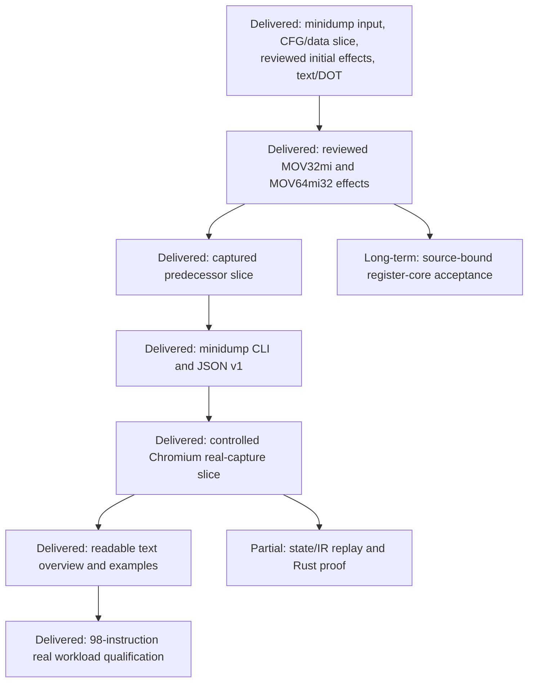

# Ariadne checkpoints

Updated **2026-10-01** for BAP-only minidump semantics and the separate partial
Stage 1 exit gate, following Stage E completion, MirrorRust integration and Priority 4 delivery. The Stage D 49-case gate remains intact at **0/49** as a
long-term formal purpose. Earlier entries retain their historical,
time-local commit and validation status.

```mermaid
flowchart TD
    A["2026-09-17 · 18d2a91<br/>Snapshot-scoped virtual-address contract"]
    B["2026-09-19 · f7b8b50<br/>Extended formal models and semantic types"]
    C["2026-09-19 · 62d7c57<br/>Rust analysis core and generated MBT bindings"]
    D["2026-09-20 · bd54f7a<br/>Initial x86-64 instruction-semantics specification"]
    E["2026-09-22 · 9a21901<br/>AMD64 foundations and scoped user64 acceptance gates"]
    F["2026-09-24 · 6fbfbd9<br/>Staged delivery roadmap"]
    G["2026-09-24 · fb7f142<br/>Pinned LLVM MC byte-span adapter"]
    H["2026-09-26 · aee833f<br/>Structured operands and reviewed conservative effects"]
    I["2026-09-26 · 712a635<br/>Windows/Linux AMD64 minidump input"]
    J["2026-09-27 · a9dc41a<br/>Text and Graphviz outcome rendering"]
    K["2026-09-28 23:08 CST · plan baseline<br/>Remaining implementation stages A–F"]
    L["2026-09-28 23:49 CST · validation<br/>Stage A MOV memory-immediate effects"]
    M["2026-09-29 07:26 CST · handoff<br/>Stage A delivered; Stage B next"]
    N["2026-09-29 10:16 CST · working tree<br/>B/C delivered; D pending; E/F partial"]
    O["2026-09-29 13:43 CST · working tree<br/>D0–D3 bounded evidence; 0/49 accepted"]
    P["2026-09-29 14:11 CST · decision<br/>D formal gate long term; practical queue separate"]
    Q["2026-09-29 17:27 CST · working tree<br/>Priority 1 real Chromium capture qualified"]
    R["2026-09-29 23:29 CST · working tree<br/>P2 no-change; P3 delivered; P4 measured partial"]
    S["2026-09-30 00:13 CST · source-bound<br/>19/19 integration gates; D source hashes unchanged"]
    T["2026-10-01 · working tree<br/>518ed9e · Stage E typed MirrorRust ports; two-fixture replay"]
    A --> B --> C --> D --> E --> F --> G --> H --> I --> J --> K --> L --> M --> N --> O --> P --> Q --> R --> S
    U["2026-10-01 · source-bound working tree<br/>Stage E complete: generated replay, mutations, reports/CLI"]
    V["2026-10-01 · working tree<br/>BAP Stage 1 implemented; Windows acceptance still required"]
    W["2026-10-01 · working tree<br/>LLVM semantic backend removed; BAP-only default"]
    S --> T --> U --> V --> W
```

## 2026-10-01 — LLVM semantic backend removed

Following the user's removal instruction, BAP is the sole semantic producer for
normal minidump CLI/library preparation. The semantic selector and automatic
LLVM effect fallback are removed. LLVM MC remains an independent decoded-fact
reference, with no production uses/defs/rules from its legacy semantic layer.
Historical effect-rule research and the separate supplied LLVM IR path remain.
The [removal plan](Plans/bap-only-semantics.md) and
[current record](docs/Ariadne/bap-only-removal-validation.json) identify the scope.

All **16 removal gates** pass against **93 stable current hashes**, including
**12 Stage E regression gates**, **99 model observations** and **16 producer/adapter
mutants**. BIL-only immediate-store coverage preserves both platform producer
fixtures; partial-register self-move definitions remain explicit. The retained
real Linux query still has 34 decoded instructions, 45 edges and a 28-site slice.
The [validation report](docs/Ariadne/bap-only-removal-validation.md) records
remaining gaps and workload samples.

The explicit default change does not complete the missing original Windows
98-instruction qualification or its 2,000 ms condition. Stage 2 remains
unstarted and unqualified; Stage D remains **0/49**. Validation was retained
before the user-authorized commit.

## 2026-10-01 — BAP Stage 1 implementation

The [BAP integration plan](Plans/bap-integration.md) now has an optional semantic
backend feeding the existing Rust core. A hash-pinned isolated BAP helper,
strict Rust transport, conservative BIL projection, shared captured-preparation
seam, CLI selector and per-site reports are implemented. LLVM remains default.

The [current record](docs/Ariadne/bap-stage1-validation.json) passes all
**16 implementation gates** with **92 stable source hashes**. Its finite corpus
contains 34 native BIL cases and 23 admitted opcode forms. Independent model
replay compares all nine fields for **99 observations**, all **15 producer/adapter
mutants** are detected, and a fresh **12-gate Stage E regression** passes.
Release workload evidence shows a controlled NOT coverage gain and preserves
the real 34-site Linux analysis, at a measured median cost of about 645 ms.

**Stage 1's exit remains partial:** fresh BAP acceptance and timing on the
original hash-pinned 98-instruction Windows capture are unavailable. The
[validation report](docs/Ariadne/bap-stage1-validation.md) identifies the missing
S4/S5 clause and rerun command. The 2,000 ms default-promotion target is preserved.
Stage 2 remains unstarted and unqualified; Stage D stays **0/49**. These Stage 1
implementation changes are uncommitted.

## 2026-10-01 — Stage E completion

The [completion plan](Plans/stage-e-completion.md) is delivered within its
finite conformance/report acceptance scope. The
[source-bound completion record](docs/Ariadne/stage-e-completion-validation.json)
passes **12/12 gates** with stable source hashes. Its 16 machine-state and
16 IR inputs cover joins, loops, empty/multiple roots and seeds, sparse/full-width
addresses, equal-valued IDs, terminal alternatives, phi inputs, memory/call
uncertainty and native text/bitcode. Repeated negotiated replay matches
**64 complete traces and 326 observations**. All **15 mechanical engine mutants**
fail as genuine model mismatches through unchanged observers/bindings.

The optional minidump `--stateflow-input` handoff retains full recovery and
preparation evidence, while the separate native IR CLI verifies owned artifacts
before analysis. Their versioned text/DOT/JSON reports preserve identity,
uncertainty and model-relative feasibility. Both command paths are checked
with Graphviz. The existing minidump regression/mutation record passes and
is reused only after an exact source-hash check; its isolated copies now include
the new report-crate dependency.

**Stage E is complete at this recorded tier.** Supplied transition relations
and completeness assertions remain premises. The 0/49 Stage D instruction-step
gate and universal Stage F Rust refinement remain open. Changes after `518ed9e`
are currently uncommitted; no new ISA or historical-execution claim is made.

## 2026-10-01 — First Stage E MirrorRust integration

The separate [Stage E harness](mbt/stage-e/README.md) now uses the sibling
`~/Repos/MirrorRust` client through two compiler-generated typed ports.
Deferred factories preserve exact-digest admission before port construction.
Four complete fixture traces (the existing machine-state and LLVM IR examples
each replayed twice) matched all 20 observations, including their declared
derived result views. Both wrong-digest checks rejected before any factory,
initialization or observation. Three projection tests, four Rust binding tests,
formatting and Clippy passed. The core harness was repaired for MirrorRust's
`NegotiatedError` API and passed its existing 12 traces, 168 matched states,
wrong-digest rejection and five engine mutation checks.

The [retained source-bound record](docs/Ariadne/stage-e-mirrorrust-integration-validation.json)
pins client, SUT, oracle and generated artifacts. The
[first-stage implementation plan](Plans/stage-e-mirrorrust-integration.md) is
complete. Broader generated scenarios, Stage E engine mutants,
recovery/native-adapter handoff coverage and report/CLI integration remain
open; **Stage E is still partial**. No fresh 19-component overall integration
result or universal Rust-refinement claim is made by this checkpoint.

The subsequent [installed ModelMirrors compatibility check](docs/Ariadne/installed-modelmirrors-compatibility.md)
passes all 11 runtime checks: the 168 core states, 20 Stage E observations,
three pre-factory digest rejections and five expected core mutation mismatches.
The actual installed binary is hash-bound; it prints `Mirrors 0.0.3`, while
`v0.0.3.1` names the local source tag. Exact clean-tag build provenance remains
unverified because the installed binary differs from the dirty checkout's build.

## 2026-09-30 — Priority 4 qualification and measured optimization

The [qualified Windows Electron workload](docs/Ariadne/priority-4-performance-validation.md)
has 98 captured decoded instructions, 113 edges and a 19-node predecessor
slice. A matching PE runtime-function entry and 101 forward byte matches
anchor the query independently of RIP. Eight exact control-only bindings
retain fully opaque effects. The private predecessor cache and checked native
helper reduce CLI median from 3,845.7 to 1,787.6 ms, meeting the fixed 2,000 ms
median budget. The measured range is 1,680.0–2,450.0 ms; no worst-case bound is
claimed. All five synthetic families complete at 128, 256 and 512 nodes.

All 277 visible actions match the frozen scanning reference, as do transitions
on 256 generated requests. Text, DOT and JSON hashes are byte-identical across
the performance checkpoints. The [integration record](docs/Ariadne/current-integration-validation.json)
has 19 passing components and 93 stable source hashes, including the fresh
11-component minidump gate, native Windows/Linux matrix, MBT replay and
mutation gates. It retains the rerun of an interrupted generated test artifact.
Practical Priority 4 is delivered for this query. Formal instruction-step
acceptance, the Rust refinement proof and Stage E generated replay remain open.

## 2026-09-30 00:13 CST — historical integration checkpoint

The integration report at that checkpoint
passed all 19 B/C/E/F gates with **89 stable source hashes**, including the
11-gate nested minidump acceptance, root and IR tests, formal fixtures and
the now explicitly selected original benchmark binary. The required
register-core gate returned its expected **pending 0/49** result. The
retained [Stage D component record](docs/Ariadne/stage-d-progress-validation.json)
matched all **242 source hashes** at that checkpoint; it remains a component
checkpoint, not accepted instruction steps. A redundant Stage D rerun passed
its first observation, AMD64 component and mutation checks before it was
stopped; that incomplete run is not counted as a new acceptance result.

## 2026-09-29 23:29 CST — practical priorities 2–4

The [Priority 2 review](docs/Ariadne/priority-2-effects-validation.md)
found no exact source-reviewable instruction effect needed to reach the
possible address producer in the first real Chromium case. Seven pre-seed
calls remain deliberately opaque; no ABI preservation or instruction-step
claim was added. [Priority 3](docs/Ariadne/priority-3-presentation-validation.md)
delivers a readable instruction overview and reproducible Linux/Windows CLI
examples. The controlled real case retained byte-identical JSON and DOT
outputs after this text-only change.

[Priority 4 measurements](docs/Ariadne/priority-4-performance-validation.md)
put the 34-node real query at a 1,299 ms median against a predeclared
2,000 ms local budget. Five-repeat 128/256-node synthetic measurements passed;
the 512-node suite hit its 180-second bound. No production optimization was
made. The required 64-node real workload is still missing, so performance
qualification remains open. The integrated minidump gate passed 11/11
components with 57 stable source hashes; the real-capture replay and
benchmark each retained 28 stable source hashes. The raw real dump remains
ignored and external to tracked files.

## 2026-09-29 17:27 CST — Priority 1 real-capture acceptance

The [controlled Chromium/Linux case](docs/Ariadne/priority-1-real-capture-validation.md)
uses an exact matching-build function symbol and forward decoding to select a
captured instruction boundary 125 bytes before the exception RIP. Ariadne
decoded 34 starts and retained a 28-node possible data slice; a reviewed RBX
load is a possible address producer for the faulting memory read. Opaque
calls and a later unsupported control remain visible. The
[source-bound record](docs/Ariadne/priority-1-validation.json) contains a
passing focused gate, three negative controls and all 11 passing minidump
regression gates with stable sources. The raw dump stays in ignored local
`tmp/priority1/`; no PE/ELF reader, historical execution claim or formal
case acceptance was added. Priorities 2–4 remain open.

## 2026-09-29 14:11 CST — assurance priorities

The [assurance decision](docs/Ariadne/practical-assurance-priorities.md)
places the unchanged **49-case Stage D acceptance gate** in the long-term
formal research track. It remains **0/49**; no profile, form, coverage ledger,
fallback or checker rule was weakened or promoted. Practical Windows/Linux
minidump investigation continues with exact source-reviewed conservative
effects and explicit unknowns.

The next practical work is to qualify a representative **historical captured
predecessor slice** beyond the tool-produced fixture, add only effect rules
that block such real paths, improve investigator presentation/release examples,
and measure larger captures before optimizing. Stage E result integration and
universal Rust refinement are separate work, not prerequisites for the
current minidump CLI. This is a planning/status change; no new acceptance test
or implementation behavior is claimed.

## 2026-09-29 13:43 CST — Stage D first-case progress

The [standalone Stage D plan](docs/Ariadne/stage-d-register-core-implementation-plan.md)
has begun. The source-bound [D0–D3 progress record](docs/Ariadne/stage-d-progress.md)
pins the first `MOV reg64, imm32` form and profile hashes, checks LLVM 20.1.2
payload observations under Windows/Linux targets, and adds TLA+/Lean fixtures
for a CPL-3 body, assumed fallthrough, LOCK #UD rollback witness and finite
RAX-byte-cell projection. Nine deliberate semantic mutations were rejected.

The default AMD64 suite passed 70 Apalache typechecks, 33 TLC configurations,
73 Lean build jobs, the combined axiom audit and 50 Python integrity tests on
stable sources. Fifteen native effects tests also passed. The
[Stage D validation report](docs/Ariadne/stage-d-progress-validation.json)
records **242 stable source hashes**. The required `register-core` gate still
reports **0/49 accepted** because the complete case-specific boundary,
TLA+/Lean correspondence, general projection and coverage-ledger binding
remain open. E/F status from the prior checkpoint is unchanged. This working
tree has not been committed or pushed.

## 2026-09-29 10:16 CST — progress through Stage F

**Stage B delivered:** two hash-pinned, tool-produced Windows/Linux minidumps
capture an independently specified earlier entry and a crash-IP seed. Both
decode four nodes; the backward slice includes the RAX address producer and
seed, excludes the unrelated RCX write, and retains an opaque `RET64`
preparation gap. These fixtures prove a captured-byte analysis path, not a
historical crash execution. The two older Breakpad dumps remain separate
crash-IP regressions.

**Stage C delivered:** the supported minidump CLI emits text, Graphviz-parsed
DOT and JSON v1 from one frozen query, with artifact/source offsets, decoder
identity, operand/effect evidence, CFG, origins and typed uncertainty. It
rejects malformed or exhausted runs without publishing a complete report.
See the [B/C validation](docs/Ariadne/stage-b-c-validation.md).

**Stage D remains pending:** the default profile integrity check passes, but
the required `register-core` gate still rejects **0/49** verified cases; the
72 control/stack and 156 RAM cases also remain unaccepted. The
[case audit](docs/Ariadne/stage-d-acceptance-audit.md) records an exact
register-MOV candidate and its open instruction-step obligations. No ledger
status or source-form hash was promoted.

**Stage E is partial:** separate Rust machine-state and native LLVM IR paths
now pass their focused TLA+ fixtures, contract negatives, Apalache/TLC checks,
and LLVM 20.1.2 verifier-backed `.ll`/`.bc` tests. Generated model-based
replay of all observable fields and CLI integration remain open. **Stage F is
partial:** a [proof-boundary record and benchmark baseline](docs/Ariadne/stage-f-proof-and-performance.md)
measure loops, joins, calls, dense aliases and a pinned minidump; no universal
Rust refinement or solver optimization is claimed. The
[19-gate source-bound report](docs/Ariadne/stage-b-f-validation.json) passed
with **83 stable source hashes**. This working-tree progress has not been
committed or pushed.

## 2026-09-29 07:26 CST — Stage A handoff

The reviewed memory-immediate MOV effects and source-bound Stage A validation
are the delivery baseline for this commit. Both pinned Linux/Windows minidumps
now decode their crash-IP instruction, while a captured predecessor path and
backward address-producer slice remain Stage B work. The evidence-linked CLI
and JSON output remain Stage C work. This handoff does not promote an AMD64
instruction-step case: `register-core` remains **0/49** verified and `ram-data`
remains **0/156** verified.

## 2026-09-28 23:49 CST — Stage A effect delivery

Implemented the exact `MOV32mi` and `MOV64mi32` memory-immediate effect rules.
The registry is now **139 LLVM opcode identities** under
`user64-effects-v1.1`. Both pinned Windows/Linux AMD64 dumps decode their
crash-IP instruction from captured bytes: the Linux fixture decodes one node,
the Windows fixture three. Each still has one later unresolved obligation;
neither run establishes earlier address producers or the actual faulting
store's commit behavior. That predecessor slice remains Stage B work.

The [Stage A validation](docs/Ariadne/stage-a-validation.md) records the pinned
AMD/LLVM source review, all eight passing source-bound acceptance gates,
ten rejected effect mutations, six rejected input mutations and the
unchanged 12-trace/168-state core MBT replay. The generic `AMD64-F-0503`
catalogue row still needs reviewed semantic binding before the memory form can
be accepted as an instruction step. The active profile remains **0/49**
verified `register-core` steps and **0/156** verified `ram-data` cases.
No source-form ledger, core engine or user64 profile was promoted. The
validation report below records the working-tree status at its own time point.

## 2026-09-28 23:08 CST — remaining implementation plan begins

This checkpoint starts the [remaining implementation plan](docs/Ariadne/remaining-implementation-plan.md)
from committed HEAD `a9dc41a`. The existing analyzer, LLVM MC adapter,
Windows/Linux AMD64 minidump reader, reviewed effect registry and text/DOT
renderer are delivered. No implementation or acceptance status changes at this
plan-start point; the only task edits are this checkpoint and the cross-linked
planning documents. Untracked editor/TLA+ caches remain outside delivery.

Two hash-pinned real minidumps still decode **zero** instructions at their
crash IPs because `MOV32mi` and `MOV64mi32` are outside the current reviewed
effect/control registry. The plan first reviews those exact memory alternatives,
then establishes a captured predecessor path to a decoded crash-IP slice,
and then produces an evidence-linked minidump CLI/report. Useful analysis from
those forms is distinct from source-bound ISA instruction-step acceptance.

The live `amd64-user64-v1` report at this checkpoint shows 49 paired
`register-core` bodies and **0/49 verified instruction steps**; the 72
control/stack and 156 RAM cases also have zero accepted steps. The accepted
no-trust unknown-instruction fallback remains in force. Formal case closure can
advance alongside the practical minidump path. The separate abstract-state
and supplied LLVM IR Rust machines, explicit Rust-refinement assurance and
measured scalability follow under their own gates. PE/ELF image and ELF core
readers remain deferred under the current input scope.

This entry records the plan baseline, not passing evidence for any of its six
future stages. The plan document defines each deliverable and acceptance test.

## Current delivery checkpoint

The Rust core recovers a local instruction-level CFG, computes may-reaching
definitions, and builds a backward data slice from an immutable, validated
request. Calls remain visible in the graph while local discovery and data flow
follow summary edges. Missing bytes, decode failures, and incomplete targets
remain explicit obligations.

The optional LLVM MC **20.1.2** adapter now connects caller-provided byte spans
to that core through `ByteSnapshot::to_request()`. It supplies instruction
lengths and conservative control-flow summaries, preserves captured-byte
precedence, requires explicit trust for dump/file fallback, and retains
unresolved indirect targets. The legacy `to_request()` interface treats every
successfully decoded instruction as reading/may-writing all caller-tracked
locations, with no must-writes. These summaries
do not certify precise architectural effects or verified instruction steps.

`ByteSnapshot::prepare()` now supplies reviewed normal-continuation summaries
for 139 exact LLVM opcode identities, byte-level register aliases, and per-site
evidence. Memory remains coarse and calls remain opaque. See the
[initial effects record](docs/Ariadne/operand-effects-validation.md) and
[Stage A validation](docs/Ariadne/stage-a-validation.md).

Windows/Linux AMD64 minidump input is delivered in [input/](input/README.md).
The Stage B predecessor fixtures and Stage C minidump CLI/JSON v1 are
delivered. PE/ELF image and ELF core readers remain deferred; broader effect
coverage, precise aliasing and annotated assembly remain pending.
Text and Graphviz DOT rendering remains available in `ariadne::render`. The
separate machine-state and native LLVM IR Rust paths have focused fixture
validation but still need generated model-based replay. The AMD64 formal
library is not yet an accepted Rust ISA executor.

## Formal acceptance checkpoint

The live profile report was rechecked on 2026-09-28:

| Milestone | Paired bodies | Verified instruction steps | Status |
| --- | ---: | ---: | --- |
| `register-core` | 49 | 0 / 49 | Active, pending acceptance |
| `near-control-stack` | 0 | 0 / 72 | Pending |
| `ram-data` | 0 | 0 / 156 | Pending |

The conservative no-trust `UnknownInstructionFallback` foundation is accepted
for the pinned user64 profile. All **277 instruction cases remain unsupported**
under the acceptance gate. Paired bodies and successful component checks do
not establish complete instruction-step support. Broad full-manual expansion
remains deferred.

## Validation evidence

| Evidence date | Scope | Result and boundary |
| --- | --- | --- |
| 2026-09-19, recorded | Generated MBT gate | 12 complete traces, 168 matched states, required action/pair coverage, digest rejection, and five implementation mutations rejected. Not rerun for this checkpoint. |
| 2026-09-22 validation record | Latest aggregate AMD64 component checkpoint | 50 TLA+ typechecks, 22 TLC configurations, 38 Lean modules with combined axiom audit, full-width register-view symbolic check, and 32 Python tests passed. Historical checked-source evidence; not a fresh verification of current HEAD. |
| 2026-09-22, recorded | Focused user64 fallback and acceptance tooling | Fallback TLA+/Lean checks and audit, 50 Python integrity/profile/acceptance tests, and inventory checks passed. No instruction case was accepted. |
| 2026-09-26, fresh at `fb7f142` | `cargo test --offline` | 19 integration tests and 1 doctest passed. Five LLVM-native integration tests were ignored by the default test run. |
| 2026-09-26, fresh at `fb7f142` | `cargo clippy --offline --all-targets -- -D warnings` | Passed. |
| 2026-09-26, attempted at `fb7f142` | `bash native/llvm_mc/check.sh` | Stopped before native build/tests: LLVM 20.1.2 headers or library unavailable at configured paths. Native behavior was not freshly verified; this is an environment prerequisite failure. |
| 2026-09-26, fresh | `python3 tools/amd64_profile.py report` | Confirmed 49 paired register bodies and zero verified cases across all three milestones. This report does not execute the formal proof/model gates. |
| 2026-09-28, fresh | `python3 tools/amd64_profile.py report` | Reconfirmed 49 paired register bodies and zero verified cases across all three milestones. The Stage A effect rule does not change the profile case ledger. |
| 2026-09-28 23:49 CST, source-bound | Stage A integrated gate | All eight minidump gates passed, including the complete existing effects gate, formal projection/input checks, native Windows/Linux tests, real artifacts and mutations. Source hashes stayed stable; this does not certify faulting-store retirement or a user64 instruction step. |
| 2026-09-29 10:16 CST, source-bound | B/C/E/F progress gate | All 19 gates passed with 83 stable source hashes: 11 nested minidump gates, root/IR tests and checks, native LLVM IR, both E formal model fixtures, profile integrity and baseline benchmark. Required register-core acceptance remains a separately recorded expected failure; E model-based replay and F Rust proof remain open. |
| 2026-09-29 13:42 CST, source-bound | Stage D D0–D3 progress gate | Five component gates passed with 242 stable source hashes; 70 TLA+ typechecks, 33 TLC configs, 73 Lean jobs, nine first-case mutants and 15 native effect tests. Required register-core acceptance remains pending at 0/49. |
| 2026-09-29 17:27 CST, source-bound | Priority 1 controlled Chromium real-capture gate | Focused case passed with 30 forward-companion byte matches, 34 decoded starts, 28 slice nodes, Graphviz parsing, seed-only negative control and 28 stable source hashes. Changed dump and wrong build ID were rejected before publication. The existing minidump gate passed 11/11 components with 57 stable source hashes. |
| 2026-09-29 23:29 CST, source-bound | Practical priorities 2 and 3 | First real path received a no-change effect decision; the text report gained an instruction overview and two platform examples. JSON/DOT for the controlled case remained byte-identical. All 11 minidump gates passed with 57 stable source hashes; the focused replay retained 28 stable hashes. |
| 2026-09-29 23:29 CST, source-bound | Priority 4 bounded measurement | Five measured runs each for the 34-node real CLI query, the four-node Windows reference and 128/256-node synthetic families; 28 source and four tool hashes stable. The attempted 512-node five-repeat run timed out at 180 seconds. The 64-node real workload target remains open. |
| 2026-09-30 00:13 CST, source-bound | Historical B/C/E/F integration | 19/19 gates passed with 89 stable source hashes; required register-core milestone remained pending at 0/49. Stage D's retained 242-hash component record matched that snapshot; no new full Stage D gate result is claimed. |
| 2026-09-30, source-bound | Priority 4 delivery | A 98-instruction real Windows query meets the fixed median budget after optimization; 277 actions and report hashes are preserved. All 128/256/512-node synthetic families complete. Current integration has 19 passing components and 93 stable source hashes, with a recorded minidump recheck after an interrupted test artifact. Formal register-core remains 0/49. |

The full AMD64 TLA+/Lean suite was not rerun. The subsequent effects delivery
ran its focused TLA+ gate and the existing core MBT gate successfully.

## Next delivery stages

```mermaid
flowchart TD
    A["Delivered: minidump input, CFG/data slice,<br/>reviewed initial effects, text/DOT"]
    B["Delivered: reviewed MOV32mi and MOV64mi32 effects"]
    C["Delivered: captured predecessor slice"]
    D["Delivered: minidump CLI and JSON v1"]
    G["Delivered: controlled Chromium real-capture slice"]
    H["Delivered: readable text overview and examples"]
    I["Delivered: 98-instruction real workload qualification"]
    E["Long-term: source-bound register-core acceptance"]
    F["Partial: state/IR replay and Rust proof"]
    A --> B --> C --> D --> G --> H --> I
    G --> F
    B --> E
```

Formal acceptance work can advance alongside adapter work. The next formal
acceptance decision is the `register-core` gate: close its legality/payload,
state validity, values/flags/frames, faults/commit, instruction-boundary,
TLA+/Lean correspondence, and conservative analysis-projection obligations.

## Source records

- [Delivery roadmap](ROADMAP.md)
- [Rust implementation](docs/implementation.md)
- [LLVM MC adapter](docs/llvm-mc-adapter.md)
- [User64 profile and acceptance rules](docs/amd64-user64.md)
- [AMD64 validation record](docs/amd64-validation.md)
- [AMD64 task ledger](docs/amd64-semantics-tasks.md)
- [Model-based testing evidence](mbt/README.md)
- [Remaining implementation plan](docs/Ariadne/remaining-implementation-plan.md)
- [Stage A source review and validation](docs/Ariadne/stage-a-validation.md)
- [Priority 1 real-capture validation](docs/Ariadne/priority-1-real-capture-validation.md)
- [Priority 2 effect decision](docs/Ariadne/priority-2-effects-validation.md)
- [Priority 3 presentation validation](docs/Ariadne/priority-3-presentation-validation.md)
- [Priority 4 performance validation](docs/Ariadne/priority-4-performance-validation.md)
- [Current integration gate](docs/Ariadne/current-integration-validation.json)

## 2026-09-26 — Operand/effects working-tree delivery

- Added `ByteSnapshot::prepare()`, a 137-location catalogue, protocol v2,
  normalized operands, 137 exact opcode rules and explicit effect/control gaps.
- Preserved `to_request()` and all existing `Ariadne.tla`/Rust engine behavior.
- Fresh integrated gate: 24 Rust tests plus one doctest, 16 real native tests
  (5 legacy + 11 effects), formatting, Clippy, both TLA+ typechecks and TLC,
  six effect mutations, and core MBT all passed with stable source hashes.
- Core MBT retained 12 traces / 168 states and rejected all five engine mutants.
- Matching LLVM development headers were downloaded/extracted into `/tmp`;
  the earlier native-prerequisite failure is resolved for this session.
- Full user64 instruction-step acceptance remains 0/277. No commit or push.

[Implementation plan](docs/Ariadne/operand-effects-plan.md),
[rule matrix](docs/Ariadne/operand-effects-rules.md),
[validation and limitations](docs/Ariadne/operand-effects-validation.md).

## 2026-09-26 — Minidump-only delivery

The separate `ariadne-input` package reads Windows/Linux AMD64 minidumps,
indexes MemoryList/Memory64List/thread-stack capture, retains mapping and
context evidence, and prepares local instruction starts automatically. Captured
conflicts and holes stay explicit; no image fallback is enabled. The existing
engine remains unchanged. PE/ELF images and ELF cores are still design-only.

Linux and Windows target negotiation now shares the reviewed effect pipeline.
Local-only materialization preserves original roots, keeps seeds separate, and
returns an error rather than a partial request if resource limits are exhausted.

See [minidump usage](input/README.md) and
[the source-bound validation record](docs/Ariadne/minidump-validation.md).
No commit or push was performed for this delivery. Unrelated Lean moves/deletions
in the working tree were preserved.

## 2026-09-27 — Analyzer-outcome rendering

Added the pure `ariadne::render` module with readable text and Graphviz DOT
formats. It preserves snapshot identity, structural edges, possible reaching
origins, slice membership, missing seeds and unresolved recovery obligations.
The input example keeps upstream evidence separate from the core rendering.

Root/input tests, formatting and Clippy passed; real Graphviz parsed escaped
metadata and generated valid SVG examples. Full analysis/formal suites were
not rerun for this presentation-only addition. No commit or push performed.

[Rendering guide and examples](docs/Ariadne/result-rendering.md).
