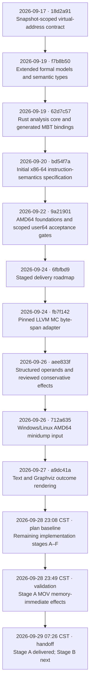
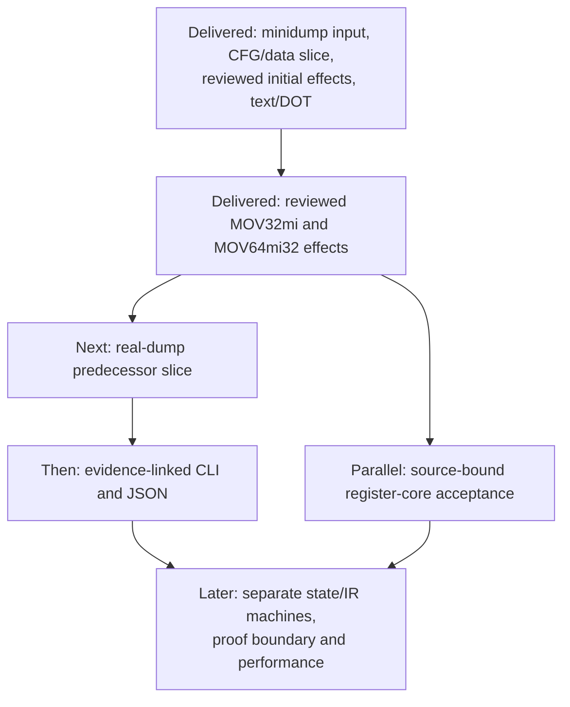

# Ariadne checkpoints

Updated **2026-09-29 07:26 CST (Asia/Shanghai)** for the Stage A delivery
checkpoint. Its source-bound validation ran on 2026-09-28 against parent commit
`9bde052`. The plan-start entry remains a separate time point. Earlier delivery
entries retain their historical, time-local commit and validation status.

```mermaid
flowchart TD
    A["2026-09-17 · 18d2a91<br/>Snapshot-scoped virtual-address contract"]
    B["2026-09-19 · f7b8b50<br/>Extended formal models and semantic types"]
    C["2026-09-19 · 62d7c57<br/>Rust analysis core and generated MBT bindings"]
    D["2026-09-20 · bd54f7a<br/>Initial x86-64 instruction-semantics specification"]
    E["2026-09-22 · 9a21901<br/>AMD64 foundations and scoped user64 acceptance gates"]
    F["2026-09-24 · 6fbfbd9<br/>Staged delivery roadmap"]
    G["2026-09-24 · fb7f142<br/>Pinned LLVM MC byte-span adapter"]
    H["2026-09-26 · aee833f<br/>Structured operands and reviewed conservative effects"]
    I["2026-09-26 · 712a635<br/>Windows/Linux AMD64 minidump input"]
    J["2026-09-27 · a9dc41a<br/>Text and Graphviz outcome rendering"]
    K["2026-09-28 23:08 CST · plan baseline<br/>Remaining implementation stages A–F"]
    L["2026-09-28 23:49 CST · validation<br/>Stage A MOV memory-immediate effects"]
    M["2026-09-29 07:26 CST · handoff<br/>Stage A delivered; Stage B next"]
    A --> B --> C --> D --> E --> F --> G --> H --> I --> J --> K --> L --> M
```

## 2026-09-29 07:26 CST — Stage A handoff

The reviewed memory-immediate MOV effects and source-bound Stage A validation
are the delivery baseline for this commit. Both pinned Linux/Windows minidumps
now decode their crash-IP instruction, while a captured predecessor path and
backward address-producer slice remain Stage B work. The evidence-linked CLI
and JSON output remain Stage C work. This handoff does not promote an AMD64
instruction-step case: `register-core` remains **0/49** verified and `ram-data`
remains **0/156** verified.

## 2026-09-28 23:49 CST — Stage A effect delivery

Implemented the exact `MOV32mi` and `MOV64mi32` memory-immediate effect rules.
The registry is now **139 LLVM opcode identities** under
`user64-effects-v1.1`. Both pinned Windows/Linux AMD64 dumps decode their
crash-IP instruction from captured bytes: the Linux fixture decodes one node,
the Windows fixture three. Each still has one later unresolved obligation;
neither run establishes earlier address producers or the actual faulting
store's commit behavior. That predecessor slice remains Stage B work.

The [Stage A validation](docs/Ariadne/stage-a-validation.md) records the pinned
AMD/LLVM source review, all eight passing source-bound acceptance gates,
ten rejected effect mutations, six rejected input mutations and the
unchanged 12-trace/168-state core MBT replay. The generic `AMD64-F-0503`
catalogue row still needs reviewed semantic binding before the memory form can
be accepted as an instruction step. The active profile remains **0/49**
verified `register-core` steps and **0/156** verified `ram-data` cases.
No source-form ledger, core engine or user64 profile was promoted. The
validation report below records the working-tree status at its own time point.

## 2026-09-28 23:08 CST — remaining implementation plan begins

This checkpoint starts the [remaining implementation plan](docs/Ariadne/remaining-implementation-plan.md)
from committed HEAD `a9dc41a`. The existing analyzer, LLVM MC adapter,
Windows/Linux AMD64 minidump reader, reviewed effect registry and text/DOT
renderer are delivered. No implementation or acceptance status changes at this
plan-start point; the only task edits are this checkpoint and the cross-linked
planning documents. Untracked editor/TLA+ caches remain outside delivery.

Two hash-pinned real minidumps still decode **zero** instructions at their
crash IPs because `MOV32mi` and `MOV64mi32` are outside the current reviewed
effect/control registry. The plan first reviews those exact memory alternatives,
then establishes a captured predecessor path to a decoded crash-IP slice,
and then produces an evidence-linked minidump CLI/report. Useful analysis from
those forms is distinct from source-bound ISA instruction-step acceptance.

The live `amd64-user64-v1` report at this checkpoint shows 49 paired
`register-core` bodies and **0/49 verified instruction steps**; the 72
control/stack and 156 RAM cases also have zero accepted steps. The accepted
no-trust unknown-instruction fallback remains in force. Formal case closure can
advance alongside the practical minidump path. The separate abstract-state
and supplied LLVM IR Rust machines, explicit Rust-refinement assurance and
measured scalability follow under their own gates. PE/ELF image and ELF core
readers remain deferred under the current input scope.

This entry records the plan baseline, not passing evidence for any of its six
future stages. The plan document defines each deliverable and acceptance test.

## Current delivery checkpoint

The Rust core recovers a local instruction-level CFG, computes may-reaching
definitions, and builds a backward data slice from an immutable, validated
request. Calls remain visible in the graph while local discovery and data flow
follow summary edges. Missing bytes, decode failures, and incomplete targets
remain explicit obligations.

The optional LLVM MC **20.1.2** adapter now connects caller-provided byte spans
to that core through `ByteSnapshot::to_request()`. It supplies instruction
lengths and conservative control-flow summaries, preserves captured-byte
precedence, requires explicit trust for dump/file fallback, and retains
unresolved indirect targets. The legacy `to_request()` interface treats every
successfully decoded instruction as reading/may-writing all caller-tracked
locations, with no must-writes. These summaries
do not certify precise architectural effects or verified instruction steps.

`ByteSnapshot::prepare()` now supplies reviewed normal-continuation summaries
for 139 exact LLVM opcode identities, byte-level register aliases, and per-site
evidence. Memory remains coarse and calls remain opaque. See the
[initial effects record](docs/Ariadne/operand-effects-validation.md) and
[Stage A validation](docs/Ariadne/stage-a-validation.md).

Windows/Linux AMD64 minidump input is delivered in [input/](input/README.md).
PE/ELF image and ELF core readers, broader effect coverage and precise alias analysis,
Rust abstract machine-state propagation, the native LLVM IR analysis implementation, the
analyzer CLI, annotated assembly and JSON export remain pending.
Text and Graphviz DOT rendering is available in `ariadne::render`. The AMD64 formal library is
not yet integrated into the Rust runtime.

## Formal acceptance checkpoint

The live profile report was rechecked on 2026-09-28:

| Milestone | Paired bodies | Verified instruction steps | Status |
| --- | ---: | ---: | --- |
| `register-core` | 49 | 0 / 49 | Active, pending acceptance |
| `near-control-stack` | 0 | 0 / 72 | Pending |
| `ram-data` | 0 | 0 / 156 | Pending |

The conservative no-trust `UnknownInstructionFallback` foundation is accepted
for the pinned user64 profile. All **277 instruction cases remain unsupported**
under the acceptance gate. Paired bodies and successful component checks do
not establish complete instruction-step support. Broad full-manual expansion
remains deferred.

## Validation evidence

| Evidence date | Scope | Result and boundary |
| --- | --- | --- |
| 2026-09-19, recorded | Generated MBT gate | 12 complete traces, 168 matched states, required action/pair coverage, digest rejection, and five implementation mutations rejected. Not rerun for this checkpoint. |
| 2026-09-22 validation record | Latest aggregate AMD64 component checkpoint | 50 TLA+ typechecks, 22 TLC configurations, 38 Lean modules with combined axiom audit, full-width register-view symbolic check, and 32 Python tests passed. Historical checked-source evidence; not a fresh verification of current HEAD. |
| 2026-09-22, recorded | Focused user64 fallback and acceptance tooling | Fallback TLA+/Lean checks and audit, 50 Python integrity/profile/acceptance tests, and inventory checks passed. No instruction case was accepted. |
| 2026-09-26, fresh at `fb7f142` | `cargo test --offline` | 19 integration tests and 1 doctest passed. Five LLVM-native integration tests were ignored by the default test run. |
| 2026-09-26, fresh at `fb7f142` | `cargo clippy --offline --all-targets -- -D warnings` | Passed. |
| 2026-09-26, attempted at `fb7f142` | `bash native/llvm_mc/check.sh` | Stopped before native build/tests: LLVM 20.1.2 headers or library unavailable at configured paths. Native behavior was not freshly verified; this is an environment prerequisite failure. |
| 2026-09-26, fresh | `python3 tools/amd64_profile.py report` | Confirmed 49 paired register bodies and zero verified cases across all three milestones. This report does not execute the formal proof/model gates. |
| 2026-09-28, fresh | `python3 tools/amd64_profile.py report` | Reconfirmed 49 paired register bodies and zero verified cases across all three milestones. The Stage A effect rule does not change the profile case ledger. |
| 2026-09-28 23:49 CST, source-bound | Stage A integrated gate | All eight minidump gates passed, including the complete existing effects gate, formal projection/input checks, native Windows/Linux tests, real artifacts and mutations. Source hashes stayed stable; this does not certify faulting-store retirement or a user64 instruction step. |

The full AMD64 TLA+/Lean suite was not rerun. The subsequent effects delivery
ran its focused TLA+ gate and the existing core MBT gate successfully.

## Next delivery stages

```mermaid
flowchart TD
    A["Delivered: minidump input, CFG/data slice,<br/>reviewed initial effects, text/DOT"]
    B["Delivered: reviewed MOV32mi and MOV64mi32 effects"]
    C["Next: real-dump predecessor slice"]
    D["Then: evidence-linked CLI and JSON"]
    E["Parallel: source-bound register-core acceptance"]
    F["Later: separate state/IR machines,<br/>proof boundary and performance"]
    A --> B --> C --> D --> F
    B --> E --> F
```

Formal acceptance work can advance alongside adapter work. The next formal
acceptance decision is the `register-core` gate: close its legality/payload,
state validity, values/flags/frames, faults/commit, instruction-boundary,
TLA+/Lean correspondence, and conservative analysis-projection obligations.

## Source records

- [Delivery roadmap](ROADMAP.md)
- [Rust implementation](docs/implementation.md)
- [LLVM MC adapter](docs/llvm-mc-adapter.md)
- [User64 profile and acceptance rules](docs/amd64-user64.md)
- [AMD64 validation record](docs/amd64-validation.md)
- [AMD64 task ledger](docs/amd64-semantics-tasks.md)
- [Model-based testing evidence](mbt/README.md)
- [Remaining implementation plan](docs/Ariadne/remaining-implementation-plan.md)
- [Stage A source review and validation](docs/Ariadne/stage-a-validation.md)

## 2026-09-26 — Operand/effects working-tree delivery

- Added `ByteSnapshot::prepare()`, a 137-location catalogue, protocol v2,
  normalized operands, 137 exact opcode rules and explicit effect/control gaps.
- Preserved `to_request()` and all existing `Ariadne.tla`/Rust engine behavior.
- Fresh integrated gate: 24 Rust tests plus one doctest, 16 real native tests
  (5 legacy + 11 effects), formatting, Clippy, both TLA+ typechecks and TLC,
  six effect mutations, and core MBT all passed with stable source hashes.
- Core MBT retained 12 traces / 168 states and rejected all five engine mutants.
- Matching LLVM development headers were downloaded/extracted into `/tmp`;
  the earlier native-prerequisite failure is resolved for this session.
- Full user64 instruction-step acceptance remains 0/277. No commit or push.

[Implementation plan](docs/Ariadne/operand-effects-plan.md),
[rule matrix](docs/Ariadne/operand-effects-rules.md),
[validation and limitations](docs/Ariadne/operand-effects-validation.md).

## 2026-09-26 — Minidump-only delivery

The separate `ariadne-input` package reads Windows/Linux AMD64 minidumps,
indexes MemoryList/Memory64List/thread-stack capture, retains mapping and
context evidence, and prepares local instruction starts automatically. Captured
conflicts and holes stay explicit; no image fallback is enabled. The existing
engine remains unchanged. PE/ELF images and ELF cores are still design-only.

Linux and Windows target negotiation now shares the reviewed effect pipeline.
Local-only materialization preserves original roots, keeps seeds separate, and
returns an error rather than a partial request if resource limits are exhausted.

See [minidump usage](input/README.md) and
[the source-bound validation record](docs/Ariadne/minidump-validation.md).
No commit or push was performed for this delivery. Unrelated Lean moves/deletions
in the working tree were preserved.

## 2026-09-27 — Analyzer-outcome rendering

Added the pure `ariadne::render` module with readable text and Graphviz DOT
formats. It preserves snapshot identity, structural edges, possible reaching
origins, slice membership, missing seeds and unresolved recovery obligations.
The input example keeps upstream evidence separate from the core rendering.

Root/input tests, formatting and Clippy passed; real Graphviz parsed escaped
metadata and generated valid SVG examples. Full analysis/formal suites were
not rerun for this presentation-only addition. No commit or push performed.

[Rendering guide and examples](docs/Ariadne/result-rendering.md).
