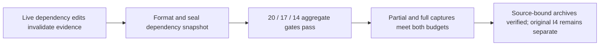
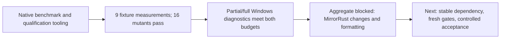
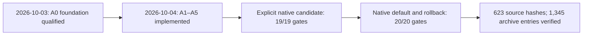
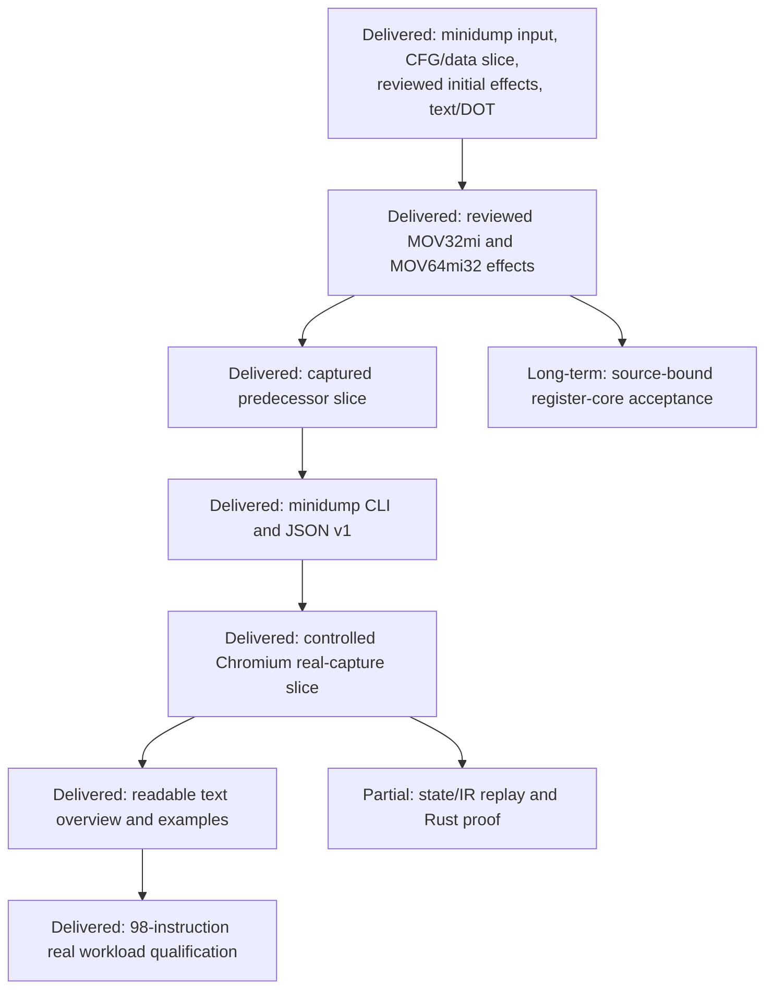

# Ariadne checkpoints

## Context and follow-up

**Status.** Chronological record; earlier entries describe their own dates.

**Why this document exists.** [Roadmap](ROADMAP.md) defines the stages whose progress is recorded here.

**What this document establishes.** This chronology records what was delivered, which checks were exercised and what was still open at each checkpoint. The latest scope decision supersedes earlier project commitments.

**Where to go next.**

- [Plan index](Plans/README.md) — identifies what is still open after the recorded deliveries.
- [Evidence guide](evidence/Ariadne/README.md) — explains how to interpret retained results without treating them as fresh qualification.

**What remains unresolved.** These results apply to the recorded sources, backend and workload. They do not qualify the current checkout without fresh or exact-source-verified evidence. Retired ISA milestones in older entries are no longer active work.

For the wider context, see the optional [documentation map](docs/documentation-map.md).

Updated **2026-10-07**: I5b zero-base-plus-displacement has B0–B5 implemented and
qualified for its recorded finite source/fixture and controlled Windows tiers. The product intent
is debugging bugs at the machine-code level using captured instruction/context evidence.
Native BAP remains the CLI default, and controlled
Windows I5a is qualified under a read-only, hash-pinned MirrorRust dependency
snapshot. The latest retained records pass 20 Stage 2 gates, 17 investigation gates,
14 I5a source/fixture gates and both controlled capture modes. Active Windows
I4 is re-pinned and the native performance follow-up meets its fixed 2-second
CLI limit at 1,692.696 ms for the exact controlled query. BAP lifting stays trusted
and the independent ISA track retired.

## 2026-10-07 — Native I4 performance follow-up qualified

[D0–D3](Plans/i4-performance-implementation.md) are complete for the unchanged
98-start Windows fault-address explanation query. The normal native-default
release CLI measures **1,692.696 ms / 2,000 ms**, one warm-up/five measured repeats.
The separate 34-start Linux reference binding/explanation/rendering phase sum
is **182.924 ms / 250 ms**. The [validation guide](docs/Ariadne/i4-performance-validation.md)
records exact samples, backend/query identity and finite acceptance scope.

Decoder process reuse, native derived-flow and immutable response caches,
Rust validated-row/frame reuse and parallel streaming runtime hashing preserve
full observations, 216 model actions, possible origins and explicit uncertainty.
All 18 I5b, 20 native-core, 14 I5a and nested investigation/Stage 1 gates pass,
including affected native tests, replay, mutations, normal CLI and old-output
comparisons. No fixed budget, capture pin or source-bound Stage 2 design/plan
was changed.

Completion rechecks the existing campaign against current 712-source/12-tool
inventories and the sealed MirrorRust dependency identity. This is exact-source
verified reuse of the recorded tests, with a new archive/current-inventory audit;
it is not a second runtime campaign. The [retained manifest](evidence/Ariadne/i4-performance-evidence-manifest.json)
verifies all 3,625 archive entries and the nested 919-entry regression / 1,432-entry
core archives. Both earlier failed phase/timing attempts are retained separately.
Historical re-pin and I5 records remain byte-identical. Full I4 acceptance is
true for the recorded controlled capture/query; original Electron, general
latency, universal refinement and packaged-release qualification remain outside
this result.

## 2026-10-07 — I5b machine-code debugging question qualified

[B0–B5](Plans/i5b-zero-base-offset.md) are implemented and qualified for the
finite Windows AMD64 scalar MOV base/displacement profile. The
[validation guide](docs/Ariadne/i5b-validation.md) and
[aggregate](evidence/Ariadne/i5b-qualification.json) record **18/18 gates**, 57
independent fixtures plus one auxiliary call case, all 15 detected real-code
mutants, stable 294-source/11-tool inventories and separately passing partial/
full controlled Windows tiers under the sealed MirrorRust snapshot.

The debugger-facing answer binds exact captured opcode/bytes, encoded base and
signed displacement, valid fault-context base value, effective address and
reported inaccessible byte. Six real positive/refuted/indexed-unknown controls
are independently inspected against raw dump/context and supplied PE bytes.
Their largest CLI median is **900.772 ms / 1,500 ms**; largest binding/assessment/
all-format phase median is **1.422 ms / 10 ms**. All nine frozen fixture workloads
also pass. This supports the exact declared question, not historical null
provenance, executed paths, object lifetime or a general root cause.

All 246 old I5a assessment outputs and 24 old base/explanation reports remain
byte-exact. Refreshed I5a 14-gate, investigation/minidump/Stage E and native-core
20-gate regressions pass. The [new evidence manifest](evidence/Ariadne/i5b-evidence-manifest.json)
verifies 2,005 entries in the retained archive; [case pins](evidence/Ariadne/i5b-controlled-cases.json)
preserve exact per-capture identities/questions. Historical records and the
source-bound Stage 2 design/plan remain unchanged. I4's separate over-budget
Windows criterion and other I5/I6/I7 work remain open.

## 2026-10-07 — I5b hypothesis selected and detailed plan written

The user selected the zero-base-plus-offset hypothesis. The
[design](docs/Ariadne/i5b-zero-base-offset-design.md) scopes its first profile to
Windows AMD64 scalar MOV accesses with an encoded GPR base, no index and a
signed displacement. Its predicate is captured base zero and displacement
nonzero, distinct from I5a's zero effective address. The
[B0–B5 plan](Plans/i5b-zero-base-offset.md) gives source ownership, exact role/
expression agreement, independent fixtures, strict reports/CLI, mutation and
separate source/fixture/controlled-Windows acceptance criteria.

Source inspection found that affine BIL evidence loses encoded base/index roles,
while the existing bound question evidence does not retain those decoded roles.
The plan requires a new decoded-fact receipt during existing preparation and a
question-specific sealed binding. LLVM remains the independent decode reference;
BAP remains the semantic producer. Missing/conflicting prerequisites remain
unknown and no historical null provenance is asserted.

This is a documentation-only delivery. Every I5b implementation stage remains
pending. Existing qualification records retain their historical scope; no new
capture, runtime campaign, threshold change for I4/I5a or release claim is made.

## 2026-10-05 — Documentation and plan status synchronized

Current entry points, module guides, historical delivery contexts and plan
ledgers now agree with the implemented native-default pipeline and retained
evidence. The [plan index](Plans/README.md) separates remaining investigation
work from delivered native, foundation, capture and qualification plans. The
[documentation network](docs/documentation-map.md) links historical results
to their accepted successors without promoting old failed flags.

Stale descriptions of unstarted Stage 2, Rust-owned production minidump analysis
and the lost Electron dump as an active I4 prerequisite are superseded. Current
usage names the BAP workload v4 / aggregate v5 schemas and the separate I4 v3
workload schema, bundled inputs and exact-copy environment overrides. Historical
reference-decoding phase timings are labeled as evidence for their earlier
pipeline, not a diagnosis of the current native I4 performance failure.

The [I4 plan](Plans/i4-windows-repin.md#remaining-i4-performance-qualification)
now gives the remaining measured-diagnosis and fixed-budget qualification steps.
The active result remains 17 passing correctness gates and **4,774.451 ms**
against **2,000 ms**, so full I4 acceptance is false. Native core 20-gate and
I5a 14-gate/controlled-capture records retain their separate passing scope.

This synchronization changes Markdown only. Source/tool/dependency inventories
and retained archive contents are checked against the existing records; the
source-bound Stage 2 contract/execution-plan bytes and historical evidence
remain unchanged. Navigation/context and whitespace checks pass. No new
runtime campaign, optimization, threshold change or release claim is recorded.

## 2026-10-05 — Windows I4 re-pinned; correctness passes, CLI over budget

The user authorized replacing the unavailable original Electron capture. The
[completed plan](Plans/i4-windows-repin.md) and
[delivery guide](docs/Ariadne/i4-windows-repin-validation.md) bind the existing
independently inspected real Windows AMD64 Crashpad capture with 98 instruction
starts. The new active I4 case uses entry `0x00007ff7382f4840`, fault/seed
`0x00007ff7382f49b4`, producer `0x00007ff7382f49b1` and access index zero.
The original manifest and older records remain unchanged historical evidence.

All 17 investigation gates pass. Five native-default explanation-CLI samples
after warm-up yield **4,774.451 ms**, exceeding the unchanged **2,000 ms** ceiling.
Re-pin and correctness succeed; `fullI4RealCaptureAcceptance=false` remains an
explicit performance failure. BAP's unlimited timing policy does not waive I4.
The [I4 record](evidence/Ariadne/i4-windows-repin-validation.json) and verified
865-entry archive retain source/tool identities, exact samples and reports.

The complete source refresh passes 20 core gates with 632 stable sources and
1,355 verified archive entries. Native I5a passes 14 gates with 216 sources; both
controlled capture modes pass the unchanged 1,500 ms CLI / 10 ms phase criteria
(partial 869.642 / 1.067 ms; full 873.537 / 1.032 ms). Its archive verifies 1,969
entries. Both use the same read-only dependency snapshot. Previous accepted
[core](evidence/Ariadne/bap-core-history/2026-10-05-before-i4-repin/bap-core-qualification.json)
and [I5a](evidence/Ariadne/i5a-native-history/2026-10-05-before-i4-repin/i5a-native-evidence-manifest.json)
bundles are preserved byte-for-byte before the source refresh.

## 2026-10-05 — Dependency isolation repairs and native I5a accepted

The [native qualification plan](Plans/i5a-native-qualification.md) is complete
for its recorded scope. Live MirrorRust edits first invalidated dependency hashes
and formatting. Formatting-only changes repaired the immediate failure, but
continued edits required an isolated dependency view. The new
[snapshot wrapper](tools/with_mirrorrust_snapshot.py) captures all non-ignored
worktree inputs, formats the copy, and mounts it read-only at the normal dependency
path. Manifest hashes and mount/source checks bind every qualification record;
reuse across snapshots is rejected. The live checkout remains editable.

All **183 Python qualification tests** pass. The final aggregates pass
**20/20 Stage 2**, **17/17 investigation**, and **14/14 I5a** gates with current
source/tool identities under the selected snapshot. The native 41-case corpus,
16 I5a mutants, default/reference comparisons and both controlled modes pass.
No production performance patch or timing-budget change was needed.

| Controlled capture | Assessment CLI median | Native phase median | Fixed criteria |
| --- | ---: | ---: | --- |
| Partial | 811.713 ms | 1.014 ms | 1,500 ms CLI / 10 ms phases: pass |
| Full | 843.215 ms | 1.108 ms | 1,500 ms CLI / 10 ms phases: pass |

```mermaid
flowchart LR
  A["Live dependency edits invalidate evidence"] --> B["Format and seal dependency snapshot"]
  B --> C["20 / 17 / 14 aggregate gates pass"]
  C --> D["Partial and full captures meet both budgets"]
  D --> E["Source-bound archives verified; original I4 remains separate"]
```

The [qualification guide](docs/Ariadne/i5a-native-qualification.md),
[fixture record](evidence/Ariadne/i5a-native-history/2026-10-05-before-i4-repin/i5a-native-fixture-validation.json) and
[controlled record](evidence/Ariadne/i5a-native-history/2026-10-05-before-i4-repin/i5a-native-controlled-validation.json)
keep the tiers separate. The native I5a archive verifies **1,894 entries** and
211 source hashes. The refreshed Stage 2 archive verifies **1,350 entries** and
627 Ariadne sources, and retains the complete dependency snapshot manifest.
The earlier rejected progress archive and the
[original adoption record](evidence/Ariadne/bap-core-history/2026-10-04-adoption/bap-core-qualification.json)
remain byte-identical historical evidence. Original-Windows I4, packaged release,
broader hypotheses and universal refinement are not credited by this result.

## 2026-10-04 — Native I5a measurements pass; aggregate refresh blocked

This earlier block is resolved by the [2026-10-05 native qualification](docs/Ariadne/i5a-native-qualification.md). The following numbers and failed decisions retain their historical meaning.

The [native qualification plan](Plans/i5a-native-qualification.md) now has a
completed-native-analysis phase benchmark, exact backend/query/build receipts,
current source/tool inventories and historical capture-provenance checks.
Twelve native contract controls and 28 controlled-capture controls pass. The
native corpus exercises all 41 independent cases; all sixteen I5a mutants are
detected. No production performance change was needed.

Nine measured fixtures pass the unchanged 1,500 ms CLI and 10 ms incremental
phase criteria. The retained Windows partial/full diagnostic CLI medians are
**804.201 / 811.943 ms**; their native phase medians are **0.967 / 0.994 ms**.
These diagnostics do not constitute controlled-case acceptance.

The [progress record](evidence/Ariadne/i5a-native-progress/progress.json) keeps
the failed decisions explicit. The first Stage 2 refresh passed all twenty
component gates but rejected final tool stability after the sibling MirrorRust
sources changed. A rerun then failed `cargo fmt --all -- --check` in that
dependency. Investigation passed **16/17** gates; I5a passed **12/14**, with
formatting and the resulting nonpassing investigation prerequisite unresolved.
Further MirrorRust changes also invalidate reuse of the completed Stage E
dependency inventory. Ariadne's 626 aggregate source hashes remained stable.

```mermaid
flowchart LR
  A["Native benchmark and qualification tooling"] --> B["9 fixture measurements; 16 mutants pass"]
  B --> C["Partial/full Windows diagnostics meet both budgets"]
  C --> D["Aggregate blocked: MirrorRust changes and formatting"]
  D --> E["Next: stable dependency, fresh gates, controlled acceptance"]
```

The [qualification guide](docs/Ariadne/i5a-native-qualification.md) gives the
retained samples and resumption sequence. Finish the independent MirrorRust
work and its formatting, then refresh Stage 2/Stage E and investigation, run the
fourteen I5a gates, and finally run controlled partial/full qualification with
the passing native v2 fixture record. Preserve the older accepted records and
these rejected attempts; do not rebind their hashes or promote their flags.

## 2026-10-04 — Complete native Stage 2 qualified and adopted

The [execution plan](Plans/bap-stage2-implementation.md) delivers native recovery,
reaching definitions, slicing, finite stateflow, capture-bound integration and
real generated helper replay. The explicit-native candidate passed 19 gates
before adoption. The final run passes **20/20 gates**, including all root checks,
native tests, complete Stage 1/Stage E regressions, default selection and explicit
Rust rollback across five captured workloads.

```mermaid
flowchart LR
  A["2026-10-03: A0 foundation qualified"] --> B["2026-10-04: A1–A5 implemented"]
  B --> C["Explicit native candidate: 19/19 gates"]
  C --> D["Native default and rollback: 20/20 gates"]
  D --> E["623 source hashes; 1,345 archive entries verified"]
```

The [qualification guide](docs/Ariadne/bap-core-qualification.md) and
[record](evidence/Ariadne/bap-core-history/2026-10-04-adoption/bap-core-qualification.json) bind 44 generated traces
and 330 observations, twelve detected native algorithm mutations, boundary
controls and five release workloads. `stage2Qualified`, `defaultNativeVerified`
and `sourcesStable` are true. The [archive manifest](evidence/Ariadne/bap-core-history/2026-10-04-adoption/bap-core-evidence-manifest.json)
verifies all 1,345 entries, including a smoke check with no backend or helper-path
override against the exact final release executable.

The pinned 98-start Windows median is **4,901.01 ms native / 2,820.26 ms Rust**.
All JSON/text/DOT comparisons pass under the accepted unlimited timing policy.
This is Linux-hosted, workspace-local qualification with Windows and Linux
capture inputs; packaged release, universal refinement, ISA proof and separate
I4/I5a acceptance are not credited by this result.

## 2026-10-03 — OCaml recovery foundation qualified

The [OCaml qualification plan](Plans/bap-ocaml-qualification.md) now has a
workspace-local OCaml 4.12.1/BAP SDK, a standalone helper and Rust process
transport. The helper owns complete recovery input admission, actual Init/Visit
state and BAP term attribution. Its capabilities stop at Visit, observe and reset;
production analysis remains Rust.

Six explicit native test groups pass, and seven real-code mutations are detected
without observer changes. Two clean helper builds have identical hashes. SDK
library/compiler/lock substitutions and native protocol failures are rejected.
The [qualification guide](docs/Ariadne/bap-ocaml-qualification.md) records the
source-bound final decision: 199 stable source hashes and 327 verified archive
entries. Full A0 exit now passes after the user-approved formatting-only
MirrorRust change and fresh root, effects, minidump, Stage E, Stage 1 and A0
checks. All required gates pass; `a0ExitPassed=true` and `stage2Qualified=false`. Complete A1–A6 is not credited by this bootstrap.

## 2026-10-03 — Stage 2 A0 started

Created the [Stage 2 analysis contract](docs/Ariadne/bap-analysis-core-design.md)
and [A0 execution plan](Plans/bap-stage2-a0.md). They define immutable inputs,
BAP-owned state, strict session/action envelopes, independent recovery/stateflow
observations, full-width addresses and one-to-many BIR attribution. Production
analysis remains on the existing Rust core.

Seven envelope/attribution tests pass. Two fresh native probes against the pinned
BAP runtime confirm persistent graph/term state and unsigned address attribution.
They also show that two labels on identical TID endpoints collapse to one edge;
the analysis must retain its typed parallel-edge relation separately.

The [A0 record](evidence/Ariadne/bap-stage2-a0-validation.json) binds 15 source/design
files and tool identities. Its `passed` covers these bounded checks;
`a0ExitPassed=false` and `stage2Qualified=false`. The installed extraction has no
OCaml SDK `.cmi`/`.cmxa` files, so a compatible isolated SDK and real custom-pass
initialize/observe qualification are next. No recovery/dataflow/stateflow pass,
model replay or mutation acceptance is claimed. See the
[validation guide](docs/Ariadne/bap-stage2-a0-validation.md) and
[25-entry evidence archive](evidence/Ariadne/bap-stage2-a0-evidence-manifest.json).

## 2026-10-03 — BAP latency acceptance changed to unlimited

Applied the user's explicit request to remove the BAP Windows workload timing
limit. The active pin now records a null budget and an explicit unlimited policy;
workload v4 and aggregate v5 retain finite raw samples and every correctness,
provenance, artifact and source/tool check. The capture/query/bundle are unchanged.

All **60 controlled tests** and **17 implementation gates** pass, with **178
stable source hashes**. Fresh native and workload runs are retained; unchanged
model/mutation and Stage E evidence was reused after complete identity checks.
The new Windows CLI median is **3,111.33 ms**, recorded without a ceiling.
Full Stage 1 exit and the Stage 2 prerequisite now pass under the new policy;
Stage 2 implementation remains unstarted. Operational watchdogs remain separate.

See the [policy and validation](docs/Ariadne/bap-unlimited-validation.md),
[source-bound record](evidence/Ariadne/bap-unlimited-validation.json) and
[evidence manifest](evidence/Ariadne/bap-unlimited-evidence-manifest.json).
Earlier bounded-policy results below remain historical. Changes are uncommitted.

## 2026-10-03 — Controlled Windows workload generated and repinned

After the user confirmed that the original Windows dump no longer exists,
completed the [replacement plan](Plans/bap-windows-repin.md). A native Windows
`crashpad-nzsn` process generated a **217,936-byte** partial dump from a controlled
98-instruction checksum/loop/branch workload. Independent byte, input/checksum,
process/module and exception/context inspection passes. The original null-write
profile also passes its capture regression; uploads remain disabled.

The [new BAP pin](evidence/Ariadne/bap-windows-workload-case.json) and
[23-entry input bundle](evidence/Ariadne/bap-windows-workload-inputs.tar.gz) retain
the capture, matching executable and independent witnesses. The historical
Priority 4 manifest and I4 requirement remain unchanged.

Fresh validation passes **17/17 implementation gates**, **178 stable aggregate
source hashes**, **59 controlled workload tests** and **9 inspector tests**.
The Windows query recovers **98 starts, 99 edges, a 90-instruction slice and zero
obligations**, with its RCX producer independently witnessed. Model/mutation and
Stage E components were reused only after complete source/tool checks.

The release CLI median is **10,667.76 ms** against **2,000 ms**. Phase medians
identify reference decoding at **7,572.13 ms** and core analysis at **69.61 ms**;
no optimization is included. Capture/pin delivery is complete, while full Stage 1
and the Stage 2 prerequisite remain false due to latency. Stage 2 is unstarted.
The [delivery guide](docs/Ariadne/bap-windows-repin-validation.md),
[source-bound record](evidence/Ariadne/bap-windows-repin-validation.json) and
[199-entry derived archive](evidence/Ariadne/bap-windows-repin-evidence-manifest.json)
retain exact results and timing limitations. Changes remain uncommitted.

## 2026-10-03 — BAP workload qualification repair and source refresh

Completed R0–R2 of the [BAP plan](Plans/bap-integration.md). The Linux workload
runner now preserves its source inventory through the Windows-input branch,
requires captured preparation evidence for every decoded address and retains
raw release samples. Workload v2 and aggregate v3 validate the evidence and
require complete source/tool inventories. Full-exit and Stage 2 prerequisite
decisions require the original Windows workload's median at most 2,000 ms.

The [current record](evidence/Ariadne/bap-windows-workload-validation.json)
passes all **17 implementation gates** with **177 stable source hashes**:
39 controlled Python tests, native corpus/integration, eight model cases with
99 matched states across all nine fields, 16 detected mutations and four
available release workloads. Stage E's 12-gate record was reused after verifying
all 315 source entries and its native IR/MC/Graphviz hashes. The final aggregate
also reran native rendering after repairing its Graphviz environment.

Both real Windows demo captures pass supplemental Linux BAP benchmark queries.
They each decode two instructions and do not replace the original 98-instruction
capture, which bounded searches did not locate. `stage1ExitPassed`,
`stage2PrerequisiteSatisfied` and `defaultPromotionEligible` remain **false**;
Stage 2 A0–A6 remain unstarted. See the [delivery guide](docs/Ariadne/bap-windows-workload-validation.md)
and [238-entry archive manifest](evidence/Ariadne/bap-windows-workload-evidence-manifest.json).
Changes remain uncommitted.

## 2026-10-03 — Native Windows Crashpad demo captures

Integrated `crashpad-nzsn` at `7a884c25` into a [small demo](native/crashpad-demo/README.md)
and built it with native Windows tools. The original fork checkout stayed clean;
recorded standalone compatibility files and a build-helper adjustment live in an
isolated build. The demo disables uploads and deliberately faults only after
synchronous handler registration and a flushed witness.

Partial and full capture produced **225,408-byte** and **15,987,422-byte** real
minidumps. Independent checks match process identity, exception/context, module
and executable bytes. Both capture `mov dword ptr [rcx], 5` with `RCX=0`, and
Ariadne returns `consistent_with_evidence` at address zero without assessment gaps.
Missing-handler and invalid-mode controls exit before the deliberate crash.

The capture-input gap is resolved for this controlled case. Its phase medians are
under 2 ms, but CLI medians are approximately **1.82 s**, exceeding the unchanged
**1.5 s** I5a condition. Controlled-case acceptance therefore remains partial;
the original Windows I4 artifact/query also remains separate and unexercised.
See the [delivery guide](docs/Ariadne/crashpad-demo-validation.md) and
[retained record](evidence/Ariadne/crashpad-demo-validation.json). Raw dumps remain
under ignored `tmp/crashpad-demo/20261003/`; changes are uncommitted.

## 2026-10-03 — I5a zero-address source/fixture delivery

Implemented the [I5a plan](Plans/i5a-zero-address.md): immutable exception/context
evidence, exact query binding, a bounded Windows AMD64 scalar MOV zero-address
assessment, strict independent reports and explicit CLI modes. The question adds
a seed without becoming a discovery root; numeric conclusions retain their
capture/lifting premises and do not assert a root cause or historical path.

All 12 acceptance gates pass with 171 stable source hashes, including fresh
17-gate investigation, 12-gate Stage E and 11-gate minidump regressions. The new
41-case independent corpus covers six MOV forms; all 16 I5a mutants are detected,
and 24 prior CLI reports remain byte-identical. Stage E retains 64 complete
traces, 326 matched observations and 15 detected model mutants.

Nine measured fixtures meet the frozen I5a criteria: combined phase medians are
0.86–1.80 ms against 10 ms, and assessment CLI medians are 755–1,180 ms against
1,500 ms. The existing Linux explanation phase remains within its separate
250 ms condition. See the [delivery record](docs/Ariadne/i5a-validation.md),
[source-bound acceptance](evidence/Ariadne/i5a-validation.json) and
[verified archive manifest](evidence/Ariadne/i5a-evidence-manifest.json).

Controlled real Windows I5a and original-Windows I4 acceptance remain false;
neither fixtures nor the retained Linux case replaces those missing artifacts.
Broader hypotheses and I6–I7 remain separate work. These changes are uncommitted.

## 2026-10-02 — Investigation correctness repairs

Implemented the [qualification and truncation repairs](docs/Ariadne/investigation-correctness-validation.md):
full Windows I4 acceptance now requires valid bound explanation-CLI samples with
a median at most 2,000 ms, and exhausted explanation budgets return structurally
valid partial/unavailable answers. Strict validators and normal query outputs
remain intact.

Fresh validation passed all 17 investigation gates with 123 stable source hashes,
including 12 nested Stage E gates and 11 minidump gates. All 13 investigation
mutants and two controlled Python decision mutants were detected. Default-output
comparison preserved 24 reports byte-for-byte. The retained Linux explanation
phase measured about 159 ms against the unchanged 250 ms condition.

The [source-bound record](evidence/Ariadne/investigation-correctness-validation.json)
and associated archive retain the exercised evidence. Full original-Windows I4
acceptance remains false because its pinned capture is unavailable. The
[completed fix plan](Plans/completed/investigation-correctness-fixes.md) covers
these repairs, not later investigation capabilities or BAP core migration.

## 2026-10-02 — Independent ISA proof track retired

Removed register-core acceptance dependencies from the B/C/E/F, Stage E and BAP
qualification runners. Active checks retain native integration, model replay,
mutation sensitivity and workload conditions. Historical ISA sources, tools and
records remain in place; their documentation is marked retired. Analysis-level
formal models and the manual lockfile used by effects provenance remain.

This scope change does not refresh retained qualification records or waive the
missing original Windows capture. Three focused tests cover eleven controlled
runner executions and the effects source inventory; see the
[retirement validation](docs/Ariadne/semantic-assurance.md#retirement-validation).
Full native/formal campaigns were not rerun for this orchestration change.

```mermaid
flowchart TD
    A["2026-09-17 · 18d2a91<br/>Snapshot-scoped virtual-address contract"]
    B["2026-09-19 · f7b8b50<br/>Extended formal models and semantic types"]
    C["2026-09-19 · 62d7c57<br/>Rust analysis core and generated MBT bindings"]
    D["2026-09-20 · bd54f7a<br/>Initial x86-64 instruction-semantics specification"]
    E["2026-09-22 · 9a21901<br/>AMD64 foundations and scoped user64 acceptance gates"]
    F["2026-09-24 · 6fbfbd9<br/>Staged delivery roadmap"]
    G["2026-09-24 · fb7f142<br/>Pinned LLVM MC byte-span adapter"]
    H["2026-09-26 · aee833f<br/>Structured operands and reviewed conservative effects"]
    I["2026-09-26 · 712a635<br/>Windows/Linux AMD64 minidump input"]
    J["2026-09-27 · a9dc41a<br/>Text and Graphviz outcome rendering"]
    K["2026-09-28 23:08 CST · plan baseline<br/>Remaining implementation stages A–F"]
    L["2026-09-28 23:49 CST · validation<br/>Stage A MOV memory-immediate effects"]
    M["2026-09-29 07:26 CST · handoff<br/>Stage A delivered; Stage B next"]
    N["2026-09-29 10:16 CST · working tree<br/>B/C delivered; D pending; E/F partial"]
    O["2026-09-29 13:43 CST · working tree<br/>D0–D3 bounded evidence; 0/49 accepted"]
    P["2026-09-29 14:11 CST · decision<br/>D formal gate long term; practical queue separate"]
    Q["2026-09-29 17:27 CST · working tree<br/>Priority 1 real Chromium capture qualified"]
    R["2026-09-29 23:29 CST · working tree<br/>P2 no-change; P3 delivered; P4 measured partial"]
    S["2026-09-30 00:13 CST · source-bound<br/>19/19 integration gates; D source hashes unchanged"]
    T["2026-10-01 · working tree<br/>518ed9e · Stage E typed MirrorRust ports; two-fixture replay"]
    A --> B --> C --> D --> E --> F --> G --> H --> I --> J --> K --> L --> M --> N --> O --> P --> Q --> R --> S
    U["2026-10-01 · source-bound working tree<br/>Stage E complete: generated replay, mutations, reports/CLI"]
    V["2026-10-01 · working tree<br/>BAP Stage 1 implemented; Windows acceptance still required"]
    W["2026-10-01 · working tree<br/>LLVM semantic backend removed; BAP-only default"]
    X["2026-10-01 · 25e59f3<br/>Typed fault-address investigation"]
    Y["2026-10-02 · working tree<br/>One Cargo package; src/tests/target layout"]
    Z["2026-10-02 · c9eb4c5<br/>Investigation qualification/truncation repairs"]
    AA["2026-10-03 · working tree<br/>I5a source/fixture tier: 12/12 gates"]
    AB["2026-10-03 · working tree<br/>Windows Crashpad demo captures; I5a CLI over budget"]
    S --> T --> U --> V --> W --> X --> Y --> Z --> AA --> AB
```

## 2026-10-02 — Rust source layout consolidated

The [layout delivery](docs/Ariadne/rust-source-layout.md) follows the
[source-layout plan](Plans/completed/rust-source-layout.md): all 86 Rust files live under
`src/` or `tests/`, with one root Cargo manifest/lockfile and root `target/`.
Default builds provide both CLIs. Benchmarks and MirrorRust replay use optional
features; core-only builds retain no activated external crate dependencies.

Thirty report/explanation outputs match the prior executables byte-for-byte.
Generated bindings and capture/IR fixtures retain their original bytes. Replay
and mutation builds use isolated root `target/` subdirectories, and CLI
measurement/test builds use the default production feature set. The
[source-bound record](evidence/Ariadne/rust-source-layout-validation.json) retains
the exercised regression tier; the original Windows I4 capture is still absent.
The root Lean/formal files and core engine/model source remain unchanged.
Validation was retained before the user-authorized publication.

## 2026-10-01 — First investigation question

The [I0–I4 plan](Plans/investigation-layer.md) now has an implemented bound
fault-address explanation module, typed BIL address evidence, exact query binding,
CLI question and strict reports. The
[source-bound first-delivery record](evidence/Ariadne/investigation-validation.json)
passes **16 gates**, including the full **12-gate Stage E regression**, and
**11 new actual investigation/producer mutants**. Both platform fixtures and the
pinned controlled Chromium/Linux capture retain expected producer evidence.

The [validation report](docs/Ariadne/investigation-validation.md) records about
153 ms incremental explanation-phase median on the 34-site real query, under
the frozen 250 ms condition. Answers retain alternatives and explicit evidence
requirements; no executed history, UAF or general root-cause proof is inferred.
Full original-Windows I4/2,000 ms qualification remains partial. I5–I7 and BAP
Stage 2 remain unimplemented; Stage D stays 0/49. Validation was retained before
the user-authorized publication.

## 2026-10-01 — LLVM semantic backend removed

Following the user's removal instruction, BAP is the sole semantic producer for
normal minidump CLI/library preparation. The semantic selector and automatic
LLVM effect fallback are removed. LLVM MC remains an independent decoded-fact
reference, with no production uses/defs/rules from its legacy semantic layer.
Historical effect-rule research and the separate supplied LLVM IR path remain.
The [removal plan](Plans/completed/bap-only-semantics.md) and
[current record](evidence/Ariadne/bap-only-removal-validation.json) identify the scope.

All **16 removal gates** pass against **93 stable current hashes**, including
**12 Stage E regression gates**, **99 model observations** and **16 producer/adapter
mutants**. BIL-only immediate-store coverage preserves both platform producer
fixtures; partial-register self-move definitions remain explicit. The retained
real Linux query still has 34 decoded instructions, 45 edges and a 28-site slice.
The [validation report](docs/Ariadne/bap-only-removal-validation.md) records
remaining gaps and workload samples.

The explicit default change does not complete the missing original Windows
98-instruction qualification or its 2,000 ms condition. Stage 2 remains
unstarted and unqualified; Stage D remains **0/49**. Validation was retained
before the user-authorized commit.

## 2026-10-01 — BAP Stage 1 implementation

The [BAP integration plan](Plans/bap-integration.md) now has an optional semantic
backend feeding the existing Rust core. A hash-pinned isolated BAP helper,
strict Rust transport, conservative BIL projection, shared captured-preparation
seam, CLI selector and per-site reports are implemented. LLVM remains default.

The [current record](evidence/Ariadne/bap-stage1-validation.json) passes all
**16 implementation gates** with **92 stable source hashes**. Its finite corpus
contains 34 native BIL cases and 23 admitted opcode forms. Independent model
replay compares all nine fields for **99 observations**, all **15 producer/adapter
mutants** are detected, and a fresh **12-gate Stage E regression** passes.
Release workload evidence shows a controlled NOT coverage gain and preserves
the real 34-site Linux analysis, at a measured median cost of about 645 ms.

**Stage 1's exit remains partial:** fresh BAP acceptance and timing on the
original hash-pinned 98-instruction Windows capture are unavailable. The
[historical BAP Stage 1 validation record](evidence/Ariadne/bap-stage1-validation.json) identifies the missing
S4/S5 clause and rerun command. The 2,000 ms default-promotion target is preserved.
Stage 2 remains unstarted and unqualified; Stage D stays **0/49**. These Stage 1
implementation changes are uncommitted.

## 2026-10-01 — Stage E completion

The [completion plan](Plans/completed/stage-e-completion.md) is delivered within its
finite conformance/report acceptance scope. The
[source-bound completion record](evidence/Ariadne/stage-e-completion-validation.json)
passes **12/12 gates** with stable source hashes. Its 16 machine-state and
16 IR inputs cover joins, loops, empty/multiple roots and seeds, sparse/full-width
addresses, equal-valued IDs, terminal alternatives, phi inputs, memory/call
uncertainty and native text/bitcode. Repeated negotiated replay matches
**64 complete traces and 326 observations**. All **15 mechanical engine mutants**
fail as genuine model mismatches through unchanged observers/bindings.

The optional minidump `--stateflow-input` handoff retains full recovery and
preparation evidence, while the separate native IR CLI verifies owned artifacts
before analysis. Their versioned text/DOT/JSON reports preserve identity,
uncertainty and model-relative feasibility. Both command paths are checked
with Graphviz. The existing minidump regression/mutation record passes and
is reused only after an exact source-hash check; its isolated copies now include
the new report-crate dependency.

**Stage E is complete at this recorded tier.** Supplied transition relations
and completeness assertions remain premises. The 0/49 Stage D instruction-step
gate and universal Stage F Rust refinement remain open. Changes after `518ed9e`
are currently uncommitted; no new ISA or historical-execution claim is made.

## 2026-10-01 — First Stage E MirrorRust integration

The separate [Stage E harness](mbt/stage-e/README.md) now uses the sibling
`~/Repos/MirrorRust` client through two compiler-generated typed ports.
Deferred factories preserve exact-digest admission before port construction.
Four complete fixture traces (the existing machine-state and LLVM IR examples
each replayed twice) matched all 20 observations, including their declared
derived result views. Both wrong-digest checks rejected before any factory,
initialization or observation. Three projection tests, four Rust binding tests,
formatting and Clippy passed. The core harness was repaired for MirrorRust's
`NegotiatedError` API and passed its existing 12 traces, 168 matched states,
wrong-digest rejection and five engine mutation checks.

The [retained source-bound record](evidence/Ariadne/stage-e-mirrorrust-integration-validation.json)
pins client, SUT, oracle and generated artifacts. The
[first-stage implementation plan](Plans/completed/stage-e-mirrorrust-integration.md) is
complete. Broader generated scenarios, Stage E engine mutants,
recovery/native-adapter handoff coverage and report/CLI integration remain
open; **Stage E is still partial**. No fresh 19-component overall integration
result or universal Rust-refinement claim is made by this checkpoint.

The subsequent [installed ModelMirrors compatibility check](docs/Ariadne/installed-modelmirrors-compatibility.md)
passes all 11 runtime checks: the 168 core states, 20 Stage E observations,
three pre-factory digest rejections and five expected core mutation mismatches.
The actual installed binary is hash-bound; it prints `Mirrors 0.0.3`, while
`v0.0.3.1` names the local source tag. Exact clean-tag build provenance remains
unverified because the installed binary differs from the dirty checkout's build.

## 2026-09-30 — Priority 4 qualification and measured optimization

The [qualified Windows Electron workload](docs/Ariadne/priority-4-performance-validation.md)
has 98 captured decoded instructions, 113 edges and a 19-node predecessor
slice. A matching PE runtime-function entry and 101 forward byte matches
anchor the query independently of RIP. Eight exact control-only bindings
retain fully opaque effects. The private predecessor cache and checked native
helper reduce CLI median from 3,845.7 to 1,787.6 ms, meeting the fixed 2,000 ms
median budget. The measured range is 1,680.0–2,450.0 ms; no worst-case bound is
claimed. All five synthetic families complete at 128, 256 and 512 nodes.

All 277 visible actions match the frozen scanning reference, as do transitions
on 256 generated requests. Text, DOT and JSON hashes are byte-identical across
the performance checkpoints. The [integration record](evidence/Ariadne/current-integration-validation.json)
has 19 passing components and 93 stable source hashes, including the fresh
11-component minidump gate, native Windows/Linux matrix, MBT replay and
mutation gates. It retains the rerun of an interrupted generated test artifact.
Practical Priority 4 is delivered for this query. Formal instruction-step
acceptance, the Rust refinement proof and Stage E generated replay remain open.

## 2026-09-30 00:13 CST — historical integration checkpoint

The integration report at that checkpoint
passed all 19 B/C/E/F gates with **89 stable source hashes**, including the
11-gate nested minidump acceptance, root and IR tests, formal fixtures and
the now explicitly selected original benchmark binary. The required
register-core gate returned its expected **pending 0/49** result. The
retained [Stage D component record](evidence/Ariadne/stage-d-progress-validation.json)
matched all **242 source hashes** at that checkpoint; it remains a component
checkpoint, not accepted instruction steps. A redundant Stage D rerun passed
its first observation, AMD64 component and mutation checks before it was
stopped; that incomplete run is not counted as a new acceptance result.

## 2026-09-29 23:29 CST — practical priorities 2–4

The [Priority 2 review](docs/Ariadne/priority-2-effects-validation.md)
found no exact source-reviewable instruction effect needed to reach the
possible address producer in the first real Chromium case. Seven pre-seed
calls remain deliberately opaque; no ABI preservation or instruction-step
claim was added. [Priority 3](docs/Ariadne/priority-3-presentation-validation.md)
delivers a readable instruction overview and reproducible Linux/Windows CLI
examples. The controlled real case retained byte-identical JSON and DOT
outputs after this text-only change.

[Priority 4 measurements](docs/Ariadne/priority-4-performance-validation.md)
put the 34-node real query at a 1,299 ms median against a predeclared
2,000 ms local budget. Five-repeat 128/256-node synthetic measurements passed;
the 512-node suite hit its 180-second bound. No production optimization was
made. The required 64-node real workload is still missing, so performance
qualification remains open. The integrated minidump gate passed 11/11
components with 57 stable source hashes; the real-capture replay and
benchmark each retained 28 stable source hashes. The raw real dump remains
ignored and external to tracked files.

## 2026-09-29 17:27 CST — Priority 1 real-capture acceptance

The [controlled Chromium/Linux case](docs/Ariadne/priority-1-real-capture-validation.md)
uses an exact matching-build function symbol and forward decoding to select a
captured instruction boundary 125 bytes before the exception RIP. Ariadne
decoded 34 starts and retained a 28-node possible data slice; a reviewed RBX
load is a possible address producer for the faulting memory read. Opaque
calls and a later unsupported control remain visible. The
[source-bound record](evidence/Ariadne/priority-1-validation.json) contains a
passing focused gate, three negative controls and all 11 passing minidump
regression gates with stable sources. The raw dump stays in ignored local
`tmp/priority1/`; no PE/ELF reader, historical execution claim or formal
case acceptance was added. Priorities 2–4 remain open.

## 2026-09-29 14:11 CST — assurance priorities

The [assurance decision](docs/Ariadne/practical-assurance-priorities.md)
places the unchanged **49-case Stage D acceptance gate** in the long-term
formal research track. It remains **0/49**; no profile, form, coverage ledger,
fallback or checker rule was weakened or promoted. Practical Windows/Linux
minidump investigation continues with exact source-reviewed conservative
effects and explicit unknowns.

The next practical work is to qualify a representative **historical captured
predecessor slice** beyond the tool-produced fixture, add only effect rules
that block such real paths, improve investigator presentation/release examples,
and measure larger captures before optimizing. Stage E result integration and
universal Rust refinement are separate work, not prerequisites for the
current minidump CLI. This is a planning/status change; no new acceptance test
or implementation behavior is claimed.

## 2026-09-29 13:43 CST — Stage D first-case progress

The [ISA-track retirement decision](docs/Ariadne/semantic-assurance.md)
has begun. The source-bound [historical Stage D validation record](evidence/Ariadne/stage-d-progress-validation.json)
pins the first `MOV reg64, imm32` form and profile hashes, checks LLVM 20.1.2
payload observations under Windows/Linux targets, and adds TLA+/Lean fixtures
for a CPL-3 body, assumed fallthrough, LOCK #UD rollback witness and finite
RAX-byte-cell projection. Nine deliberate semantic mutations were rejected.

The default AMD64 suite passed 70 Apalache typechecks, 33 TLC configurations,
73 Lean build jobs, the combined axiom audit and 50 Python integrity tests on
stable sources. Fifteen native effects tests also passed. The
[Stage D validation report](evidence/Ariadne/stage-d-progress-validation.json)
records **242 stable source hashes**. The required `register-core` gate still
reports **0/49 accepted** because the complete case-specific boundary,
TLA+/Lean correspondence, general projection and coverage-ledger binding
remain open. E/F status from the prior checkpoint is unchanged. This working
tree has not been committed or pushed.

## 2026-09-29 10:16 CST — progress through Stage F

**Stage B delivered:** two hash-pinned, tool-produced Windows/Linux minidumps
capture an independently specified earlier entry and a crash-IP seed. Both
decode four nodes; the backward slice includes the RAX address producer and
seed, excludes the unrelated RCX write, and retains an opaque `RET64`
preparation gap. These fixtures prove a captured-byte analysis path, not a
historical crash execution. The two older Breakpad dumps remain separate
crash-IP regressions.

**Stage C delivered:** the supported minidump CLI emits text, Graphviz-parsed
DOT and JSON v1 from one frozen query, with artifact/source offsets, decoder
identity, operand/effect evidence, CFG, origins and typed uncertainty. It
rejects malformed or exhausted runs without publishing a complete report.
See the [B/C validation](docs/Ariadne/stage-b-c-validation.md).

**Stage D remains pending:** the default profile integrity check passes, but
the required `register-core` gate still rejects **0/49** verified cases; the
72 control/stack and 156 RAM cases also remain unaccepted. The
[historical user64 coverage ledger](Specs/AMD64/user64-coverage.json) records an exact
register-MOV candidate and its open instruction-step obligations. No ledger
status or source-form hash was promoted.

**Stage E is partial:** separate Rust machine-state and native LLVM IR paths
now pass their focused TLA+ fixtures, contract negatives, Apalache/TLC checks,
and LLVM 20.1.2 verifier-backed `.ll`/`.bc` tests. Generated model-based
replay of all observable fields and CLI integration remain open. **Stage F is
partial:** a [proof-boundary record and benchmark baseline](docs/Ariadne/stage-f-proof-and-performance.md)
measure loops, joins, calls, dense aliases and a pinned minidump; no universal
Rust refinement or solver optimization is claimed. The
[19-gate source-bound report](evidence/Ariadne/stage-b-f-validation.json) passed
with **83 stable source hashes**. This working-tree progress has not been
committed or pushed.

## 2026-09-29 07:26 CST — Stage A handoff

The reviewed memory-immediate MOV effects and source-bound Stage A validation
are the delivery baseline for this commit. Both pinned Linux/Windows minidumps
now decode their crash-IP instruction, while a captured predecessor path and
backward address-producer slice remain Stage B work. The evidence-linked CLI
and JSON output remain Stage C work. This handoff does not promote an AMD64
instruction-step case: `register-core` remains **0/49** verified and `ram-data`
remains **0/156** verified.

## 2026-09-28 23:49 CST — Stage A effect delivery

Implemented the exact `MOV32mi` and `MOV64mi32` memory-immediate effect rules.
The registry is now **139 LLVM opcode identities** under
`user64-effects-v1.1`. Both pinned Windows/Linux AMD64 dumps decode their
crash-IP instruction from captured bytes: the Linux fixture decodes one node,
the Windows fixture three. Each still has one later unresolved obligation;
neither run establishes earlier address producers or the actual faulting
store's commit behavior. That predecessor slice remains Stage B work.

The [Stage A validation](docs/Ariadne/stage-a-validation.md) records the pinned
AMD/LLVM source review, all eight passing source-bound acceptance gates,
ten rejected effect mutations, six rejected input mutations and the
unchanged 12-trace/168-state core MBT replay. The generic `AMD64-F-0503`
catalogue row still needs reviewed semantic binding before the memory form can
be accepted as an instruction step. The active profile remains **0/49**
verified `register-core` steps and **0/156** verified `ram-data` cases.
No source-form ledger, core engine or user64 profile was promoted. The
validation report below records the working-tree status at its own time point.

## 2026-09-28 23:08 CST — remaining implementation plan begins

This checkpoint starts the [current roadmap](ROADMAP.md)
from committed HEAD `a9dc41a`. The existing analyzer, LLVM MC adapter,
Windows/Linux AMD64 minidump reader, reviewed effect registry and text/DOT
renderer are delivered. No implementation or acceptance status changes at this
plan-start point; the only task edits are this checkpoint and the cross-linked
planning documents. Untracked editor/TLA+ caches remain outside delivery.

Two hash-pinned real minidumps still decode **zero** instructions at their
crash IPs because `MOV32mi` and `MOV64mi32` are outside the current reviewed
effect/control registry. The plan first reviews those exact memory alternatives,
then establishes a captured predecessor path to a decoded crash-IP slice,
and then produces an evidence-linked minidump CLI/report. Useful analysis from
those forms is distinct from source-bound ISA instruction-step acceptance.

The live `amd64-user64-v1` report at this checkpoint shows 49 paired
`register-core` bodies and **0/49 verified instruction steps**; the 72
control/stack and 156 RAM cases also have zero accepted steps. The accepted
no-trust unknown-instruction fallback remains in force. Formal case closure can
advance alongside the practical minidump path. The separate abstract-state
and supplied LLVM IR Rust machines, explicit Rust-refinement assurance and
measured scalability follow under their own gates. PE/ELF image and ELF core
readers remain deferred under the current input scope.

This entry records the plan baseline, not passing evidence for any of its six
future stages. The plan document defines each deliverable and acceptance test.

## Current delivery checkpoint

The Rust core recovers a local instruction-level CFG, computes may-reaching
definitions, and builds a backward data slice from an immutable, validated
request. Calls remain visible in the graph while local discovery and data flow
follow summary edges. Missing bytes, decode failures, and incomplete targets
remain explicit obligations.

The optional LLVM MC **20.1.2** adapter now connects caller-provided byte spans
to that core through `ByteSnapshot::to_request()`. It supplies instruction
lengths and conservative control-flow summaries, preserves captured-byte
precedence, requires explicit trust for dump/file fallback, and retains
unresolved indirect targets. The legacy `to_request()` interface treats every
successfully decoded instruction as reading/may-writing all caller-tracked
locations, with no must-writes. These summaries
do not certify precise architectural effects or verified instruction steps.

`ByteSnapshot::prepare()` now supplies reviewed normal-continuation summaries
for 139 exact LLVM opcode identities, byte-level register aliases, and per-site
evidence. Memory remains coarse and calls remain opaque. See the
[initial effects record](docs/Ariadne/operand-effects-validation.md) and
[Stage A validation](docs/Ariadne/stage-a-validation.md).

Windows/Linux AMD64 minidump input is delivered in [input/](docs/Ariadne/modules/input.md).
The Stage B predecessor fixtures and Stage C minidump CLI/JSON v1 are
delivered. PE/ELF image and ELF core readers remain deferred; broader effect
coverage, precise aliasing and annotated assembly remain pending.
Text and Graphviz DOT rendering remains available in `ariadne::render`. The
separate machine-state and native LLVM IR Rust paths have focused fixture
validation but still need generated model-based replay. The AMD64 formal
library is not yet an accepted Rust ISA executor.

## Formal acceptance checkpoint

The live profile report was rechecked on 2026-09-28:

| Milestone | Paired bodies | Verified instruction steps | Status |
| --- | ---: | ---: | --- |
| `register-core` | 49 | 0 / 49 | Active, pending acceptance |
| `near-control-stack` | 0 | 0 / 72 | Pending |
| `ram-data` | 0 | 0 / 156 | Pending |

The conservative no-trust `UnknownInstructionFallback` foundation is accepted
for the pinned user64 profile. All **277 instruction cases remain unsupported**
under the acceptance gate. Paired bodies and successful component checks do
not establish complete instruction-step support. Broad full-manual expansion
remains deferred.

## Validation evidence

| Evidence date | Scope | Result and boundary |
| --- | --- | --- |
| 2026-09-19, recorded | Generated MBT gate | 12 complete traces, 168 matched states, required action/pair coverage, digest rejection, and five implementation mutations rejected. Not rerun for this checkpoint. |
| 2026-09-22 validation record | Latest aggregate AMD64 component checkpoint | 50 TLA+ typechecks, 22 TLC configurations, 38 Lean modules with combined axiom audit, full-width register-view symbolic check, and 32 Python tests passed. Historical checked-source evidence; not a fresh verification of current HEAD. |
| 2026-09-22, recorded | Focused user64 fallback and acceptance tooling | Fallback TLA+/Lean checks and audit, 50 Python integrity/profile/acceptance tests, and inventory checks passed. No instruction case was accepted. |
| 2026-09-26, fresh at `fb7f142` | `cargo test --offline` | 19 integration tests and 1 doctest passed. Five LLVM-native integration tests were ignored by the default test run. |
| 2026-09-26, fresh at `fb7f142` | `cargo clippy --offline --all-targets -- -D warnings` | Passed. |
| 2026-09-26, attempted at `fb7f142` | `bash native/llvm_mc/check.sh` | Stopped before native build/tests: LLVM 20.1.2 headers or library unavailable at configured paths. Native behavior was not freshly verified; this is an environment prerequisite failure. |
| 2026-09-26, fresh | `python3 tools/amd64_profile.py report` | Confirmed 49 paired register bodies and zero verified cases across all three milestones. This report does not execute the formal proof/model gates. |
| 2026-09-28, fresh | `python3 tools/amd64_profile.py report` | Reconfirmed 49 paired register bodies and zero verified cases across all three milestones. The Stage A effect rule does not change the profile case ledger. |
| 2026-09-28 23:49 CST, source-bound | Stage A integrated gate | All eight minidump gates passed, including the complete existing effects gate, formal projection/input checks, native Windows/Linux tests, real artifacts and mutations. Source hashes stayed stable; this does not certify faulting-store retirement or a user64 instruction step. |
| 2026-09-29 10:16 CST, source-bound | B/C/E/F progress gate | All 19 gates passed with 83 stable source hashes: 11 nested minidump gates, root/IR tests and checks, native LLVM IR, both E formal model fixtures, profile integrity and baseline benchmark. Required register-core acceptance remains a separately recorded expected failure; E model-based replay and F Rust proof remain open. |
| 2026-09-29 13:42 CST, source-bound | Stage D D0–D3 progress gate | Five component gates passed with 242 stable source hashes; 70 TLA+ typechecks, 33 TLC configs, 73 Lean jobs, nine first-case mutants and 15 native effect tests. Required register-core acceptance remains pending at 0/49. |
| 2026-09-29 17:27 CST, source-bound | Priority 1 controlled Chromium real-capture gate | Focused case passed with 30 forward-companion byte matches, 34 decoded starts, 28 slice nodes, Graphviz parsing, seed-only negative control and 28 stable source hashes. Changed dump and wrong build ID were rejected before publication. The existing minidump gate passed 11/11 components with 57 stable source hashes. |
| 2026-09-29 23:29 CST, source-bound | Practical priorities 2 and 3 | First real path received a no-change effect decision; the text report gained an instruction overview and two platform examples. JSON/DOT for the controlled case remained byte-identical. All 11 minidump gates passed with 57 stable source hashes; the focused replay retained 28 stable hashes. |
| 2026-09-29 23:29 CST, source-bound | Priority 4 bounded measurement | Five measured runs each for the 34-node real CLI query, the four-node Windows reference and 128/256-node synthetic families; 28 source and four tool hashes stable. The attempted 512-node five-repeat run timed out at 180 seconds. The 64-node real workload target remains open. |
| 2026-09-30 00:13 CST, source-bound | Historical B/C/E/F integration | 19/19 gates passed with 89 stable source hashes; required register-core milestone remained pending at 0/49. Stage D's retained 242-hash component record matched that snapshot; no new full Stage D gate result is claimed. |
| 2026-09-30, source-bound | Priority 4 delivery | A 98-instruction real Windows query meets the fixed median budget after optimization; 277 actions and report hashes are preserved. All 128/256/512-node synthetic families complete. Current integration has 19 passing components and 93 stable source hashes, with a recorded minidump recheck after an interrupted test artifact. Formal register-core remains 0/49. |

The full AMD64 TLA+/Lean suite was not rerun. The subsequent effects delivery
ran its focused TLA+ gate and the existing core MBT gate successfully.

## Next delivery stages

```mermaid
flowchart TD
    A["Delivered: minidump input, CFG/data slice,<br/>reviewed initial effects, text/DOT"]
    B["Delivered: reviewed MOV32mi and MOV64mi32 effects"]
    C["Delivered: captured predecessor slice"]
    D["Delivered: minidump CLI and JSON v1"]
    G["Delivered: controlled Chromium real-capture slice"]
    H["Delivered: readable text overview and examples"]
    I["Delivered: 98-instruction real workload qualification"]
    E["Long-term: source-bound register-core acceptance"]
    F["Partial: state/IR replay and Rust proof"]
    A --> B --> C --> D --> G --> H --> I
    G --> F
    B --> E
```

Formal acceptance work can advance alongside adapter work. The next formal
acceptance decision is the `register-core` gate: close its legality/payload,
state validity, values/flags/frames, faults/commit, instruction-boundary,
TLA+/Lean correspondence, and conservative analysis-projection obligations.

## Source records

- [Delivery roadmap](ROADMAP.md)
- [Rust implementation](docs/implementation.md)
- [LLVM MC adapter](docs/llvm-mc-adapter.md)
- [User64 profile and acceptance rules](docs/amd64-user64.md)
- [AMD64 validation record](docs/amd64-validation.md)
- [AMD64 task ledger](docs/amd64-semantics-tasks.md)
- [Model-based testing evidence](mbt/README.md)
- [current roadmap](ROADMAP.md)
- [Stage A source review and validation](docs/Ariadne/stage-a-validation.md)
- [Priority 1 real-capture validation](docs/Ariadne/priority-1-real-capture-validation.md)
- [Priority 2 effect decision](docs/Ariadne/priority-2-effects-validation.md)
- [Priority 3 presentation validation](docs/Ariadne/priority-3-presentation-validation.md)
- [Priority 4 performance validation](docs/Ariadne/priority-4-performance-validation.md)
- [Current integration gate](evidence/Ariadne/current-integration-validation.json)

## 2026-09-26 — Operand/effects working-tree delivery

- Added `ByteSnapshot::prepare()`, a 137-location catalogue, protocol v2,
  normalized operands, 137 exact opcode rules and explicit effect/control gaps.
- Preserved `to_request()` and all existing `Ariadne.tla`/Rust engine behavior.
- Fresh integrated gate: 24 Rust tests plus one doctest, 16 real native tests
  (5 legacy + 11 effects), formatting, Clippy, both TLA+ typechecks and TLC,
  six effect mutations, and core MBT all passed with stable source hashes.
- Core MBT retained 12 traces / 168 states and rejected all five engine mutants.
- Matching LLVM development headers were downloaded/extracted into `/tmp`;
  the earlier native-prerequisite failure is resolved for this session.
- Full user64 instruction-step acceptance remains 0/277. No commit or push.

[Implementation plan](Plans/completed/operand-effects-plan.md),
[rule matrix](docs/Ariadne/operand-effects-rules.md),
[validation and limitations](docs/Ariadne/operand-effects-validation.md).

## 2026-09-26 — Minidump-only delivery

The separate `ariadne-input` package reads Windows/Linux AMD64 minidumps,
indexes MemoryList/Memory64List/thread-stack capture, retains mapping and
context evidence, and prepares local instruction starts automatically. Captured
conflicts and holes stay explicit; no image fallback is enabled. The existing
engine remains unchanged. PE/ELF images and ELF cores are still design-only.

Linux and Windows target negotiation now shares the reviewed effect pipeline.
Local-only materialization preserves original roots, keeps seeds separate, and
returns an error rather than a partial request if resource limits are exhausted.

See [minidump usage](docs/Ariadne/modules/input.md) and
[the source-bound validation record](docs/Ariadne/minidump-validation.md).
No commit or push was performed for this delivery. Unrelated Lean moves/deletions
in the working tree were preserved.

## 2026-09-27 — Analyzer-outcome rendering

Added the pure `ariadne::render` module with readable text and Graphviz DOT
formats. It preserves snapshot identity, structural edges, possible reaching
origins, slice membership, missing seeds and unresolved recovery obligations.
The input example keeps upstream evidence separate from the core rendering.

Root/input tests, formatting and Clippy passed; real Graphviz parsed escaped
metadata and generated valid SVG examples. Full analysis/formal suites were
not rerun for this presentation-only addition. No commit or push performed.

[Rendering guide and examples](docs/Ariadne/result-rendering.md).
