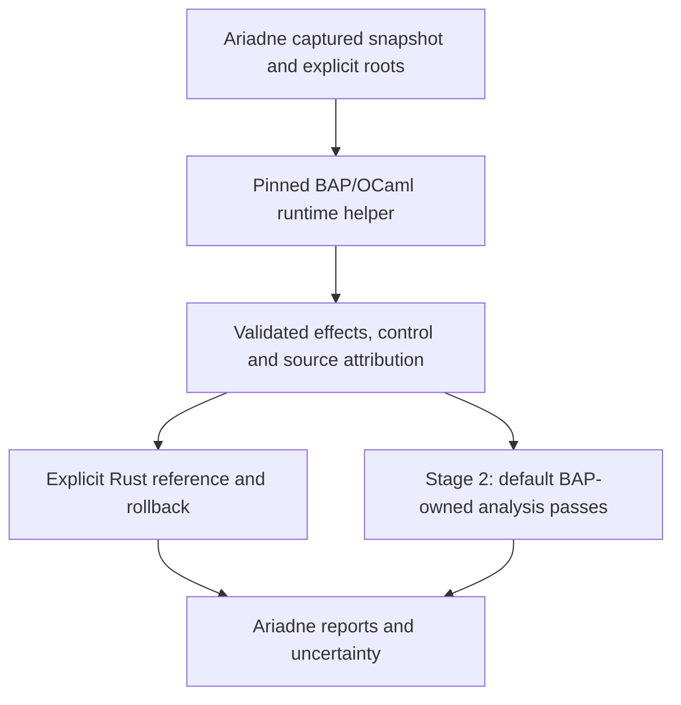

# BAP integration plan: semantic backend, then analysis core

## Context and follow-up

**Status.** Stage 1 exit and the Stage 2 prerequisite pass under the user-authorized unlimited timing policy: 17 implementation gates and 60 controlled tests pass. The Stage 2 A0 foundation is qualified. Complete native analysis is qualified by the [Stage 2 record](../docs/Ariadne/bap-core-qualification.md): all 20 gates pass, native analysis is the CLI default and explicit Rust rollback is verified.

**Why this document exists.** [BAP assessment](../docs/Ariadne/bap-core-refactor-assessment.md) motivates staged integration behind the existing Rust contract.

**What this document establishes.** Current implementation ownership, the completed Stage 1 qualification policy, and the acceptance criteria for the delivered A0–A6 migration. Stage 2 owns native analysis while preserving the existing observable contracts; each retained record qualifies its exact source/tool snapshot.

**Where to go next.**

- [Stage 2 qualification](../docs/Ariadne/bap-core-qualification.md) — records all 20 passing gates, native default adoption, Rust rollback and the exercised scope.
- [Stage 2 execution plan](bap-stage2-implementation.md) and [contract](../docs/Ariadne/bap-analysis-core-design.md) — explain the delivered native algorithms and their acceptance criteria.
- [Stage 2 A0 plan](bap-stage2-a0.md) — preserves the completed migration foundation and its earlier bounded scope.

- [Unlimited timing policy](../docs/Ariadne/bap-unlimited-validation.md) — records the user-authorized removal of the BAP latency ceiling and refreshed qualification.

- [Windows workload replacement](bap-windows-repin.md) — follows the user's authorization to generate and repin a new controlled Crashpad capture for Stage 1.

- [Backend design](../docs/Ariadne/bap-semantic-backend-design.md) — defines the implemented Stage 1 boundary.
- [BAP-only delivery](../docs/Ariadne/bap-only-removal-validation.md) — records the authorized default change and its narrower acceptance.
- [Previous workload delivery](../docs/Ariadne/bap-windows-workload-validation.md) — retains the R0–R2 repair and refresh evidence before the workload replacement.
- [Replacement validation](../docs/Ariadne/bap-windows-repin-validation.md) — records the completed capture/pin, passing implementation gates and former latency limit.
- [Backend guide](../docs/Ariadne/modules/bap.md) — provides current build and qualification entry points.
- [Controlled Windows demo](../docs/Ariadne/crashpad-demo-validation.md) — documents the separate two-instruction I5a/smoke capture.

**What remains unresolved.** The qualified native analysis does not establish universal refinement, ISA/lifter correctness or packaged cross-platform release qualification. Source/tool changes require fresh qualification. The active BAP policy has no latency ceiling, while historical Priority 4, active re-pinned I4 and controlled I5a retain their separate contracts. The [native I5a refresh](../docs/Ariadne/i5a-native-qualification.md) now independently qualifies both controlled captures under its fixed budgets and pinned dependency snapshot; that acceptance comes from its own records.

For the wider context, see the optional [documentation map](../docs/documentation-map.md).

Originally prepared **2026-10-01** against `818f93e`; the execution ledger below
supersedes its optional-backend rollout and former crate-layout proposals.
Design basis: [BAP assessment](../docs/Ariadne/bap-core-refactor-assessment.md),
[current effect contract](../docs/Ariadne/operand-effects-design.md), and
[Stage E contracts](../docs/Ariadne/stage-e-report-contracts.md).

The requested order remains Stage 1, BAP lifting/projection feeding the existing
Rust engine, followed by Stage 2, BAP-owned recovery and analysis. The completed
[BAP-only change](completed/bap-only-semantics.md) separately authorized default
selection and removed the semantic selector and LLVM effect fallback.
Stage 2 depends on a passing Stage 1 record. Partial acceptance does not
satisfy that dependency. Stage D ISA proofs are [retired](../docs/Ariadne/semantic-assurance.md);
Stage F universal refinement remains a separate research boundary.

The [Stage 1 protocol/projection implementation design](../docs/Ariadne/bap-semantic-backend-design.md)
records the selected isolated C bridge hosting BAP's OCaml runtime, actual
release-asset fingerprints and conservative admission policy. S0 uses pinned
official assets rather than modifying the user's existing OCaml switches.

## Architecture and boundaries



The existing C++ helper hosts the packaged BAP/OCaml runtime through its C API.
It lifts explicitly supplied instruction prefixes and serializes typed BIL;
the separate `native/bap-core/` OCaml helper owns scoped recovery, reaching
definitions, slicing and finite supplied stateflow. Rust validates its capture
inputs, transport and completed results before investigation and rendering.
One root Cargo package contains feature-gated modules. Core-only builds retain
no activated external dependencies.

| Responsibility | Current owner |
| --- | --- |
| Pinned runtime and native lifting | `native/bap/` |
| Helper lifecycle, protocol, BIL projection and address evidence | `src/bap/` |
| Captured-byte discovery and preparation | `src/input/` |
| Default recovery, reaching definitions and slicing | `native/bap-core/`, with validated transport in `src/bap/` |
| Default finite supplied stateflow | `native/bap-core/stateflow.ml`, with validated transport in `src/bap/` |
| Explicit Rust reference and rollback | `src/engine.rs`, `src/machine_state.rs` |
| Directly supplied LLVM IR analysis | `src/llvm_ir.rs` |
| Investigation and rendering | `src/investigation/`, `src/reports/` |
| Benchmarks and generated replay | `src/bin/`, `src/mbt/`, `tests/mbt/`, `mbt/` |

The [Stage 2 qualification](../docs/Ariadne/bap-core-qualification.md) checks actual
native recovery/analysis state and transitions through helper replay, mutations
and product comparisons. Its evidence is separate from Stage 1 BIL producer
checks and Rust replay.

The initial scope remains Linux-host investigation of Windows/Linux AMD64
minidumps under the current user64 effect assumptions. Preserve captured-byte
precedence, explicit entry witnesses, sparse/conflicting data, resource limits,
call-only edge policy and unresolved obligations. A matching executable may
provide an entry witness under the existing policy; it cannot fill missing
runtime code bytes. No PE/ELF reader, retrospective reconstruction from crash
registers, interprocedural return matching or full CPU executor is introduced.

Here, **Windows workload means a Windows-origin minidump analyzed on Linux**.
It does not mean running Ariadne or its benchmark script on Windows.

| Component | Execution host | Role |
| --- | --- | --- |
| Demo application and Crashpad handler | Windows, for the controlled Windows case | Produce the minidump and independent capture witness. |
| Ariadne CLI, BAP helper and LLVM decode reference | Linux | Analyze Windows/Linux AMD64 minidump inputs. |
| `tools/measure_bap.py` and `tools/check_bap_semantics.py` | Linux | Run and qualify that Linux analysis pipeline, including the selected Windows-origin workload. |

The Windows workload's latency is therefore measured on the Linux analysis host.

BIL/BIR remain distinct from LLVM IR. The directly supplied, LLVM-verified
`.ll`/`.bc` path keeps its own identity and acceptance contract.

## Shared contracts

| Boundary | Required contents |
| --- | --- |
| Input | Snapshot ID, exact VA and bytes, source offsets, available prefix/stop reason, roots/seeds and limits |
| Identity | BAP source/build, OCaml/opam lock, target/mode, decoder/lifter providers, plugins, executable/library hashes and projection revision |
| Evidence | Consumed bytes/length, form/operands, BIL/BIR and source attribution, precision class and per-site gaps |
| Projection | Canonical byte GPR cells, flags, `memory:any`, `state:other`; separate `uses`, `may_defs`, `must_defs`; typed control/completeness |
| Failure | Distinguish unavailable bytes, invalid decode, unsupported/unknown lift, undefined outputs and unknown control from protocol/version/timeout/I/O failures |
| Analysis | Snapshot-owned nodes, total map domains, parallel edge labels, entry/instruction origins, phases, slice, missing seeds and obligations |
| Validation | Exact source/tool/corpus hashes, independent expectations, actual observations, intended mutant mismatches, coverage and measured limits |

Specify bounded versioned messages before implementation. Addresses must retain
full u64 precision. Validate cardinality, duplicates, schema, bytes and identity;
handle process exit, deadlines, batching and query reset. Pretty assembly or an
unrestricted CLI dump is not the production schema. Cache/knowledge-base keys
must include snapshot/content and tool identity: equal VAs in different captures
cannot reuse stale instruction semantics.

## Current execution ledger

| Scope | Current state | Remaining action |
| --- | --- | --- |
| S0–S3: selected runtime, lifting, projection and product integration | Implemented; BAP-only production preparation | Preserve current identities, explicit unsupported results and capture-only input. |
| S4: BAP correctness qualification | Refreshed aggregate passes 17/17 implementation gates with 178 stable sources; replacement correctness and evidence checks pass | Preserve this exact capture/source/tool binding in further work. |
| S5: workload acceptance | Active capture is pinned; timing policy is unlimited | Retain valid finite raw measurements and all correctness/source/tool checks. |
| A0: migration contract | Qualified: all OQ0–OQ6 gates pass | Retain the source-bound [OCaml qualification](../docs/Ariadne/bap-ocaml-qualification.md) as the completed foundation for the later A1–A6 result. |
| A1–A6: BAP analysis core | Qualified: 20 aggregate gates pass, default native selection and Rust rollback verified | Follow the [complete execution plan](bap-stage2-implementation.md). |

The `bap-stage1-validation.json` and `bap-only-removal-validation.json` records
contain changed source hashes and obsolete pre-consolidation paths. Matching
native helper hashes alone does not make those records current. The newer I5a
record contains the nested Stage E regression reused after full source/tool
verification in the [previous BAP record](../docs/Ariadne/bap-windows-workload-validation.md).
That record qualifies its source snapshot and available corpus. The
[replacement campaign](../docs/Ariadne/bap-windows-repin-validation.md) separately
binds its new manifest, input archive and consumer changes in the retained result.

### Next execution order

| Step | State | Delivered behavior or next action |
| --- | --- | --- |
| R0. Repair Windows-input bookkeeping | Complete | [measure_bap.py](../tools/measure_bap.py) keeps `source_hashes_before` separate from `seed_definitions`; a stable Windows run preserves the source-hash map, while a changed inventory fails. Existing artifact, query, producer and captured-byte checks remain enforced. |
| R1. Make qualification decisions explicit | Complete in the previous delivery | Workload v2 and aggregate v3 introduced raw CLI samples and independent decisions. The active replacement now uses workload v4, aggregate v5 and `windowsWorkload*` fields through the shared [validator](../tools/bap_workload_contract.py). |
| R2. Refresh current source/corpus evidence | Complete for the previous available corpus | The 2026-10-03 [delivery record](../docs/Ariadne/bap-windows-workload-validation.md) retains 17 passing implementation gates, 177 stable sources, 99 matched model states, 16 detected mutations and four available release workloads. Stage E was reused after complete identity checks. |
| R3. Replace and measure the Windows S4/S5 case | Complete under the former bounded policy | The [replacement plan](bap-windows-repin.md) delivered the capture, pin and exact 98-instruction evidence. The observed CLI median is 10,667.760921 ms against the former 2,000 ms limit. |
| R4. Record the full Stage 1 decision | Complete: full exit and prerequisite true | Use the [current policy validation](../docs/Ariadne/bap-unlimited-validation.md). Valid captured evidence and passing implementation gates establish the prerequisite; the A0 foundation is qualified; complete A1–A6 is qualified by the later Stage 2 record. |

The previous R0–R2 delivery retains 39 passing controlled tests across the runner, shared validator and
aggregate checker, including complete source/tool inventories and captured
preparation evidence for every decoded Windows address. The
[delivery record](../docs/Ariadne/bap-windows-workload-validation.md) separates
those stubbed decision tests from fresh native/model/mutation/workload evidence
and retained Stage E reuse. The replacement now passes 59 controlled BAP tests
and nine independent-inspector tests. Its fresh aggregate separately passes
17/17 implementation gates with 178 stable source hashes; the workload record
binds 168 sources.

The actual Linux Ariadne query also recovers 98 starts, 99 edges and a 90-site
slice with zero obligations and no missing seeds. All eight RCX producer-byte
witnesses pass. Five measured release CLI samples have a **10,667.760921 ms**
median, minimum 10,408.020862 ms and maximum 10,821.892755 ms. The evidence is valid
under the former **2,000 ms** policy the limit was unmet and both exit fields
were false. The [unlimited policy](../docs/Ariadne/bap-unlimited-validation.md)
supersedes that timing condition.

The **current user-authorized qualification policy** requires passing implementation
and source-stability gates plus valid active controlled Windows evidence. Latency
has no acceptance ceiling. The shared validator still checks exact identity,
98 decoded starts, source/tool bindings and finite raw samples with a matching
summary. Missing or invalid evidence cannot satisfy the prerequisite. Valid slow
runs can satisfy `stage1ExitPassed`, `stage2PrerequisiteSatisfied` and
`defaultPromotionEligible`; timing remains reported.

The producer requires captured preparation evidence for every decoded site and
the independent RCX producer in the slice and all eight reaching byte origins.
The query retains one warm-up and five measured release CLI samples. Workload
schema `ariadne.bap-workloads/v4` and aggregate schema `ariadne.bap-only-removal/v5`
use `windowsWorkload*` fields so the replacement cannot be mistaken for the
historical case.

The user subsequently removed the BAP latency ceiling. The replacement changed the
active BAP S4/S5 input; historical Priority 4 retains the original manifest.
The later [I4-specific re-pin](../docs/Ariadne/i4-windows-repin-validation.md)
uses the same capture under its unchanged 2,000 ms investigation budget. BAP-only default selection retains its separate explicit authorization.

The existing two-instruction Crashpad demo remains a separate I5a/smoke case.
The active replacement uses its dedicated 98-instruction checksum/loop/diamond
profile. Capture and pinning are complete; latency is measured without blocking qualification.

### Original Windows input and commands

This section preserves the historical input reference. The user confirmed that
the original dump no longer exists. Its [unchanged manifest](../evidence/Ariadne/priority-4-real-capture-case.json) records
`f13d18cd-9ade-4eff-947c-15a649b636fa.dmp`, 2,028,400 bytes, SHA-256
`4b3deb70134015ec227b3cf5edf82e1dac0b308b3f19ae62f79cbd4251109e86`.
Its entry is `0x7ff6451d52d0`, seed `0x7ff6451d530f`, and independent address
producer `0x7ff6451d530b`. The matching PE supplies an entry/boundary witness;
it must not fill uncaptured runtime bytes. Historical Priority 4 and earlier I4 records still
refer to this case; the replacement cannot qualify the original Electron crash.

### Active Windows input and commands

The [active manifest](../evidence/Ariadne/bap-windows-workload-case.json) pins
`crashpad-windows-checksum-98-v1`: a native Windows AMD64 partial-mode Crashpad
capture of a 379-byte function with 98 instruction starts. The dump is 217,936
bytes, SHA-256 `1bd80af7a739471a7026776bfb37cbbe5953d01ad122e7cf7db0392f84da0b0a`.
Entry is `0x7ff7382f4840`, seed `0x7ff7382f49b4`, and producer
`0x7ff7382f49b1`. Independent inspection checks the entire captured function,
the matching executable and the input/checksum witness. Executable bytes never
fill uncaptured runtime ranges.

The [input archive](../evidence/Ariadne/bap-windows-workload-inputs.tar.gz)
contains 23 pinned entries and is 399,636 bytes. It retains the dump, companion,
build/inspection records and sources. The default workload runner verifies the
archive and capture identity before materializing `capture.dmp` in its output
area. An explicit path must match this same active pin.

Run the bundled workload or supply an explicit copy on the Linux analysis host:

```sh
python3 tools/check_bap_semantics.py
python3 tools/measure_bap.py --output /new/workload-directory

ARIADNE_BAP_WINDOWS_DUMP=/absolute/path/to/replacement.dmp \
  python3 tools/check_bap_semantics.py
python3 tools/measure_bap.py --windows-dump /absolute/path/to/replacement.dmp \
  --output /new/explicit-workload-directory
python3 tools/check_bap_semantics.py \
  --workload-record /new/workload-directory/report.json

# Deliberately omit Windows qualification for an implementation-only run.
python3 tools/measure_bap.py --skip-windows --output /new/implementation-directory
```

`ARIADNE_PRIORITY4_DUMP` no longer selects either active BAP or I4 workloads.
BAP uses its bundled pin or `ARIADNE_BAP_WINDOWS_DUMP`; the separately
[re-pinned I4 runner](../docs/Ariadne/i4-windows-repin-validation.md) uses its
own bundle contract or `ARIADNE_I4_WINDOWS_DUMP`. Explicit `--skip-windows`
leaves the corresponding Windows qualification predicates false.

The acceptance runner also accepts `--model-record`, `--mutation-record` and
`--stage-e-record`, with their existing identity checks. The current workload
runner has no companion-file option. If companion validation is refreshed,
separate artifact/function-boundary checks from the historical
`tools/check_priority4_real_capture.py` assertions of LLVM `effects-v1` rule IDs;
those rule assertions cannot serve as BAP semantic acceptance.

## Stage 1: BAP semantic backend

### Work sequence

| Step | Deliverables and ownership | Exit condition |
| --- | --- | --- |
| S0. Baseline and version selection | Freeze current sources, queries, outputs and workload records. Add a reproducible BAP toolchain lock/setup in `native/bap/`. Evaluate stable BAP first, or an explicitly pinned source revision if required. Pin one lifter/provider configuration. | Clean helper build, plugin/version probes, both dump target configurations, and demonstrated coexistence with LLVM MC 20.1.2. No floating testing branch or presumed LLVM ABI compatibility. |
| S1. Protocol and raw-byte helper | Implemented requested-site lifting in `native/bap/` and strict transport/lifecycle in `src/bap/`. | Exact VA/byte/length round trips; sparse/short captures remain gaps; malformed, duplicate, missing, inconsistent, oversized and wrong-version responses fail. No zero fill, executable fallback or implicit root discovery. |
| S2. Conservative projection | Implemented typed BIL projection in `src/bap/`, with shared contracts in `src/effects/` and the independent decode reference in `src/llvm_mc/`. | Source-reviewed rules and positive/negative tests for aliases, widths, flags, conditional writes, address inputs, memory and calls; unsupported behavior stays explicit. |
| S3. Preparation and CLI integration | Implemented BAP-only preparation in `src/input/materialize.rs` and the minidump CLI. `--bap-helper`/`--bap-runtime` select configured artifacts; the semantic selector is removed. | The immutable query/reader policy supplies all production BAP inputs. Reports identify decoder, semantic provider, projection, quality and gaps; `fallback` remains null. |
| S4. Correctness qualification | Existing `tests/bap/` and `tools/check_bap_semantics.py` combine independent expectations, decoder comparison, fixtures, generated replay and adapter mutations. The replacement campaign passes all 17 implementation gates and exact-query correctness checks. | A source-bound record identifies every supported exact form, compared result and remaining gap. Model replay validates the solver relative to its inputs; separate source/fixture checks qualify the semantic producer. |
| S5. Workload acceptance | Existing `src/bin/bap_minidump.rs` and `tools/measure_bap.py` measure startup, decode/lift, projection, analysis and rendering. The default runner materializes the bundled active capture. | One warm-up and at least five repeats, median/spread and resource outcomes on the exact query. Valid active controlled Windows evidence with exactly 98 decoded starts and valid finite timing samples under the unlimited policy are required for full exit and the prerequisite. |

### Projection policy

- Architectural locations are separate from BIL/BIR temporaries. Preserve each
  architectural read/write's source instruction and canonical cells.
- Handle AL/AH/AX/EAX/RAX, extraction/concatenation and zero/sign extension.
  A whole-register assignment preserving old bits cannot kill their origins.
- Possible writes join across alternatives. Definite replacement requires every
  admitted normal-continuation alternative to replace that cell. Conditions,
  flags and address-generation dependencies contribute reads.
- `mem := Store(...)` cannot kill all origins in `memory:any`. Preserve weak
  updates under uncertain aliases.
- `Unknown`, `Special`, unsupported operators and unexplained empty lifts
  cannot become no-ops or known fallthrough. Architectural undefinedness needs
  separate reviewed evidence; a generic unknown is insufficient.
- Calls retain opaque effects and incomplete-target obligations. Inferred ABI
  information does not establish callee-saved preservation. Fault/commit
  uncertainty remains visible; these summaries are not accepted ISA steps.

LLVM MC remains the Stage 1 decoded-fact reference. Admit a BAP lift only after
checking the same bytes, length and reviewed control/operand shape. Compare
semantics rather than opcode spelling. Preserve disagreements and conservatively
handle them; never silently choose the more precise answer. Agreement between
tools is evidence, not architectural proof.

Infrastructure failures fail the selected query before publication. Unsupported
or inconsistent lifts stop conservatively with opaque effects and explicit gaps;
they do not use legacy LLVM effect fallback. Quality distinguishes exercised
external lifting, reviewed projection and opaque effects, without claiming an
accepted ISA step. Report schema changes preserve consumers or receive a new version.

### Qualification corpus and exit

Cover partial/zero-extending writes, sign extension, defined/preserved/undefined
flags, conditional writes, weak stores, aliasing loads, direct/indirect control,
opaque calls and returns, unsupported prefixes/forms, missing seeds, sparse/
short/conflicting captures and high VAs. Include query reset with identical VAs
but different snapshots, mixed supported/opaque paths, both Stage B platform
fixtures and the hash-pinned representative real captures.

Mutants must detect omitted address/flag reads, wrong partial-register kills,
whole-memory kills, fabricated call preservation/fallthrough, dropped unknowns,
wrong VA/bytes/length binding and cross-snapshot cache reuse. Build or timeout
failures do not count as detected semantic defects. Retain raw dumps/caches under
existing ignored-file policy and archive appropriate derived evidence.

**Stage 1 exit:** a passing selected-build/protocol/projection/input/report
record and corpus, with supported scope, the active pinned Windows evidence and the
independently validated finite release timing samples under the unlimited
policy. The BAP-only default is already selected by separate instruction.
A partial Stage 1 cannot qualify Stage 2.

## Stage 2: BAP analysis core

Stage 2 began on 2026-10-03. The [A0 plan](bap-stage2-a0.md),
[analysis contract](../docs/Ariadne/bap-analysis-core-design.md) and
[validation](../docs/Ariadne/bap-stage2-a0-validation.md) retain seven contract
tests and native graph/term observations. The subsequent
[OCaml foundation](../docs/Ariadne/bap-ocaml-qualification.md) implements an isolated
SDK, real Init/Visit state and Rust transport. Its recorded OQ decision controls
full A0 exit. Complete A1–A6 and default adoption subsequently pass the
[Stage 2 qualification](../docs/Ariadne/bap-core-qualification.md).

The delivered Stage 2 helper owns scoped project/graph and mutable analysis
state. Rust retains captured input, validated orchestration and reports, and
its analyzers remain selectable as an independent reference and rollback
choice. Completed native analysis reaches investigation through `AnalysisView`
without executing the Rust reference solver.

Use BAP graph/term/analysis facilities where their semantics fit and custom OCaml
passes for Ariadne's origin, weak-memory and call policies. BAP SSA/liveness is
not assumed to implement the current reaching-definition or slice contract.
The first migration preserves formal observables; richer native BIR analyses
remain separate future result contracts.

| Step | Deliverables and ownership | Exit condition |
| --- | --- | --- |
| A0. Freeze migration semantics | Extend the BAP design/protocol with ownership, input/state/result schemas, BIR attribution and mappings to `Specs/Ariadne.tla` and `Specs/AriadneMachineState.tla`. | Explicit initialization/action/result and finite-domain mappings. Observations expose actual BAP-owned state; bulk output cannot be turned into fabricated incremental traces. |
| A1. Scoped projects and recovery | Implement project/session ownership and recovery passes in `native/bap-core/`. Retain roots and reader-approved captured spans; add a bounded reader bridge if discovery needs more prefixes. | Every instruction maps to real captured bytes. Default/speculative scans cannot enter the accepted graph; failed targets, typed parallel edges and call-only context remain visible. |
| A2. Reaching definitions and slicing | Compute in BAP-owned passes using canonical cells, entry/instruction origins, weak memory updates and local-edge policy. Add the Rust transport facade in `src/bap/`. | Generated fixed-input comparisons against both Rust and TLA+ cover every map entry, phase, graph/origin/slice field and obligation. Independent expectations resolve differences; precision alone does not select the winner. |
| A3. Finite stateflow | Move finite catalogue/relation propagation into BAP-owned state with its independent phase/result family. Keep caller transition/completeness premises explicit. | Full-observation tests cover joins, loops, equal-valued distinct IDs, terminal outcomes and unknown edges. Infeasibility still requires the relevant complete, reached source. No automatic CPU executor is implied. |
| A4. Real helper replay | Extend the protocol and generated-interface integration in `mbt/` for initialize, one actual action, observe and reset. Implement MirrorRust ports over the helper with deferred admission and real session/process cleanup. | Core fixture/action/pair coverage, the Stage E generated corpus and BIR-specific cases pass. Observers use neither expected/previous reports nor the Rust reference to manufacture BAP state. |
| A5. Mutations and product integration | Mechanically mutate temporary copies of real OCaml passes/projection code, with unchanged observers/bindings. Connect `src/reports/`/`src/input/` and `--analysis-backend rust|bap`. | Genuine mismatches detect bad kills, source gating, call traversal, lost attribution/gaps, incorrect terminals/phi/memory dependencies and early completion. Versioned text/DOT/JSON retain identity and uncertainty and pass independent parsing. |
| A6. Qualify and adopt | Use `tools/check_bap_core.py`; rerun affected gates and measure against Rust using the same semantic inputs, queries and host. | Stable source/tool/corpus hashes, passing independent/model/differential checks, workload budget and a working Rust rollback path. Then select the accepted BAP core as default. |

One machine instruction may map to several BIR terms, and transformations may
introduce synthetic phi/temporary nodes. Preserve that attribution explicitly.
Synthetic terms do not receive invented machine VAs or captured bytes. Exclude
transformations that lose attribution or erase uncertainty until their projection
is qualified.

Custom passes must expose real transitions compatible with the chosen model
schedule to retain current per-action replay. If a native algorithm cannot meet
that contract, fix the pass or keep it experimental. A bulk/result-level model
would require its own design and acceptance; it cannot pass the old incremental
gate by relaxing comparisons.

**Stage 2 exit:** BAP owns accepted recovery, dataflow, slicing and stateflow
computation; fresh replay/mutations cover it; reports and workload acceptance
pass; Rust remains selectable as reference. This is the exercised conformance
and product tier, not universal compiled-code or architectural correctness.

## Evidence and open decisions

Retain separate Stage 1 and Stage 2 records under `evidence/Ariadne/`, with readable
delivery explanations under `docs/Ariadne/`, and exact
source/build/profile IDs, inputs, normalized outputs, query/host settings,
coverage, first mismatches and unavailable checks. Existing Stage E records
remain evidence for their pinned Rust sources and do not transfer automatically.
Stage D is retired; neither BAP stage establishes Stage F's universal proof goal.

S0/S1 selected and implemented the current packaged runtime, helper lifecycle,
target configuration, raw-byte protocol and admitted BIL subset. The
[A0 qualification](../docs/Ariadne/bap-ocaml-qualification.md) resolved the isolated
runtime/pass build and bounded native observations. The subsequent
[Stage 2 qualification](../docs/Ariadne/bap-core-qualification.md) covers complete
native analysis and per-action observations under its pinned SDK and transport
contract. Broader LLVM/runtime interoperability remains outside that result.
The [official release](https://github.com/BinaryAnalysisPlatform/bap/releases/tag/v2.5.0)
and [driver API](https://binaryanalysisplatform.github.io/bap/api/master/bap/Bap/Std/Disasm/Driver/index.html)
are primary references; master API documentation must be checked against the
selected build.

## Stage 1 execution status

The [historical BAP Stage 1 validation record](../evidence/Ariadne/bap-stage1-validation.json)
tracks its original source snapshot. S0–S3 are implemented. That S4 record exercised 34 native BIL
cases, strict transport, both platform fixtures, full-state model replay,
15 real producer/adapter mutants, and the existing Rust/Stage E regression.
S5 includes startup/lift/projection/analysis/render timing and a controlled
coverage benefit, with one warm-up and five release-build repeats.

The [previous R0–R2 delivery](../docs/Ariadne/bap-windows-workload-validation.md),
recorded on 2026-10-03 before the replacement,
records the repaired runner and shared evidence validator. R0–R2 are complete
for the available corpus. The [retained aggregate](../evidence/Ariadne/bap-windows-workload-validation.json)
passed **17/17 implementation gates** with **177 stable source hashes** and
**39 controlled tests**: 15 producer, 14 validator and 10 aggregate-gate tests.
Native coverage includes 41 exact cases and 30 admitted forms; BAP model replay
checks eight cases, 99 states and nine fields; all 16 mutations are detected.
Four available release workloads pass their checks.

Model, mutation and workload evidence was freshly generated in that campaign,
then reused by the final aggregate after identity checks. The 12-gate Stage E
record was reused from I5a after exact verification of all 315 source hashes
and its native IR, MC and Graphviz tool hashes. The
[evidence manifest](../evidence/Ariadne/bap-windows-workload-evidence-manifest.json)
binds the [retained archive](../evidence/Ariadne/bap-windows-workload-evidence.tar.gz),
whose 238 entries were verified.

The [replacement delivery](../docs/Ariadne/bap-windows-repin-validation.md)
records a new native Crashpad capture and active BAP pin under the user's
authorization. Capture generation and independent inspection are complete;
59 controlled BAP tests and nine inspector tests pass. The
[new retained record](../evidence/Ariadne/bap-windows-repin-validation.json)
contains 17/17 passing implementation gates with 178 stable aggregate source
hashes and 168 workload source hashes. The valid 98-start Windows workload has
a 10,667.760921 ms CLI median against the former 2,000 ms condition, so that
historical record has false exit/prerequisite fields. Its
[manifest](../evidence/Ariadne/bap-windows-repin-evidence-manifest.json) binds the
[evidence archive](../evidence/Ariadne/bap-windows-repin-evidence.tar.gz).

The separate phase benchmark measures reference decoding at 7,572.131181 ms,
helper startup at 1,178.301727 ms and core analysis at 69.614232 ms (medians).
These measurements identify reference decoding as the first area for further
investigation; no performance fix was implemented. The replacement task is
complete; the user subsequently removed that timing limit. The earlier false decision remains historical
evidence for its original workload. That earlier workload task did not start Stage 2; the subsequent A0 work is recorded above.
Commit/push remains a separate publication action.
