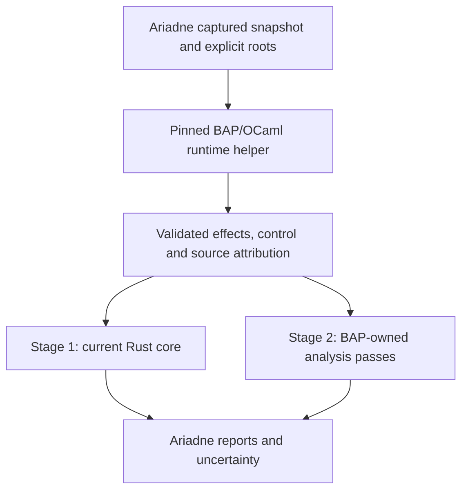

# BAP integration plan: semantic backend, then analysis core

## Context and follow-up

**Status.** Active plan: Stage 1 full Windows qualification open; Stage 2 unstarted.

**Why this document exists.** [BAP assessment](../docs/Ariadne/bap-core-refactor-assessment.md) motivates staged integration behind the existing Rust contract.

**What this document establishes.** Stage 1 integrates pinned BAP lifting and a conservative projection into the Rust engine. Stage 2 would replace analysis ownership and must preserve the existing observable contracts.

**Where to go next.**

- [Backend design](../docs/Ariadne/bap-semantic-backend-design.md) — defines the implemented Stage 1 boundary.
- [BAP-only delivery](../docs/Ariadne/bap-only-removal-validation.md) — records the authorized default change and its narrower acceptance.
- [Backend guide](../docs/Ariadne/modules/bap.md) — provides current build and qualification entry points.

**What remains unresolved.** Full original-Windows qualification is still open. The BAP analysis-core replacement has not started; neither selecting BAP nor passing a fixture closes those requirements.

For the wider context, see the optional [documentation map](../docs/documentation-map.md).

Prepared **2026-10-01** against Ariadne `818f93e`.
Status: **Stage 1 implemented; final qualification awaits the pinned Windows capture. Stage 2 has not started**.
Design basis: [BAP assessment](../docs/Ariadne/bap-core-refactor-assessment.md),
[current effect contract](../docs/Ariadne/operand-effects-design.md), and
[Stage E contracts](../docs/Ariadne/stage-e-report-contracts.md).

The requested order is Stage 1, an optional BAP semantic backend feeding the
existing Rust engine, followed by Stage 2, BAP-owned recovery and analysis.
Stage 2 depends on a passing Stage 1 record. Partial acceptance does not
satisfy that dependency. Stage D ISA proofs are [retired](../docs/Ariadne/semantic-assurance.md);
Stage F universal refinement remains a separate research boundary.

The [Stage 1 protocol/projection implementation design](../docs/Ariadne/bap-semantic-backend-design.md)
records the selected isolated C bridge hosting BAP's OCaml runtime, actual
release-asset fingerprints and conservative admission policy. S0 uses pinned
official assets rather than modifying the user's existing OCaml switches.

## Architecture and boundaries

Host the packaged BAP/OCaml runtime in a separate C++ helper process and use
an optional Rust adapter package.
Keep the root analysis crate dependency-free. Proposed ownership:
`native/bap/` for toolchain/helper/passes, `bap/` for the Rust protocol and
backend facade, `input/` for captured input/query orchestration, `reports/`
for output, and `mbt/` for generated replay. The
[Stage 1 follow-up](completed/bap-only-semantics.md) removes backend selection and LLVM
semantic fallback; BAP is the sole minidump provider. Stage 2
paths/options remain proposals.

The initial scope remains Linux-host investigation of Windows/Linux AMD64
minidumps under the current user64 effect assumptions. Preserve captured-byte
precedence, explicit entry witnesses, sparse/conflicting data, resource limits,
call-only edge policy and unresolved obligations. A matching executable may
provide an entry witness under the existing policy; it cannot fill missing
runtime code bytes. No PE/ELF reader, retrospective reconstruction from crash
registers, interprocedural return matching or full CPU executor is introduced.

BIL/BIR remain distinct from LLVM IR. The directly supplied, LLVM-verified
`.ll`/`.bc` path keeps its own identity and acceptance contract.

## Shared contracts

| Boundary | Required contents |
| --- | --- |
| Input | Snapshot ID, exact VA and bytes, source offsets, available prefix/stop reason, roots/seeds and limits |
| Identity | BAP source/build, OCaml/opam lock, target/mode, decoder/lifter providers, plugins, executable/library hashes and projection revision |
| Evidence | Consumed bytes/length, form/operands, BIL/BIR and source attribution, precision class and per-site gaps |
| Projection | Canonical byte GPR cells, flags, `memory:any`, `state:other`; separate `uses`, `may_defs`, `must_defs`; typed control/completeness |
| Failure | Distinguish unavailable bytes, invalid decode, unsupported/unknown lift, undefined outputs and unknown control from protocol/version/timeout/I/O failures |
| Analysis | Snapshot-owned nodes, total map domains, parallel edge labels, entry/instruction origins, phases, slice, missing seeds and obligations |
| Validation | Exact source/tool/corpus hashes, independent expectations, actual observations, intended mutant mismatches, coverage and measured limits |

Specify bounded versioned messages before implementation. Addresses must retain
full u64 precision. Validate cardinality, duplicates, schema, bytes and identity;
handle process exit, deadlines, batching and query reset. Pretty assembly or an
unrestricted CLI dump is not the production schema. Cache/knowledge-base keys
must include snapshot/content and tool identity: equal VAs in different captures
cannot reuse stale instruction semantics.

## Stage 1: BAP semantic backend

### Work sequence

| Step | Deliverables and ownership | Exit condition |
| --- | --- | --- |
| S0. Baseline and version selection | Freeze current sources, queries, outputs and workload records. Add a reproducible BAP toolchain lock/setup in `native/bap/`. Evaluate stable BAP first, or an explicitly pinned source revision if required. Pin one lifter/provider configuration. | Clean helper build, plugin/version probes, both dump target configurations, and demonstrated coexistence with LLVM MC 20.1.2. No floating testing branch or presumed LLVM ABI compatibility. |
| S1. Protocol and raw-byte helper | Write the protocol/design contract; implement requested-site lifting in `native/bap/` and strict transport in `bap/`. Verify candidate raw-memory APIs against the selected build. | Exact VA/byte/length round trips; sparse/short captures remain gaps; malformed, duplicate, missing, inconsistent, oversized and wrong-version responses fail. No zero fill, executable fallback or implicit root discovery. |
| S2. Conservative projection | Implement supported BIL projection in `bap/`. Make only necessary shared-type/preparation-seam changes in `src/effects.rs` and `src/llvm_mc.rs`. | Source-reviewed rules and positive/negative tests for aliases, widths, flags, conditional writes, address inputs, memory and calls; unsupported behavior stays explicit. |
| S3. Preparation and CLI integration | Generalize the captured-batch preparation boundary, retain its LLVM implementation, and connect `src/input/materialize.rs`, query options and reports. Propose `--semantics-backend llvm|bap`. | The same immutable query/reader policy drives both providers. Reports identify decoder, semantic provider, projection, quality and any fallback per site; existing default behavior remains covered. |
| S4. Correctness qualification | Add `tests/bap/` and a proposed `tools/check_bap_semantics.py`; combine independent instruction expectations, decoder comparison, end-to-end fixtures, generated replay and actual adapter mutations. | A source-bound record identifies every supported exact form, compared result and remaining gap. Model replay validates the solver relative to its inputs; separate source/fixture checks qualify the new semantic producer. |
| S5. Workload acceptance | Extend `bench/` for helper startup, decode/lift, projection, analysis and rendering. Compare identical query, host, limits and release build settings. | Warm-up plus at least five repeats, median/spread and resource outcomes; demonstrated coverage/precision benefit with declared cost. Preserve the existing 2,000 ms median target for the qualified 98-instruction query before considering default promotion. |

### Projection policy

- Architectural locations are separate from BIL/BIR temporaries. Preserve each
  architectural read/write's source instruction and canonical cells.
- Handle AL/AH/AX/EAX/RAX, extraction/concatenation and zero/sign extension.
  A whole-register assignment preserving old bits cannot kill their origins.
- Possible writes join across alternatives. Definite replacement requires every
  admitted normal-continuation alternative to replace that cell. Conditions,
  flags and address-generation dependencies contribute reads.
- `mem := Store(...)` cannot kill all origins in `memory:any`. Preserve weak
  updates under uncertain aliases.
- `Unknown`, `Special`, unsupported operators and unexplained empty lifts
  cannot become no-ops or known fallthrough. Architectural undefinedness needs
  separate reviewed evidence; a generic unknown is insufficient.
- Calls retain opaque effects and incomplete-target obligations. Inferred ABI
  information does not establish callee-saved preservation. Fault/commit
  uncertainty remains visible; these summaries are not accepted ISA steps.

LLVM MC remains the Stage 1 decoded-fact reference. Admit a BAP lift only after
checking the same bytes, length and reviewed control/operand shape. Compare
semantics rather than opcode spelling. Preserve disagreements and conservatively
handle them; never silently choose the more precise answer. Agreement between
tools is evidence, not architectural proof.

Infrastructure failures fail the selected query before publication. Healthy
unsupported lifts may use an explicitly recorded reviewed legacy rule or an
opaque summary under a defined per-site policy. Quality distinguishes tested
external lifting, reviewed projection, opaque effects and accepted ISA semantics.
Report schema changes preserve consumers or receive a new version.

### Qualification corpus and exit

Cover partial/zero-extending writes, sign extension, defined/preserved/undefined
flags, conditional writes, weak stores, aliasing loads, direct/indirect control,
opaque calls and returns, unsupported prefixes/forms, missing seeds, sparse/
short/conflicting captures and high VAs. Include query reset with identical VAs
but different snapshots, mixed supported/opaque paths, both Stage B platform
fixtures and the hash-pinned representative real captures.

Mutants must detect omitted address/flag reads, wrong partial-register kills,
whole-memory kills, fabricated call preservation/fallthrough, dropped unknowns,
wrong VA/bytes/length binding and cross-snapshot cache reuse. Build or timeout
failures do not count as detected semantic defects. Retain raw dumps/caches under
existing ignored-file policy and archive appropriate derived evidence.

**Stage 1 exit:** a passing selected-build/protocol/projection/input/report
record and corpus, with supported scope and measured limits. This qualifies BAP
as an optional semantic backend. A partial Stage 1 cannot qualify Stage 2.

## Stage 2: BAP analysis core

The target is BAP-owned project/graph and mutable analysis state. Rust retains
captured input, validated orchestration and reports. Keep the Rust analyzers as
an independent reference and rollback choice. Calling the existing Rust solver
inside a BAP wrapper does not count as this migration.

Use BAP graph/term/analysis facilities where their semantics fit and custom OCaml
passes for Ariadne's origin, weak-memory and call policies. BAP SSA/liveness is
not assumed to implement the current reaching-definition or slice contract.
The first migration preserves formal observables; richer native BIR analyses
remain separate future result contracts.

| Step | Deliverables and ownership | Exit condition |
| --- | --- | --- |
| A0. Freeze migration semantics | Extend the BAP design/protocol with ownership, input/state/result schemas, BIR attribution and mappings to `Specs/Ariadne.tla` and `Specs/AriadneMachineState.tla`. | Explicit initialization/action/result and finite-domain mappings. Observations expose actual BAP-owned state; bulk output cannot be turned into fabricated incremental traces. |
| A1. Scoped projects and recovery | Implement project/session ownership and recovery passes in `native/bap/`. Retain roots and reader-approved captured spans; add a bounded reader bridge if discovery needs more prefixes. | Every instruction maps to real captured bytes. Default/speculative scans cannot enter the accepted graph; failed targets, typed parallel edges and call-only context remain visible. |
| A2. Reaching definitions and slicing | Compute in BAP-owned passes using canonical cells, entry/instruction origins, weak memory updates and local-edge policy. Add the Rust transport facade in `bap/`. | Generated fixed-input comparisons against both Rust and TLA+ cover every map entry, phase, graph/origin/slice field and obligation. Independent expectations resolve differences; precision alone does not select the winner. |
| A3. Finite stateflow | Move finite catalogue/relation propagation into BAP-owned state with its independent phase/result family. Keep caller transition/completeness premises explicit. | Full-observation tests cover joins, loops, equal-valued distinct IDs, terminal outcomes and unknown edges. Infeasibility still requires the relevant complete, reached source. No automatic CPU executor is implied. |
| A4. Real helper replay | Extend the protocol and generated-interface integration in `mbt/` for initialize, one actual action, observe and reset. Implement MirrorRust ports over the helper with deferred admission and real session/process cleanup. | Core fixture/action/pair coverage, the Stage E generated corpus and BIR-specific cases pass. Observers use neither expected/previous reports nor the Rust reference to manufacture BAP state. |
| A5. Mutations and product integration | Mechanically mutate temporary copies of real OCaml passes/projection code, with unchanged observers/bindings. Connect `reports/`/`input/` and proposed `--analysis-backend rust|bap`. | Genuine mismatches detect bad kills, source gating, call traversal, lost attribution/gaps, incorrect terminals/phi/memory dependencies and early completion. Versioned text/DOT/JSON retain identity and uncertainty and pass independent parsing. |
| A6. Qualify and adopt | Add a proposed `tools/check_bap_core.py`; rerun affected gates and measure against Rust using the same semantic inputs, queries and host. | Stable source/tool/corpus hashes, passing independent/model/differential checks, workload budget and a working Rust rollback path. Then select the accepted BAP core as default. |

One machine instruction may map to several BIR terms, and transformations may
introduce synthetic phi/temporary nodes. Preserve that attribution explicitly.
Synthetic terms do not receive invented machine VAs or captured bytes. Exclude
transformations that lose attribution or erase uncertainty until their projection
is qualified.

Custom passes must expose real transitions compatible with the chosen model
schedule to retain current per-action replay. If a native algorithm cannot meet
that contract, fix the pass or keep it experimental. A bulk/result-level model
would require its own design and acceptance; it cannot pass the old incremental
gate by relaxing comparisons.

**Stage 2 exit:** BAP owns accepted recovery, dataflow, slicing and stateflow
computation; fresh replay/mutations cover it; reports and workload acceptance
pass; Rust remains selectable as reference. This is the exercised conformance
and product tier, not universal compiled-code or architectural correctness.

## Evidence and open decisions

Retain separate Stage 1 and Stage 2 records under `docs/Ariadne/` with exact
source/build/profile IDs, inputs, normalized outputs, query/host settings,
coverage, first mismatches and unavailable checks. Existing Stage E records
remain evidence for their pinned Rust sources and do not transfer automatically.
Stage D is retired; neither BAP stage establishes Stage F's universal proof goal.

Resolve during S0/S1: BAP/OCaml/plugin build and lifter selection; host packaging
for both dump target OSes; raw-byte API behavior; sparse-memory handling;
knowledge-base reset; reliable source attribution; and the supported BIL subset.
These are qualification questions rather than presumed LLVM 20 compatibility.
The [official release](https://github.com/BinaryAnalysisPlatform/bap/releases/tag/v2.5.0)
and [driver API](https://binaryanalysisplatform.github.io/bap/api/master/bap/Bap/Std/Disasm/Driver/index.html)
are primary references; master API documentation must be checked against the
selected build.

## Stage 1 execution status

The [historical BAP Stage 1 validation record](../evidence/Ariadne/bap-stage1-validation.json)
tracks the selected build. S0–S3 are implemented. S4 exercises 34 native BIL
cases, strict transport, both platform fixtures, full-state model replay,
15 real producer/adapter mutants, and the existing Rust/Stage E regression.
S5 includes startup/lift/projection/analysis/render timing and a controlled
coverage benefit, with one warm-up and five release-build repeats.

**Stage 1 remains partial at its exit gate:** the original hash-pinned
98-instruction Windows capture is unavailable for a fresh selected-backend
acceptance and same-query workload comparison. The existing historical LLVM
record does not qualify the new BAP path. The user has separately authorized
removing the LLVM semantic backend and selecting BAP. Keep Stage 2 unqualified
until the missing S4/S5 evidence is retained; default selection is not qualification. Commit/push remains
a separate publication action.
