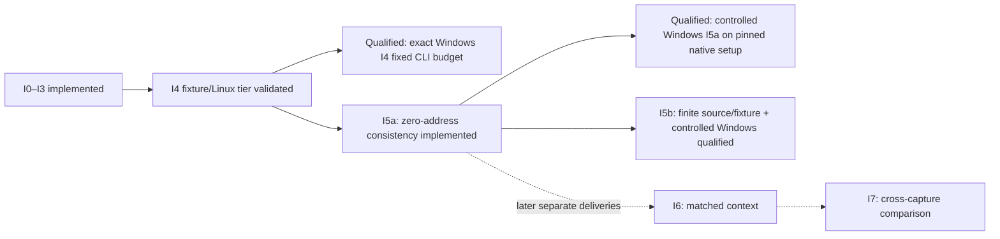

# Ariadne investigation-layer stage plan

## Context and follow-up

**Status.** Current stage/status plan as of 2026-10-07, including the selected I5b design, native I5a refresh and Windows I4 re-pin.
I0–I3 are implemented. I4 is validated for the recorded fixture/Linux tier, with
active real-Windows correctness and both fixed budgets passing in the
[native performance qualification](../docs/Ariadne/i4-performance-validation.md). I5a is implemented and passes
its historical source/fixture qualification. The native refresh qualifies its source/fixture and controlled Windows tiers
under the recorded dependency snapshot. I5b zero-base-plus-displacement has B0–B5
implemented and qualified for the recorded source/fixture and controlled partial/
full Windows tiers. Other I5
hypotheses and I6–I7 remain unimplemented.

**Why this document exists.** The [investigation design](../docs/Ariadne/investigation-layer-design.md)
turns possible-producer analysis into questions an investigator can audit. This
plan identifies which parts are delivered and which evidence or design work is
still needed; completed steps are no longer the starting task list.

**What this document establishes.** The current stage ledger, preserved acceptance
criteria for I0–I4, the bounded numeric question delivered by I5a, and the selected
I5b design/implementation sequence. It distinguishes
implementation, exercised qualification and future capabilities.

**Where to go next.**

- [I5b design](../docs/Ariadne/i5b-zero-base-offset-design.md) and
  [B0–B5 implementation plan](i5b-zero-base-offset.md) scope the selected
  zero-base-plus-nonzero-displacement question; [actual contracts](../docs/Ariadne/i5b-contracts.md)
  and [qualification](../docs/Ariadne/i5b-validation.md) separate implementation from acceptance.
- [Implemented contracts](../docs/Ariadne/investigation-contracts.md) define the
  actual interfaces, schema, limits and error behavior.
- [Windows I4 re-pin](../docs/Ariadne/i4-windows-repin-validation.md) records the
  replacement identity and historical baseline; the later
  [performance qualification](../docs/Ariadne/i4-performance-validation.md) closes its 2-second budget clause.
- [Latest correctness validation](../docs/Ariadne/investigation-correctness-validation.md)
  records the qualification/truncation repairs and their 17 passing gates.
- [I5a zero-address design](../docs/Ariadne/i5a-zero-address-design.md) scopes the
  first numeric address hypothesis and the context evidence it requires.
- [I5a execution plan](i5a-zero-address.md) assigns H0–H5 work and separate
  source/fixture and real-capture qualification tiers.
- [Native qualification](../docs/Ariadne/i5a-native-qualification.md)
  records complete native gates, passing controlled timings and the dependency snapshot.
- [I5a contracts](../docs/Ariadne/i5a-contracts.md) describe the implemented
  interface, strict schema and CLI.
- [First-delivery evidence](../docs/Ariadne/investigation-validation.md) explains
  the original supported query and fixture/Linux acceptance.

**What remains unresolved.** The exact Windows I4 capture/query is qualified at
1,692.696 ms against its unchanged 2,000 ms CLI limit; later source/tool changes
require fresh or exact-inventory-verified acceptance. The original Electron
artifact is historical after the user-authorized re-pin. The [controlled Windows I5a demo](../docs/Ariadne/crashpad-demo-validation.md)
passes capture/answer checks. Its native successor now qualifies both budgets and capture modes using a
read-only dependency snapshot. I5b now has [18-gate source/tool-bound qualification](../docs/Ariadne/i5b-validation.md);
later changes need fresh or exact-inventory-verified acceptance. Other hypotheses, object/lifetime, source-context
and cross-capture capabilities remain later work.

The [documentation map](../docs/documentation-map.md) is optional navigation.

## Current stage ledger

| Stage | Current state | Evidence or next action |
| --- | --- | --- |
| I0 — Contracts and identity | Implemented | Exact prepared/analyzer binding, typed claims and strict v1 explanation schema; see [contracts](../docs/Ariadne/investigation-contracts.md). |
| I1 — Address-expression evidence | Implemented within the admitted BIL subset | Typed memory-access expressions, input bytes and AST attribution are retained by [BAP address extraction](../src/bap/address.rs). Unsupported shapes keep gaps. |
| I2 — Explanation module | Implemented; truncation repaired | Per-byte possible producers, alternatives, premises and evidence requirements; [repair validation](../docs/Ariadne/investigation-correctness-validation.md). |
| I3 — CLI and reports | Implemented | Explicit question/index selection and transactional text/JSON/DOT publication; [first delivery](../docs/Ariadne/investigation-validation.md). |
| I4 — Qualification | Exact active 98-start Windows and separate Linux tiers pass | [Native performance result](../docs/Ariadne/i4-performance-validation.md): 1,692.696 ms / 2,000 ms CLI and 182.924 ms / 250 ms phases, with current-inventory regressions and verified archives. |
| I5a — Zero-address consistency | Qualified for source/fixture and controlled Windows tiers | [Native qualification](../docs/Ariadne/i5a-native-qualification.md): 14 passing gates and both controlled capture modes under the selected snapshot; [H0–H5](i5a-zero-address.md) preserves the criteria. |
| I5b — Zero base plus nonzero displacement | B0–B5 implemented and corpus-qualified | [Contracts](../docs/Ariadne/i5b-contracts.md) and [validation](../docs/Ariadne/i5b-validation.md): encoded GPR-base receipt, valid fault context and separate source/fixture/controlled-Windows gates. |
| Other I5 hypotheses | Unspecified beyond roadmap | Each needs its own evidence, support/refutation criteria and negative controls. |
| I6 — Matched source/object context | Unimplemented | Define build/symbol/ABI/layout matching before making context or lifetime claims. |
| I7 — Cross-capture comparison | Unimplemented | Define explicit correspondence and preserve separate snapshot provenance. |



This diagram separates exact-corpus qualification from later product capabilities.
I4 is complete for the recorded capture/query and source/tool/dependency identities. Any I5 execution plan must state the I4 tier
on which it relies and separately qualify its new context-dependent conclusions.
The active I4 performance condition is met in the separate
[native performance result](../docs/Ariadne/i4-performance-validation.md). The separately qualified
[BAP Stage 2](bap-integration.md#stage-2-bap-analysis-core) uses its own unlimited
timing policy and cannot waive I4.

## Implemented module ownership

The project has one root Cargo package. The arrows below describe module
responsibilities, not separate crates:

```text
analysis                    → standard library
investigation               → analysis; codec/hash dependencies
reports                     → analysis, investigation
input                       → analysis, BAP, reports, investigation
BAP                         → analysis, reports
```

Investigation remains independent of input acquisition, the BAP runtime and
renderers. It consumes normalized evidence and completed analysis rather than
re-reading mutable files or launching another decoder/dataflow solver.

| Responsibility | Implemented sources |
| --- | --- |
| Typed address evidence | [address types](../src/effects/address.rs), [BIL extraction](../src/bap/address.rs), [preparation](../src/bap/prepare.rs) |
| Domain question and result | [model](../src/investigation/model.rs), [binding validation](../src/investigation/validate.rs), [explanation builder](../src/investigation/explain.rs) |
| Capture-to-domain adapter | [input binding](../src/input/investigation.rs) |
| Numeric zero-address question | [fault observations](../src/investigation/fault_context.rs), [assessment](../src/investigation/zero_address.rs), [reader retention](../src/input/fault_context.rs) |
| Serialization and rendering | [explanation reports](../src/reports/investigation.rs) |
| Product integration | [minidump CLI](../src/bin/ariadne-minidump.rs) |
| Qualification | [Rust question tests](../tests/investigation/explanations.rs), [native integration tests](../tests/input/investigation.rs), [acceptance runner](../tools/check_investigation.py) |

## Delivered I0 — Contracts and identity

The implemented interface is:

```text
bind_investigation(prepared, completed_analyzer) -> BoundInvestigation
explain_fault_address(bound, FaultAddressQuestion, ExplainLimits) -> Explanation
```

The binding compares the prepared request with the completed analyzer's original
request before `finish()` consumes it. It binds snapshot/artifact, query
entries/seeds/preparation limits, semantic profile, helper/runtime/projection and
captured evidence. `AnalysisResult` alone still lacks the complete request and
is insufficient for this join.

Acceptance criteria to preserve: same-snapshot wrong-query and wrong-snapshot
inputs are rejected; incomplete analysis cannot supply a completed bundle;
site/evidence domains and captured bytes agree. The implemented
`ariadne.fault-address-explanation/v1` contract rejects duplicate/unknown fields,
dangling references and unjustified status/classification. Its observed,
derived-under-premises and unknown classes do not assert executed history.

## Delivered I1 — Typed address-use evidence

Admitted BIL now retains memory-access index/role, widths, modular affine
expression, relevant GPR byte inputs and instruction/AST attribution. This is
additional evidence, not a new reaching-definitions semantics. Base/index/scale,
signed displacement and RIP-relative constants have scoped tests; unsupported
casts, modes and loaded/conditional address expressions retain explicit gaps.

Acceptance criteria to preserve: address inputs exclude store payload inputs;
virtual variables are resolved through validated definitions; captured VA and
AST identity bind expressions; unknown shapes never become guessed addresses.
Neither flattened operand lists nor crash-time register values substitute for
this preparation evidence.

## Delivered I2 — Explanation and bounded construction

The module reads the completed reaching map before the selected instruction,
groups possible origins by location/byte, attaches captured producer evidence and
traverses dependencies within explicit budgets. Entry origins, call alternatives,
weak memory, joins and mixed-byte origins retain their premises and gaps.

Acceptance criteria to preserve: claims trace back to scoped evidence/fact IDs;
`memory:any` does not become an object identity; a set of byte alternatives does
not establish a co-occurring whole-pointer value or an executed path.

The [completed correctness repair](completed/investigation-correctness-fixes.md)
adds atomic fact/claim admission and valid zero-budget behavior. Exhaustion
retains diagnostics and returns partial or unavailable output with
`truncated=true`; it does not relax strict validation. Invalid question sites or
access indices remain errors independently of budgets.

## Delivered I3 — Question, reports and publication

The actual CLI accepts `--explain-fault-address VA --memory-access N`, with
`--explanation-only` for explicit single-format explanation output. The question
adds a seed, never an inferred entry. Preparation and core analysis run once;
binding happens before the analyzer is consumed.

Acceptance criteria to preserve: original reports and explanation text/JSON/DOT
are staged together in output-directory mode; renderers preserve the typed
claim/evidence relations; invalid options and bindings fail before publication.
Normal queries and separate stateflow/IR report contracts remain compatible.
No renderer or language model may introduce facts absent from the typed result.

## I4 — Qualified tier and remaining Windows clause

The [latest source-bound repair record](../evidence/Ariadne/investigation-correctness-validation.json)
retains 17 passing investigation gates, including the nested 12-gate Stage E and
11-gate minidump campaigns, 13 detected investigation/producer mutants and two
controlled Python decision mutants. The 24 default reports compared before/after
were byte-identical. These are retained results for their recorded sources.

The acceptance corpus continues to cover platform fixtures, the NOT chain,
alias/self-move behavior, branch joins, opaque calls, weak memory, missing seeds,
absent/conflicting capture, cross-query/snapshot rejection, malformed reports
and finite resource exhaustion. Compile failures and tool timeouts receive no
mutation-sensitivity credit.

**Historical re-pin baseline:** the user-authorized
[active case](../evidence/Ariadne/investigation-windows-workload-case.json) replaces
the unavailable Electron artifact with an independently inspected real Windows
98-instruction Crashpad capture. The [re-pin record](../evidence/Ariadne/i4-windows-repin-validation.json)
passes all 17 implementation gates and capture/query checks. One warm-up and five
measured native-default explanation-CLI repeats yield **4,774.451 ms**, exceeding
the unchanged **2,000 ms** ceiling. That record’s full I4 acceptance was false solely on
this performance clause. Workload v3 records bind the active case ID/digest,
complete source/tool inventories, native receipts and qualification environment.
Base-mode and phase-only timings cannot substitute. The original manifest and
older results remain unchanged historical evidence.

**Completed Windows clause:** the [native D0–D3 follow-up](i4-performance-implementation.md)
qualifies the same exact query at 1,692.696 ms with one warm-up/five release
explanation-CLI repeats. Native replay, mutations and I5 regressions pass with
matching source/tool/dependency inventories; the [validation](../docs/Ariadne/i4-performance-validation.md)
retains the 3,625-entry verified archive. Full I4 acceptance passes for those
recorded identities.

The retained controlled Linux query separately meets the frozen 250 ms
binding/explanation/rendering phase condition. Passing it or a synthetic Windows
fixture does not satisfy the real-Windows CLI budget. Fresh qualification
requires current source/tool identities and the appropriate regressions; older
records remain historical after changes.

## I5a — Zero-address consistency

The [I5a design](../docs/Ariadne/i5a-zero-address-design.md) selects one hypothesis:
whether a selected scalar memory operand begins its access at virtual address
zero under a valid captured exception context. It defines eligible evidence,
three bounded conclusions and independent negative controls.

The implemented profile is Windows AMD64 scalar MOV access violations. The reader
retains sealed exception parameters, raw field spans and validity-qualified
registers; binding checks the exact completed query and capture. The new
assessment evaluates only the selected exception instruction and preserves
possible producers and structural control flow.

The [I5a execution plan](i5a-zero-address.md) records the H0–H5 sequence. A new
41-case corpus covers six reviewed forms and admission negatives; old Stage B
fixtures remain unchanged and return unknown. The [contracts](../docs/Ariadne/i5a-contracts.md)
define the separate schema and `--assess-zero-address` CLI modes. All 12
[source/fixture gates](../docs/Ariadne/i5a-validation.md) pass. The later controlled
Windows demo resolves the capture gap; its approximately 1.82 s CLI median is a
historical result. The [native refresh](../docs/Ariadne/i5a-native-qualification.md)
now qualifies both timing limits and both captures, with all 14 gates passing
under the selected read-only MirrorRust snapshot. Active Windows I4 now meets its fixed budget in the
[performance qualification](../docs/Ariadne/i4-performance-validation.md); its original Electron case is historical. Stage 2
adoption has its own retained qualification and current refresh obligation.

## Selected I5b — Zero base plus nonzero displacement

The selected [I5b design](../docs/Ariadne/i5b-zero-base-offset-design.md) asks
whether the encoded GPR base is zero and its signed displacement is nonzero
at the selected exception instruction. The [B0–B5 plan](i5b-zero-base-offset.md)
defines source ownership, a finite six-MOV base/displacement matrix, strict
result/CLI modes and independent acceptance tiers. B0–B5 are implemented and
[qualified](../docs/Ariadne/i5b-validation.md) with 18 passing gates, 15 detected
mutants, stable source/tool identities and separate controlled Windows tiers. This is machine-code bug debugging
at the exact captured site, with physical register/displacement evidence.

The first profile excludes indexes and requires independently decoded base-role
evidence to agree with BAP's affine expression. Existing normalized terms alone
cannot identify an encoded base. Missing/conflicting evidence yields unknown;
only complete admitted premises permit consistency or refutation. This does
not assess historical null derivation, object lifetime or actual branch history.
The design is distinct from I5a zero-start, and neither delivery closes I4.

## Other I5, I6 and I7 deliveries

| Stage | Capability | Required additional work |
| --- | --- | --- |
| Other I5 | Arithmetic/noncanonical hypotheses and model-relative discrimination beyond I5b | Separate support/refutation criteria and valid context. Lifetime hypotheses require matched allocation/free evidence; branch discrimination requires accepted transitions/completeness. |
| I6 | Matched source/function/object context | Explicit build/symbol/ABI/layout matches. Context can annotate identities; it cannot supply missing runtime bytes or observed execution. |
| I7 | Cross-capture comparison | Explicit correspondence across independently qualified captures, with no joins by naked VA and no assumed chronology. |

Each is a separate delivery. Missing evidence means unknown, not refutation.
An LLM may later verbalize typed claims, but cannot become the authority for
missing facts, invented traces or numerical confidence. The independent ISA
instruction-step campaign is retired under the
[semantic assurance decision](../docs/Ariadne/semantic-assurance.md).
