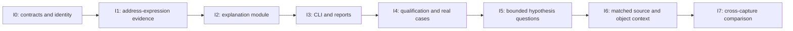

# Ariadne investigation-layer implementation plan

## Context and follow-up

**Status.** Active plan: first question delivered within a bounded tier; later questions remain open.

**Why this document exists.** [Investigation design](../docs/Ariadne/investigation-layer-design.md) motivates question-specific explanations above graph primitives.

**What this document establishes.** I0–I3 deliver typed address evidence, exact query binding, explanation and reports. I4 qualifies that question on specified artifacts; I5–I7 describe later investigation capabilities.

**Where to go next.**

- [Implemented contracts](../docs/Ariadne/investigation-contracts.md) — show the actual first-question interface.
- [Delivery record](../docs/Ariadne/investigation-validation.md) — distinguishes exercised fixtures/Linux from missing full I4 acceptance.

**What remains unresolved.** The first fault-address question is implemented, but full original-Windows I4 qualification remains open. Later hypothesis, object/source-context and cross-capture questions are planned, not delivered.

For the wider context, see the optional [documentation map](../docs/documentation-map.md).

Prepared **2026-10-01**, grounded in implementation **`7de5a1e`**.
Status: **I0–I3 implemented; I4 qualified at the exercised fixture/Linux tier.**
Full original-Windows I4 acceptance remains partial.
Evidence: [first-delivery validation](../docs/Ariadne/investigation-validation.md).
Actual interfaces and commands: [implemented contracts](../docs/Ariadne/investigation-contracts.md).
Design: [investigation layer](../docs/Ariadne/investigation-layer-design.md).

Deliver a question-specific explanation above the current BAP/Rust analysis.
The first release answers **“Which earlier definitions could contribute to this
fault-address operand, and what evidence supports or limits that answer?”**
It returns evidence, alternatives and missing premises rather than only a slice.

## Delivery sequence



**Implement I0–I4 first.** I5–I7 are separate deliveries with new evidence
requirements. The [BAP analysis-core migration](bap-integration.md#stage-2-bap-analysis-core)
is a separate infrastructure track; it is not required to build the first
explanation over the already validated Rust result. Its missing Stage 1/Windows
prerequisite is not waived by this plan.

## Current implementation constraints

| Existing fact | Consequence for implementation |
| --- | --- |
| `FilePreparedAnalysis` retains prepared requests, read spans, semantic evidence and query identity. | Reuse these facts through an input adapter. Avoid re-reading mutable files or decoding another instruction stream. |
| `AnalysisResult` retains snapshot identity but not the complete query/request. | A result with the same snapshot may belong to another query. Bind an explanation while the completed `Analyzer` still exposes its original request; compare that request with the prepared request. |
| `InstructionEvidence.operands` includes structured memory operands for immediate stores, while other forms may have flattened decoded register facts. | Do not infer an address operand by inspecting the existing register list. Add typed address-use evidence from the admitted BIL at preparation time. |
| BIL is available in `bap::Backend::prepare`, but only its hash is retained in current semantic evidence. | Extract bounded address expressions before discarding the AST, with an AST/VA/byte binding and stable per-access identity. No second native helper is necessary. |
| Core origins are per location/byte, and memory is `memory:any`. | Group origins without inventing whole-pointer co-occurrence, precise aliases or object lifetime. |
| `input/` owns the CLI, so adding a module that depends on `input/` back into that package would form a Cargo dependency cycle. | The investigation module consumes its own normalized context plus root model types. The concrete adapter belongs in `input/`. |

These constraints are grounded in [materialize.rs](../src/input/materialize.rs),
[model.rs](../src/model.rs), [engine.rs](../src/engine.rs),
[BAP preparation](../src/bap/prepare.rs), and
[decoded operand representation](../src/llvm_mc/reference.rs).

## Module layout and dependencies

The user-requested [source-layout consolidation](completed/rust-source-layout.md) places
the implemented investigation in **`src/investigation/`**, with unsafe code
forbidden. It shares the root manifest and lockfile. Core-only builds use
`--no-default-features`; the following relationships are module dependencies.

```text
analysis                    → standard library
investigation               → analysis; codec/hash dependencies
reports                     → analysis, investigation
input                       → analysis, BAP, reports, investigation
BAP                         → analysis, reports
```

`src/investigation/` must not depend on `input`, `bap` or `reports`. This keeps the
graph acyclic and separates question logic from input acquisition/rendering.
The diagram describes responsibility boundaries inside the single package.

| Ownership | Proposed files | Work |
| --- | --- | --- |
| Address evidence | `src/effects.rs`, `src/bap/projection.rs`, `src/bap/prepare.rs` | Common address-use facts and BIL extraction; no changes to reaching-definition semantics. |
| Domain module | `src/investigation/{mod,model,validate,explain}.rs` | Small question interface, validated owned inputs, evidence IDs and explanation construction. |
| Input adapter | `src/input/investigation.rs` | Bind completed analysis to prepared request/query/read evidence and normalize context. |
| Serialization/rendering | `src/reports/investigation.rs`, report codecs | Versioned explanation envelope and pure renderers. |
| Product integration | `src/bin/ariadne-minidump.rs`, relevant manifests | Question options and transactional publication. |
| Qualification | `tests/investigation/`, `tests/input/investigation.rs`, `tools/check_investigation.py`, `tools/check_investigation_mutations.py` | Independent expectations, actual mutants, source binding and workload evidence. |

Keep construction helpers internal. Do not introduce a large generic query
framework or an abstract engine interface for a hypothetical BAP-core adapter.
The accepted normalized analysis facts are the current seam.

## I0 — Freeze contracts, identity and supported scope

Define the first interface and input/report contracts before writing claim logic.
Names below are proposed and become public only after implementation:

```text
input adapter:
  bind_investigation(prepared, completed_analyzer) -> BoundInvestigation

domain interface:
  explain_fault_address(bound_investigation, question) -> Explanation

FaultAddressQuestion:
  instruction VA
  selected memory-access index

Explanation:
  identity and question
  answer status: explained | partial | unavailable
  address expression and relevant input locations
  possible origins grouped by address-input byte/location
  producer descriptions with evidence references
  claims and their premises
  unresolved alternatives and gaps
  concrete evidence requirements
```

A decoder-target completeness flag is not a guarantee of effect completeness,
stateflow completeness or observed execution. Claim classification begins with
`observed`, `derived_under_premises` and `unknown`. Structural reachability must
not be called path feasibility. Require an explicit memory-access selection
when a site has several accesses; do not silently choose an operand.

Freeze a report schema such as `ariadne.fault-address-explanation/v1`. Machine
VAs keep canonical full-width strings. Unknown/duplicate fields, unresolved
references and unsupported schema versions are errors in serialized contracts.
The schema is a proposal, not an existing accepted message.

Bind identity to snapshot/artifact digest, query entries/seeds/limits, admitted
semantic profile and helper/runtime/projection identity. Use canonical content
for stable IDs; never bind an evidence/claim by naked VA. The adapter checks:

1. Core phase is `Done`; infrastructure/budget failures have produced no bundle.
2. Prepared request equals `completed_analyzer.request()` and snapshot identities
   match. Construct the bundle before consuming the analyzer with `finish()`.
3. Site/evidence/map domains and referenced locations belong to that request.
4. The selected site's read bytes and admitted address evidence agree with its
   VA, consumed bytes, semantic identity and AST digest.

Expose the completed bundle as an owned, validated value with read-only
accessors. Do not accept arbitrary public `AnalysisResult` plus matching snapshot
text as sufficient query binding.

**Exit:** documented schemas and error/status rules, package graph without cycles,
and independent examples for a supported store, wrong query on the same snapshot,
wrong snapshot, unsupported operand and unreached instruction.

## I1 — Retain typed address-expression evidence

Extend preparation evidence with bounded memory-access facts derived from the
admitted BIL. Suggested shape:

```text
MemoryAccessEvidence:
  access index and load/store role
  access width and address width
  normalized address expression
  address-input byte locations
  instruction/AST attribution
  expression support status and gaps
```

Recognize source-reviewed forms first: immediate stores, supported scalar
loads/stores, base+index*scale+signed displacement, and RIP-relative constants
where the captured instruction VA establishes the constant. Distinguish address
inputs from store payload inputs. Resolve BIL temporaries only through their
validated definitions and bounded expression traversal.

Do not synthesize an expression from a flat register list, pretty assembly or
crash-time register values. Unknown/special expressions, unsupported segment or
address modes, invalid widths and multi-access ambiguity retain explicit gaps.
A retained unknown expression cannot claim an exact effective address.

Keep the existing effect summaries unchanged by this metadata addition. Avoid
changing the native protocol unless the typed AST lacks a required fact. Where
serialization changes, preserve existing low-level report consumers or provide
an independently versioned address-evidence field.

**Exit:** independent exact-expression/address-input expectations for both Stage B
platforms, indexed and RIP-relative addressing, signed displacement, payload-only
registers, aliases and unsupported cases. Native mutations must distinguish a
bad address fact from a compile/timeout failure.

## I2 — Implement the explanation module

Implement one question through the domain interface:

1. Validate the query and find admitted address-use evidence at the selected VA.
2. Select the address-input locations and read their origins from the completed
   reaching map **before** the instruction.
3. Group origins by byte/location. Keep entry origins, multiple producers and
   mixed-byte origins distinct; a grouped display must not imply joint feasibility.
4. Attach each instruction origin to captured bytes/spans, semantic quality,
   producer identity and relevant predecessor dependency facts.
5. Preserve a bounded dependency explanation from existing results. Do not build
   another reaching-definitions solver or turn the unordered slice into a trace.
6. Retain gaps that affect the answer: opaque call, weak aliasing, missing or
   conflicting capture, unsupported producer, unknown targets and unmet premises.
7. Emit typed claims with supporting references, premises and scope. Return
   `partial`/`unavailable` where an answer cannot be completed.

Evidence requirements should identify concrete missing observations or accepted
semantic refinements. For example, an entry origin needs earlier justified
input/trace evidence; an opaque call requires accepted callee evidence; a weak
memory origin needs alias/object evidence. “Get more data” is insufficient.

An absent prerequisite is not a refuted alternative. A control path compatible
with a dependency is not an observed execution. The module must not infer UAF,
store retirement, causation or numeric confidence from a producer slice.

Set explicit finite limits for evidence nodes, origin links and explanation
traversal. Budget exhaustion returns a typed diagnostic/partial outcome with the
unmet limit; it must never publish an apparently complete truncated explanation.

**Exit:** a small independently checked normalized corpus covering the simple
producer chain, NOT transformation, partial writes, self-moves, joins, weak stores,
opaque calls, missing seeds and conflicting capture. Each claim can be audited
back to its supporting inputs through the same public interface.

## I3 — Integrate the question, reports and publication

Proposed CLI shape: an explicit fault-address explanation request plus selected
memory-access index. For example, `--explain-fault-address VA --memory-access N`;
these are proposed flags and must not appear as existing commands until delivered.
If exception RIP is used as a site shortcut, it supplies only the selected
instruction, not an inferred function entry or pre-crash state.

The CLI continues to prepare once and run the Rust analyzer once. Construct the
bound investigation context while the completed analyzer still exposes its
request. Invoke the domain module, then finish/render the existing core result.
Integrate optional stateflow output without borrowing unprovided completeness
premises or changing the original recovery context.

Output-directory mode should retain the existing reports and add independently
versioned `explanation.json` and `explanation.txt`; DOT may represent an evidence
relation graph if it preserves the same identities and uncertainty. Stage all
outputs together and reuse existing transactional publication. Ordinary CLI
invocations remain compatible. Explanation-only output requires an explicit mode.

Keep serialization strict and renderers pure. Test text/JSON by independent
parsing and compare claim/evidence relationships. No prose generator may add
facts not present in the typed explanation.

**Exit:** both platform fixtures expose the earlier producer and exact byte
sources, reject malformed options/query bindings before publication, and retain
partial results without pretending to solve a missing seed. Standard CLI and
stateflow/IR report regressions pass.

## I4 — Qualification, real captures and performance

Create a source-bound `tools/check_investigation.py` rather than relabeling
existing BAP/Stage E evidence. Include exact source, manifest, helper, corpus,
input and output digests. Report each exercised completion clause and retain
unavailable checks separately.

| Required case | Independent expectation |
| --- | --- |
| Windows/Linux Stage B | Address is based on RAX; the earlier MOV is a possible producer, the unrelated RCX write is not an address producer, and captured offsets match the fixture. |
| Controlled NOT | MOV and NOT belong to the address dependency explanation, without claiming they executed in that order historically. |
| Alias/self-move | Relevant byte origins and explicit definitions are preserved; no whole-pointer producer is invented from mixed cells. |
| Branch join | All possible producers are retained; structural alternatives are not labelled feasible/observed without appropriate premises. |
| Opaque call | Earlier and call-origin alternatives remain visible; no ABI-based preservation is manufactured. |
| Weak memory | All admitted possible origins remain; `memory:any` does not become a precise object identity. |
| Absent/short/conflicting capture | Unsupported/unavailable facts retain their cause and captured contributors, not a guessed expression or producer. |
| Same snapshot, different query | An analyzer belonging to another entries/seeds/limits selection cannot supply this explanation. |
| Same VA, different snapshot | Evidence and claims cannot join across captures. |
| Malformed serialized explanation | Missing/duplicate IDs, dangling evidence, incorrect scope and unjustified status are rejected. |

Mechanically mutate the real implementation with unchanged observers. Required
faults: wrong address-input/payload separation, swapped site/query identity,
wrong dump offset, dropped branch/entry/call origins, whole-register grouping,
precise-memory fabrication, unordered-slice-as-history, suppressed gaps and
unsupported root-cause labels. Compiler errors, unavailable tools and timeouts
receive no detection credit. Add mutations to changed address-evidence producers
as well as the higher-level claim logic.

Run appropriate Cargo tests, formatting and Clippy for changed packages. Re-run
BAP/minidump/Stage E checks where shared types, producer evidence or CLI paths
change. Reuse historical records only when relevant source/tool hashes match;
retain earlier records as historical evidence after changes.

Real-case acceptance uses the pinned controlled Chromium/Linux artifact and its
independent entry/producer witnesses. The missing original Windows artifact
remains an explicit dependency of real-Windows qualification. Tool-produced
Windows fixtures can qualify their own tier but cannot substitute for that
historical-capture clause. The fixture's known UAF trigger is an oracle context,
not a conclusion the implementation may infer from unrelated dump contents.

Measure the normal release CLI path and separately time explanation construction
and rendering: one warm-up, at least five repeats, median/min/max, resource
outcomes and deterministic output identity. Choose and freeze a bounded explanation
cost budget during I0/I1 measurement; preserve the existing 2,000 ms median
condition for the pinned Windows query. Do not claim a total-query pass from an
explanation-only timing or silently weaken the original condition.

**Exit:** passing independent claims, real mutation mismatches, affected regressions,
source stability and retained derived evidence. Claim I0–I4 complete only at the
explicitly exercised platform/workload tier; unavailable real-Windows acceptance
remains partial and does not qualify BAP Stage 2.

## Later deliveries: I5–I7

| Stage | Concrete capability | Preconditions and acceptance |
| --- | --- | --- |
| I5. Hypothesis questions | Assess consistency of bounded address hypotheses, and distinguish supported facts, unresolved alternatives and model-relative refutation. | First qualify fault-time operand/context validity. Object-lifetime claims require matched object/allocation/free evidence. Branch discrimination requires accepted transitions and completeness. Each hypothesis has support/refutation criteria and negative controls; absence of evidence is not refutation. |
| I6. Matched source/object context | Explain relevant source/function/object context behind a candidate producer. | Require explicit build/symbol/ABI/layout match evidence. Context can annotate identities and witnesses but cannot fill missing runtime code or establish an executed history. Reject mismatched artifacts and layouts. |
| I7. Cross-capture comparison | Compare claims, producers and gaps between two independently qualified investigations. | Require explicit correspondence by matched identities; never join naked VAs or presume chronology. Retain per-capture provenance, causes of difference and unsupported comparisons. |

Specify and qualify each delivery separately after the first explanation proves
useful. These stages are not permission to invent traces, heap lifetime or
concurrency evidence. An LLM may later verbalize typed claims, but cannot become
the authority for missing facts or confidence.

## Start point, ownership and completion

Begin with **I0**, then **I1 address-use evidence**, then the I2 module. Review the
first Stage B explanation before broadening question types. Suggested execution
ownership follows the file table above; if work is delegated later, explicitly
assign files and require collaborators to preserve each other's edits. No
parallel implementation is authorized or required by this planning document.

The first delivery has succeeded when an investigator can ask the one supported
question and audit the answer, alternatives and evidence requirements without
manually interpreting a raw slice. A formatter that repeats the existing slice
is not sufficient. Preserve the separate full Windows/Stage 1, Stage 2 and ISA
acceptance statuses.

The plan was followed by user-authorized implementation and publication. The
[design](../docs/Ariadne/investigation-layer-design.md)
must link directly to this plan in the same change, naming the first-delivery
stages. Validate that link and all newly added local references before finishing.
