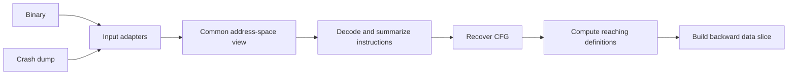

# Ariadne

Ariadne is a machine-code analysis project for understanding control flow and
data dependencies in binaries and crash dumps. Its motivating use case is
investigating Chromium and Electron crashes: start from instructions of interest,
recover their surrounding control flow, and trace possible origins of the values
they use.

**Current status: formal specification.** This repository contains a TLA+ model,
executable model-checking scenarios, and documentation. Binary/dump readers, LLVM
integration, the analyzer CLI, and graph exporters have not been implemented.

The intended implementation stack is **C++23, Bazel, and a pinned LLVM release**.
The LLVM release has not yet been selected or pinned; there are currently no
Bazel build targets. LLVM MC is the intended instruction-decoding foundation.
Instruction-effect summaries and memory-alias analysis require an additional
semantic layer; decoder metadata alone does not provide the complete analysis.

## Intended workflow

Both input formats should feed the same analysis engine through a common view
of addresses, available bytes, module mappings, and instruction semantics:



The current model abstracts the input adapters and decoder as fixed inputs. It
specifies the engine's behavior once byte availability and instruction summaries
have been supplied. Planned outputs include annotated assembly, a unified graph,
and dependency information, with JSON and Graphviz DOT export for SVG rendering.

## Analysis phases

The model describes the analyzer's execution, rather than executing the program
under investigation.

| Phase | Behavior | Completion condition |
| --- | --- | --- |
| `recover` | Visit entry points and known local successors; record instruction provenance, edges, and unresolved information | Every discovered local address has been attempted |
| `dataflow` | Propagate possible value origins, combining alternatives at joins and revisiting loops | Reaching definitions reach a fixed point |
| `slice` | Follow data producers backward from the requested decoded instructions | No further producer instructions can be added |
| `done` | Expose the graph, data-flow results, slice, and remaining gaps | Terminal analysis state |

A reaching definition identifies an instruction that could have supplied a
location's value. A definite overwrite removes earlier definitions of that
location; a possible overwrite preserves both old and new origins. The backward
slice follows these relationships from the instructions being investigated.

## Modeling decisions

- **Preserve byte provenance.** Dump-captured bytes take precedence. Filling a
  missing span from a binary requires a separate suitability certificate covering
  image identity, address mapping, relocations, and possible runtime changes.
- **Represent uncertainty explicitly.** Missing bytes, decode failures, and
  incomplete indirect-jump or call targets become unresolved obligations. A
  finished analysis can still be partial.
- **Keep structural alternatives.** Conditional branches retain both edges.
  Crash-time register values do not automatically establish earlier branch
  outcomes or justify pruning paths.
- **Use one edge representation.** Local and `call` edges share the graph, while
  explicit policies determine which edges discovery and data flow follow.

For a call at A to F with continuation B, the graph contains:

```text
A --call----> F
A --summary-> B
```

The `call` edge identifies a possible callee. The `summary` edge represents the
call's summarized effects followed by a possible return. Local analysis follows
the summary edge; it neither visits the callee automatically nor transmits
definitions across the call edge. This remains true when the callee is analyzed
independently as another entry point.

## Scope and limitations

The current specification models an instruction-level CFG, forward may-reaching
definitions, and a backward **data** slice over a finite request. Its inputs
already contain decoded instruction summaries; checking the model does not
validate an instruction decoder, dump parser, symbol file, or alias analysis.

The slice follows all modeled inputs of each included instruction. It does not
yet select individual operands, include control dependencies, or establish which
instructions actually executed. Missing slice seeds are reported separately.

Interprocedural call/return matching, path-feasibility reasoning, concrete CPU
execution, exceptions and unwinding, concurrency, self-modifying code, and TTD
history are outside the current model. Basic-block coalescing is also deferred.
These boundaries matter when interpreting a result: a possible dependency is
evidence for investigation, not proof of a crash's root cause.

See [the formal-model guide](Specs/README.md) for the complete input contract,
state transitions, invariants, and interpretation of partial results.

## Repository guide

| Path | Purpose |
| --- | --- |
| [Specs/Ariadne.tla](Specs/Ariadne.tla) | Core state machine, with detailed behavioral comments and Apalache type annotations |
| [Specs/AriadneExample.tla](Specs/AriadneExample.tla) | Binary, dump, loop, and closed-graph scenarios |
| [Specs/AriadnePipeline.tla](Specs/AriadnePipeline.tla) | Small end-to-end recovery, propagation, and slicing scenario |
| [Specs/AriadneCalls.tla](Specs/AriadneCalls.tla) | Call visibility, discovery isolation, and data-flow isolation regression |
| [Specs/check-apalache.sh](Specs/check-apalache.sh) | Typechecking and bounded safety checks |
| [Specs/README.md](Specs/README.md) | Checking commands, assumptions, and recorded validation results |

The `.cfg` files in `Specs/` configure TLC scenarios. Temporary directories,
model-checker outputs, and Bazel output paths are covered by [.gitignore](.gitignore).

## Run the specification checks

Use Java and the corresponding TLA+ tools. Recorded validation used **Java 17**,
**Apalache 0.57.0**, and **TLC 2.19**. These are tested versions, not a repository
dependency lock. No C++ or Bazel installation is needed for the model checks.

From the repository root, run Apalache with `apalache-mc` on `PATH`:

```sh
bash Specs/check-apalache.sh
```

To select another installation, set `APALACHE_MC` to its absolute executable path:

```sh
APALACHE_MC=/absolute/path/to/apalache-mc bash Specs/check-apalache.sh
```

The script typechecks all four modules, checks the four general scenarios and
the call regression through six transitions, and checks the pipeline through
eight transitions. Artifacts go to a fresh temporary directory whose path is
printed at startup. These checks can take several minutes.

An optional bound and general-scenario selector are supported:

```sh
bash Specs/check-apalache.sh 6 Loop
```

This selects `Loop` among the general scenarios; the pipeline and call regression
still run. The supplied bound also applies to the call regression, while the
pipeline remains at eight steps. Higher bounds can be substantially more costly.

For an exhaustive TLC check of the call scenario, with a `tlc` launcher on `PATH`:

```sh
cd Specs
tlc -workers 2 -metadir /tmp/ariadne-tlc-calls -config Calls.cfg AriadneCalls.tla
```

If using the tools JAR directly, replace `tlc` with
`java -cp /absolute/path/to/tla2tools.jar tlc2.TLC`. Commands for all six TLC
scenarios are in [Specs/README.md](Specs/README.md#tlc).

## Validation status

The [recorded checks](Specs/README.md#model-checking) passed for all six TLC
scenarios, including safety and fair termination. Apalache passed bounded safety
at the default bounds described above. The call regression also rejected
deliberately broken variants that traversed call edges or allowed them into
local data-flow propagation.

Apalache's bounded checks do not establish unbounded termination or exercise
completion of every larger scenario. Exploratory call-case checks at bound
twelve were stopped for runtime and are not counted as passes. TLC checks the
entire reachable state space of each supplied finite instance; that is not a
proof for every possible input or for a future C++ implementation.
