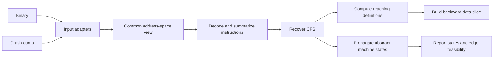
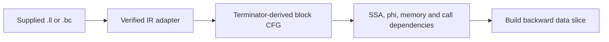

# Ariadne

## Context and follow-up

**Status.** Project entry point.

**Why this document exists.** [Roadmap](ROADMAP.md) defines the crash-investigation scope and delivery direction.

**What this document establishes.** Ariadne recovers local control flow and possible value origins from one captured snapshot, then presents evidence-bound crash-investigation answers.

**Where to go next.**

- [Documentation index](docs/Ariadne/README.md) — find the current interfaces and contracts.
- [Plan index](Plans/README.md) — separates remaining work from completed and retired work.

**What remains unresolved.** Full original-Windows I4 and controlled real Windows I5a qualification remain open. Native BAP recovery, dataflow, slicing and finite stateflow are implemented; [Stage 2 qualification](docs/Ariadne/bap-core-qualification.md) records passing aggregate acceptance and default adoption. Possible-producer and zero-address questions are implemented; other hypothesis, object/source-context and cross-capture questions remain later work.

For the wider context, see the optional [documentation map](docs/documentation-map.md).

Ariadne is a machine-code analysis project for understanding control flow and
data dependencies in binaries and crash dumps. Its motivating use case is
investigating Chromium and Electron crashes: start from instructions of interest,
recover their surrounding control flow, and trace possible origins of the values
they use.

**Current status: native BAP analysis, Rust reference and formal specifications.** The
Rust library implements `Specs/Ariadne.tla`: local CFG recovery, may-reaching
definitions, and backward data slicing from fixed adapter-supplied inputs.
The [BAP adapter](docs/Ariadne/modules/bap.md) is now the sole production minidump semantic
backend. It projects a finite typed-BIL subset into byte-register, flag and
weak-memory effects. LLVM MC 20 remains an independent decode/control reference;
its semantic selector and automatic effect fallback have been removed.
The [Stage 1 removal plan](Plans/completed/bap-only-semantics.md) records the requested
default change. Unsupported BIL retains explicit opaque/control gaps.
Historical [LLVM effect-rule research](docs/Ariadne/operand-effects-rules.md)
and its formal tests remain reference evidence, distinct from production BAP.
Neither backend establishes architectural instruction-step acceptance or a
historical crash path. The [controlled Crashpad replacement](docs/Ariadne/bap-windows-repin-validation.md)
is captured, independently inspected and pinned for replay. All 17 implementation
gates passed in the capture campaign. The user has since selected an
[unlimited latency policy](docs/Ariadne/bap-unlimited-validation.md); correctness
and source/tool evidence continue to govern qualification. [Stage 2 native algorithms](docs/Ariadne/bap-core-qualification.md) are qualified on the exercised corpus and selected by default; Rust remains available explicitly.

The [I5a assessment](docs/Ariadne/i5a-contracts.md) asks whether a selected Windows
AMD64 scalar MOV access starts at zero under admitted captured-context premises.
It retains a separate result and explicit unknowns; a zero effective address does
not establish a null-pointer root cause. Its [delivery record](docs/Ariadne/i5a-validation.md)
separates source/fixture validation from real Windows qualification. The later
[Crashpad demo](docs/Ariadne/crashpad-demo-validation.md) now supplies controlled
Windows captures and passing answers, with CLI timing still above its limit.
The [minidump input module](docs/Ariadne/modules/input.md) now reads Windows/Linux
AMD64 captures and discovers local instruction starts. A pinned tool-produced
[predecessor fixture](docs/Ariadne/stage-b-c-validation.md) now yields an
address-producer slice, and its [investigator CLI](docs/Ariadne/stage-c-report-schema.md)
publishes evidence-linked text, DOT and JSON v1. PE/ELF image and ELF core
readers remain deferred under the current input scope.
A separate [controlled Chromium real-capture case](docs/Ariadne/priority-1-real-capture-validation.md)
now reaches a faulting memory read from an independently established captured
entry and retains a possible address producer with explicit opaque-call gaps.
The CLI text report now has a [scan-friendly instruction overview and
Linux/Windows examples](docs/Ariadne/priority-3-presentation-validation.md);
JSON v1 and DOT graph semantics remain unchanged. The first
[performance measurement](docs/Ariadne/priority-4-performance-validation.md)
is bounded by a 34-node real capture and does not qualify larger workloads.
The [rendering module](docs/Ariadne/result-rendering.md) now produces readable
text and Graphviz DOT from analyzer outcomes.
The separate abstract-stateflow and supplied-IR paths pass
[Stage E generated replay, mutation and report/CLI acceptance](docs/Ariadne/stage-e-completion.md)
within the recorded finite corpus. Independent ISA proof artifacts are retained
as retired historical reference.

Ariadne relies on a pinned BAP lifter for AMD64 instruction semantics and
validates its own semantic projection and analysis. Results remain conditional
on supported lifting behavior and captured evidence. The independent AMD64
instruction-step/Lean track is **retired**, including its user64 milestones and
full-manual roadmap. Historical artifacts remain available for reference.
The [semantic assurance decision](docs/Ariadne/semantic-assurance.md) defines
this boundary. Analysis-level TLA+ specifications, replay and mutation checks
remain active.
The [Stage F record](docs/Ariadne/stage-f-proof-and-performance.md) states the
remaining Rust refinement boundary and reports a repeatable performance
baseline without claiming a proof or qualified solver optimization.

The [documentation index](docs/Ariadne/README.md) links current guides and
contracts. The [plan index](Plans/README.md) separates active work, completed
plans and retired research.

The project uses **Rust 2024 and one root Cargo package**. Rust sources live in
`src/`, integration tests and fixtures in `tests/`, and build artifacts in
`target/`. The core-only `--no-default-features` build has no activated external
crate dependencies. Default features enable the minidump and supplied-IR CLIs;
`bench` and `mbt` enable the benchmark and MirrorRust replay tools.
The independent decode reference pins LLVM MC 20.1.2. BAP supplies current
production effects; memory remains conservative and calls remain opaque.
Broader projection coverage and precise alias analysis remain future work.
The [initial effects evidence](docs/Ariadne/operand-effects-validation.md) and
[Stage A evidence](docs/Ariadne/stage-a-validation.md) describe the historical
LLVM rule path that preceded BAP.

Build and test from the repository root:

```sh
cargo build --offline --locked --release
cargo test --offline --locked
cargo clippy --offline --locked --all-features --all-targets -- -D warnings
```

The build produces `target/release/ariadne-minidump` and
`target/release/ariadne-ir`. The [source-layout plan](Plans/completed/rust-source-layout.md)
records the consolidation, and the [implementation guide](docs/implementation.md)
describes the modules and validation scope.
The [layout delivery](docs/Ariadne/rust-source-layout.md) records source and CLI
equivalence checks against the previous build.

Running the minidump CLI also requires the [BAP lifter](native/bap/README.md),
LLVM MC decode reference and [native analysis helper](native/bap-core/README.md).
Cargo does not build those helpers. The default analysis backend is BAP;
`--analysis-backend rust` selects the reference analyzer. See the
[backend setup guide](docs/Ariadne/modules/bap.md) for build and path options.

Use `ariadne::analyze(request)` for a completed result, or `Analyzer::step()` to
observe individual specification transitions. The input contract, runnable
example, and specification correspondence are described in
[the implementation guide](docs/implementation.md).

The [model-based test gate](mbt/README.md) uses Mirrors' generated `mirrorrust-v1`
bindings. A separate [Stage E integration](mbt/stage-e/README.md) connects the
machine-state and LLVM IR engines to the sibling MirrorRust client for generated
finite replay and engine mutation checks. [Stage E reports and CLIs](docs/Ariadne/stage-e-completion.md)
now preserve each result family independently. The core gate uses a generated
binding and MirrorRust to replay TLC-generated traces against the real Rust
analyzer, with required interface negotiation, coverage checks, and deliberate
implementation mutations:

```sh
python3 mbt/run.py
```

Follow the MBT guide's one-time tool preparation first; ordinary Cargo tests
remain independent of the model-checking tools and client dependencies.

## Intended workflow

Binary and dump inputs should feed the same machine analysis through a common view
of addresses, available bytes, module mappings, and instruction semantics:


```mermaid
flowchart LR
    Binary[Binary] --> Input[Input adapters]
    Dump[Crash dump] --> Input
    Input --> View[Common address-space view]
    View --> Decode[Decode and summarize instructions]
    Decode --> CFG[Recover CFG]
    CFG --> Dataflow[Compute reaching definitions]
    CFG --> Stateflow[Propagate abstract machine states]
    Dataflow --> Slice[Build backward data slice]
    Stateflow --> StateResults[Report states and edge feasibility]
```

Native LLVM IR is a separate input path. It is not reconstructed from machine
code:


```mermaid
flowchart LR
    IR[Supplied .ll or .bc] --> Adapter[Verified IR adapter]
    Adapter --> IRCFG[Terminator-derived block CFG]
    IRCFG --> Dependencies[SSA, phi, memory and call dependencies]
    Dependencies --> IRSlice[Build backward data slice]
```

Each request uses one immutable address-space snapshot, identified by
`SnapshotId`. `Addresses` and `EntryPoints` contain virtual addresses directly;
entry points start discovery and do not define an address base. Adapters map
those VAs to dump regions or binary sections/segments. Storage offsets and
compact graph node IDs are not semantic addresses.

Snowcat annotations use the shared `$address` type alias for every semantic VA.
The alias expands to `Int` for Apalache and is documentary rather than nominal;
unrelated integer quantities retain explicit `Int` annotations.

The machine model abstracts the input adapters and decoder as fixed inputs. It
specifies the engine's behavior once byte availability and instruction summaries
have been supplied. The rendering module supplies a unified CFG with slice and obligation
annotations as Graphviz DOT for SVG rendering, plus a full text report of
possible value origins. The minidump report layer now adds JSON v1 and captured
evidence; further annotated assembly remains planned.

## Machine analysis phases

The model describes the analyzer's execution, rather than executing the program
under investigation.

| Phase | Behavior | Completion condition |
| --- | --- | --- |
| `recover` | Visit entry points and known local successors; record instruction provenance, edges, and unresolved information | Every discovered local address has been attempted |
| `dataflow` | Propagate possible value origins, combining alternatives at joins and revisiting loops | Reaching definitions reach a fixed point |
| `slice` | Follow data producers backward from the requested decoded instructions | No further producer instructions can be added |
| `done` | Expose the graph, data-flow results, slice, and remaining gaps | Terminal analysis state |

A reaching definition identifies an instruction that could have supplied a
location's value. A definite overwrite removes earlier definitions of that
location; a possible overwrite preserves both old and new origins. The backward
slice follows these relationships from the instructions being investigated.

The LLVM IR model starts with a verified, normalized function. Its CFG is
derived from explicit terminator successors rather than recovered heuristically.
Ordinary SSA dependencies are direct; phi inputs retain predecessor blocks, and
conservative memory predecessors are supplied by an analysis adapter.

The separate machine-state model starts from a frozen recovered local CFG. It
propagates finite abstract states to a fixed point using a trusted ISA-semantics
relation. The structural graph is never pruned: feasibility, proven
infeasibility under stated entry facts, and unknown feasibility are derived
classifications.

## Modeling decisions

- **Preserve byte provenance.** Dump-captured bytes take precedence. Filling a
  missing span from a binary requires a separate suitability certificate covering
  image identity, address mapping, relocations, and possible runtime changes.
- **Represent uncertainty explicitly.** Missing bytes, decode failures, and
  incomplete indirect-jump or call targets become unresolved obligations. A
  finished analysis can still be partial.
- **Keep structural alternatives.** Conditional branches retain both edges.
  Crash-time register values do not automatically establish earlier branch
  outcomes or justify pruning paths.
- **Use one machine-edge representation.** Local and `call` edges share the graph, while
  explicit policies determine which edges discovery and data flow follow.

For a call at A to F with continuation B, the graph contains:

```text
A --call----> F
A --summary-> B
```

The `call` edge identifies a possible callee. The `summary` edge represents the
call's summarized effects followed by a possible return. Local analysis follows
the summary edge; it neither visits the callee automatically nor transmits
definitions across the call edge. This remains true when the callee is analyzed
independently as another entry point.

## Scope and limitations

The machine specification models an instruction-level CFG, forward may-reaching
definitions, and a backward **data** slice over a finite request. Its inputs
already contain decoded instruction summaries; checking the model does not
validate an instruction decoder, dump parser, symbol file, or alias analysis.

The LLVM IR specification models one directly supplied, verifier-accepted
function per request: a block CFG, instruction-level SSA dependencies,
edge-sensitive phi inputs, conservative memory predecessors, separate call
edges, obligations, and a backward data slice. It does not recover original
LLVM IR from a binary, prove LLVM's verifier, validate alias analysis, or claim
a correspondence between IR instructions and machine addresses.

The machine-state specification models possible abstract register, flag, and
memory states before decoded instructions. State identities preserve
cross-location correlations, while valuations expose finite per-location value
sets. It does not reconstruct historical execution, prove ISA semantics, or
justify applying a crash-time observation to an earlier program point.

`AriadneX86_64Semantics.tla` now supplies executable rules for a register/immediate
subset of x86-64 and derives inputs for the state-propagation model. See the
[supported forms and assumptions](docs/x86-64-semantics.md). It is not a complete
ISA model, a decoder, or a Rust implementation.

The slice follows all modeled inputs of each included instruction. It does not
yet select individual operands, include control dependencies, or establish which
instructions actually executed. Missing slice seeds are reported separately.

Interprocedural call/return matching, general concrete CPU execution, exception
delivery and unwinding, concurrency, self-modifying code, and TTD history remain
outside these models. State/branch reasoning is limited to supplied or supported
semantics, and `UD2` records a fault without delivering it. Basic-block coalescing
is also deferred.
These boundaries matter when interpreting a result: a possible dependency is
evidence for investigation, not proof of a crash's root cause.

See [the formal-model guide](Specs/README.md) for the complete input contract,
state transitions, invariants, and interpretation of partial results.

## Repository guide

| Path | Purpose |
| --- | --- |
| [src/lib.rs](src/lib.rs) | Rust library entry point and runnable API example |
| [src/model.rs](src/model.rs) | Request validation, semantic types, state, and result views |
| [src/engine.rs](src/engine.rs) | Executable implementation of `Specs/Ariadne.tla` |
| [tests/](tests) | Specification fixtures, transition checks, and independent generated-request oracles |
| [docs/implementation.md](docs/implementation.md) | Rust API, model correspondence, and implementation boundaries |
| [docs/llvm-mc-adapter.md](docs/llvm-mc-adapter.md) | Optional pinned decoder build, snapshot input contract, and validation |
| [docs/machine-state-design.md](docs/machine-state-design.md) | Implemented Rust design for abstract stateflow with generated conformance and report/CLI acceptance |
| [docs/x86-64-semantics.md](docs/x86-64-semantics.md) | Supported x86-64 instruction rules, stateflow composition, and validation limits |
| [mbt/README.md](mbt/README.md) | Mirrors/MirrorRust MBT setup, checked corpus, mutation gate, and evidence |
| [Specs/AriadneTypes.tla](Specs/AriadneTypes.tla) | Shared Apalache aliases for semantic identities, labels, states, and values |
| [Specs/AriadneMachineCommon.tla](Specs/AriadneMachineCommon.tla) | Stateless machine address, local-edge, and effect contracts shared by machine models |
| [Specs/Ariadne.tla](Specs/Ariadne.tla) | Core state machine, with detailed behavioral comments and Apalache type annotations |
| [Specs/AriadneExample.tla](Specs/AriadneExample.tla) | Binary, dump, loop, and closed-graph scenarios |
| [Specs/AriadnePipeline.tla](Specs/AriadnePipeline.tla) | Small end-to-end recovery, propagation, and slicing scenario |
| [Specs/AriadneCalls.tla](Specs/AriadneCalls.tla) | Call visibility, discovery isolation, and data-flow isolation regression |
| [Specs/AriadneLLVMIR.tla](Specs/AriadneLLVMIR.tla) | Native LLVM IR CFG, dependency, obligation, identity, and slicing model |
| [Specs/AriadneLLVMIRExample.tla](Specs/AriadneLLVMIRExample.tla) | Branch/phi, memory-dependency, and incomplete-call IR fixture |
| [Specs/AriadneMachineState.tla](Specs/AriadneMachineState.tla) | Post-recovery finite abstract machine-state propagation and edge classification |
| [Specs/AriadneMachineStateExample.tla](Specs/AriadneMachineStateExample.tla) | Constant/flag propagation and branch-feasibility fixture |
| [Specs/AriadneX86_64Semantics.tla](Specs/AriadneX86_64Semantics.tla) | Executable register/immediate x86-64 subset and finite-state bridge |
| [Specs/AriadneX86_64SemanticsChecks.tla](Specs/AriadneX86_64SemanticsChecks.tla) | Arithmetic, flags, operand, branch, and bridge regression checks |
| [Specs/AriadneX86_64SemanticsExample.tla](Specs/AriadneX86_64SemanticsExample.tla) | Instruction-derived stateflow with complete and incomplete inputs |
| [Specs/check-x86-64.sh](Specs/check-x86-64.sh) | x86-64 Apalache typechecks and executable TLC checks |
| [Specs/check-apalache.sh](Specs/check-apalache.sh) | Typechecking and bounded safety checks |
| [Specs/README.md](Specs/README.md) | Checking commands, assumptions, and recorded validation results |

The `.cfg` files in `Specs/` configure TLC scenarios. Temporary directories,
model-checker outputs, Cargo build output, and Bazel output paths are covered by
[.gitignore](.gitignore).

## Run the specification checks

Use Java and the corresponding TLA+ tools. Recorded validation includes
**Java 17**, **Apalache 0.57.0**, and **TLC 2.19**, plus the current native-IR
validation with **Java 25**, **Apalache 0.61.0**, and TLC revision `1476e7f`.
These are tested versions, not a repository dependency lock. The Rust library
and the TLA+ model checks can be built and run independently.

From the repository root, run Apalache with `apalache-mc` on `PATH`:

```sh
bash Specs/check-apalache.sh
```

To select another installation, set `APALACHE_MC` to its absolute executable path:

```sh
APALACHE_MC=/absolute/path/to/apalache-mc bash Specs/check-apalache.sh
```

The script typechecks all ten modules, checks the four general scenarios and
the call regression through six transitions, and checks the pipeline through
eight transitions. The native LLVM IR fixture is also checked through eight
transitions, and the machine-state fixture through six. Artifacts go to a fresh
temporary directory whose path is printed at startup. These checks can take
several minutes.

An optional bound and general-scenario selector are supported:

```sh
bash Specs/check-apalache.sh 6 Loop
```

This selects `Loop` among the general scenarios; the pipeline, call regression,
LLVM IR fixture, and machine-state fixture still run. The supplied bound also
applies to the call regression, while the other specialized checks retain their
documented bounds. Higher bounds can be substantially more costly.

For an exhaustive TLC check of the call scenario, with a `tlc` launcher on `PATH`:

```sh
cd Specs
tlc -workers 2 -metadir /tmp/ariadne-tlc-calls -config Calls.cfg AriadneCalls.tla
tlc -workers 2 -metadir /tmp/ariadne-tlc-llvmir -config LLVMIR.cfg AriadneLLVMIRExample.tla
tlc -workers 2 -metadir /tmp/ariadne-tlc-machine-state -config MachineState.cfg AriadneMachineStateExample.tla
```

If using the tools JAR directly, replace `tlc` with
`java -cp /absolute/path/to/tla2tools.jar tlc2.TLC`. Commands for all eight TLC
scenarios are in [Specs/README.md](Specs/README.md#tlc).

## Validation status

The [recorded checks](Specs/README.md#model-checking) passed for all eight TLC
scenarios, including safety and fair termination. Apalache passed bounded safety
at the default bounds described above. The call regression also rejected
deliberately broken variants that traversed call edges or allowed them into
local data-flow propagation.

Apalache's bounded checks do not establish unbounded termination or exercise
completion of every larger scenario. Exploratory call-case checks at bound
twelve were stopped for runtime and are not counted as passes. TLC checks the
entire reachable state space of each supplied finite instance; that is not a
proof for every possible input or for a future C++ implementation.
