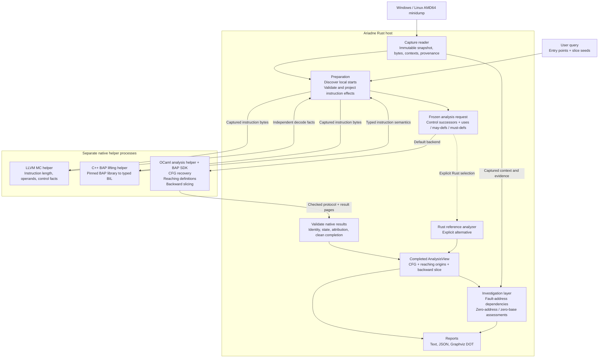
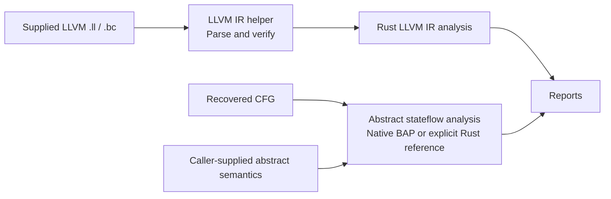

# Ariadne architecture

## Context and follow-up

**Status.** Implemented architecture overview, 2026-10-10, based on source
revision `9b7615d`. Native BAP analysis is the minidump CLI default; Rust analysis
remains an explicit reference implementation.

**Why this document exists.** The [project overview](../../README.md) and
[roadmap](../../ROADMAP.md) describe snapshot-based machine-code investigation.
This guide places the reader, instruction semantics, analysis passes and
investigation questions in one diagram.

**What this document establishes.** Runtime data flow, Rust/native process
ownership, the distinction between BAP lifting and BAP analysis, and the separate
supplied-IR, stateflow and assurance paths.

**Where to go next.**

- [Input guide](modules/input.md) — capture indexing, provenance and local-start discovery.
- [BAP guide](modules/bap.md) and [projection design](bap-semantic-backend-design.md)
  — native lifting, independent decoding and typed instruction admission.
- [Native analysis contract](bap-analysis-core-design.md) — immutable requests,
  native state ownership, checked transport and completed results.
- [Investigation contracts](investigation-contracts.md) — query-bound possible
  producers, captured observations and explicit gaps.
- [Formal-model guide](../../Specs/README.md) and
  [semantic assurance](semantic-assurance.md) — model authority and proof limits.

**What remains unresolved.** This architecture does not establish a universal
ISA or analysis-refinement proof. A dump supplies captured evidence, not an
execution trace. Missing bytes, unsupported semantics, uncertain memory aliases
and unresolved control targets can keep results partial. PE/ELF image and ELF
core readers remain deferred. Qualification is specific to its recorded sources,
tools and corpus; see the [accepted P4 scope](../../Plans/bap-projection-admission.md).

## Main minidump pipeline

Ariadne has a **Rust host that manages captured evidence and reports**, with
separate native helpers for decoding, instruction semantics and analysis.
The arrows below show logical data dependencies; the preparation stage exchanges
bounded instruction batches with its helpers while discovering candidate starts.

1. **Read the capture.** Rust indexes captured memory and retains its snapshot
   identity, semantic virtual addresses and contributor file offsets. Adjacent
   fragments may compose a read; holes and disagreeing overlaps remain explicit.
   The production minidump reader never fills missing bytes from an executable.
2. **Prepare instruction facts.** Discovery starts at explicit entry points.
   LLVM MC supplies independent length, operand and control facts. BAP supplies
   typed BIL, its instruction-semantic intermediate language. Rust checks their
   agreement and projects admitted BIL into tracked register-byte, flag and
   memory effects. It freezes the candidate domain and instruction summaries
   before either analyzer runs. Slice seeds select results without becoming roots.
3. **Analyze the frozen request.** The default OCaml helper owns actual recovery,
   dataflow and slicing state. It builds the local CFG, computes may-reaching
   definitions to a fixed point and follows dependencies backward from the seeds.
   Preparation's earlier discovery does not replace these analysis passes.
4. **Validate completion.** Rust checks native identities, state domains,
   attribution, missing seeds and clean process completion. Bounded frames and
   immutable final-result pages transport large results. It exposes the completed
   request/state through the shared `AnalysisView` interface.
5. **Explain and render.** Investigation binds that completed analysis to the
   exact prepared query and captured evidence. It produces possible address
   origins, alternatives, gaps and evidence requirements. Fault-time assessments
   additionally use admitted exception-context observations. Rendering publishes
   base analysis and optional investigation results as text, JSON and DOT.

## Ownership and process boundaries

| Component | Implementation and principal source | Responsibility |
| --- | --- | --- |
| CLI and input | Rust: [CLI](../../src/bin/ariadne-minidump.rs), [input module](../../src/input/mod.rs) | Select query/backend, parse the capture, preserve provenance and prepare immutable input. |
| Instruction lifting | C++ helper: [lifter](../../native/bap/lift.cpp) | Call the pinned BAP library and serialize typed BIL for supplied captured prefixes. |
| Independent decoding | Native LLVM helper: [guide](../llvm-mc-adapter.md) | Supply decode/control/operand facts for binding checks. It supplies no production minidump effects. |
| Projection and admission | Rust: [projection](../../src/bap/projection.rs), [admission](../../src/bap/admission.rs) | Derive `uses`, `may_defs`, justified `must_defs`, address evidence and semantic gaps. |
| Native analysis | OCaml helper: [recovery](../../native/bap-core/recovery.ml), [capture admission](../../native/bap-core/capture.ml) | Admit capture-bound input and own recovery, reaching definitions and slicing transitions. |
| Native transport and result access | Rust: [session](../../src/bap/core_session.rs), [adapter](../../src/bap/core_adapter.rs), [analysis view](../../src/analysis_view.rs) | Validate helper identity, request/result binding, transport and completion. |
| Investigation and reports | Rust: [binding](../../src/input/investigation.rs), [explanation](../../src/investigation/explain.rs), [report module](../../src/reports/mod.rs) | Reuse completed analysis, validate claims and render evidence-linked outputs. |

**BAP lifting and BAP analysis are different helpers.** The C++ helper uses
BAP's instruction-lifting library. The OCaml helper links the BAP SDK and
implements Ariadne's analysis passes. Neither block invokes the generic `bap`
CLI to obtain its production results. The Rust host communicates with these
processes through checked protocols instead of linking the OCaml runtime through
Rust FFI.

`--analysis-backend rust` selects the reference analyzer while retaining the
same BAP instruction semantics. A failed native session produces an error;
it does not automatically switch to the Rust analyzer or LLVM effect rules.
The core library can also analyze directly supplied normalized requests through
its standard-library-only Rust API.

## Separate IR and stateflow paths

The [LLVM IR path](modules/ir.md) verifies a directly supplied function and
analyzes its block successors, SSA/phi dependencies and conservative memory
predecessors. Its instruction IDs are distinct from machine virtual addresses;
it does not reconstruct original LLVM IR from a dump.

The [stateflow path](../machine-state-design.md) combines a frozen recovered CFG
with caller-supplied finite abstract transitions. It classifies possibilities
under those semantics while preserving structural edges. The minidump CLI uses
the native stateflow family by default and the Rust implementation when selected
explicitly. Neither path reconstructs observed execution history.

## Assurance and result meaning

[TLA+ specifications](../../Specs/README.md) define the modeled input contracts,
transitions and invariants. Generated replay compares finite observations, and
mutation campaigns check whether unchanged observers reject introduced defects.
This assurance track checks the implementation; it supplies no runtime
instruction semantics. BAP lifting remains a pinned trusted dependency, while
Ariadne owns transport, projection, analysis and evidence validation. The retired
ISA/Lean research is outside active qualification.

Across the pipeline, preserve these distinctions:

- Snapshot identity and semantic VAs are distinct from file offsets and graph IDs.
- Call edges remain visible; local recovery and dataflow follow summary continuations.
- Possible writes retain older origins; only justified definite writes kill them.
- Captured observations, dependencies derived under premises and missing evidence
  remain separate kinds of claims.

The final result is a **possible dependency explanation**. A captured fault-time
register value does not determine earlier branch outcomes, prove that a producer
executed, or identify the actor responsible for the bad value.
