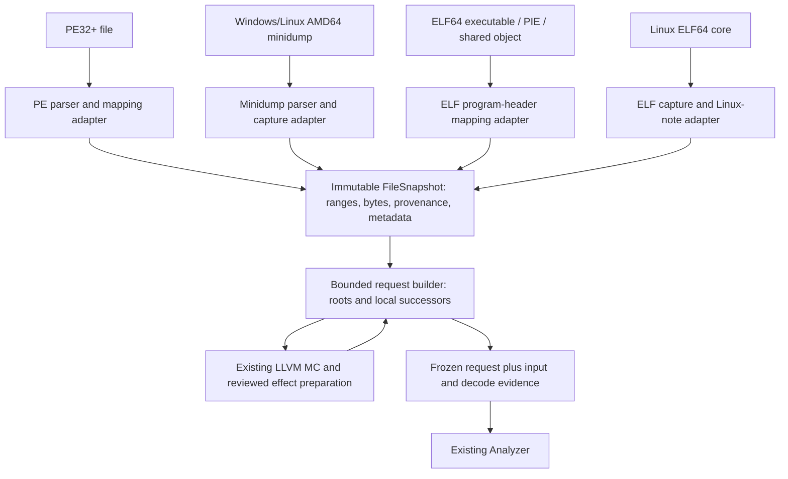

# File readers and immutable address-space preparation

Design proposal, 2026-09-26. Source baseline: `aee833f`.
Scope update: the user selected **only the minidump path** for current
implementation. Windows/Linux AMD64 minidump input is now being delivered in
[`input/`](../../input/README.md); PE/ELF images and ELF cores below remain design
work. The broader initial-delivery proposal is retained for future planning,
not used to claim implementation of those formats.

## Decision and first delivery

Add **Windows and Linux AMD64 readers in the initial delivery**, behind one
immutable address-space interface. Use the existing LLVM MC decoder and effect
rules, with explicit platform profiles. A request builder reads bytes at newly
discovered instruction starts, prepares summaries, and freezes a complete
`AnalysisRequest` before running the existing analyzer.

| Platform | Standalone image | Process capture |
| --- | --- | --- |
| Windows AMD64 | PE32+ executable/DLL, preferred image base | AMD64 minidump |
| Linux AMD64 | ELF64 `ET_EXEC` and `ET_DYN` (PIE/shared object), explicit layout | ELF64 `ET_CORE` and AMD64 Linux/Crashpad minidump |

Linux support is part of the first acceptance gate, not a deferred adapter.
Mach-O, kernel dumps/vmcore, ELF32/x32, WoW64/ARM contexts, rebased PE images,
full loader/relocation emulation, symbols, unwinding and image-backed
reconstruction of missing capture bytes remain deferred. Compressed or
systemd-coredump archive containers must first be exported to an ordinary ELF
core; the reader hashes and analyzes that exported artifact.

The original Windows-only proposal was too narrow. The native helper currently
uses a Windows target triple, but that is an integration task for this delivery,
not a reason to exclude Linux files from the reader design.



## Why a reader alone is insufficient

Today `ByteSnapshot` maps **candidate instruction VAs** to byte prefixes. It is
not a map of arbitrary memory regions. `prepare()` decodes supplied map keys
and creates placeholders for successors whose bytes were not supplied. It does
not fetch/decode those successors.

Putting one entry per PE section, ELF segment or captured memory range into that map would decode
only the beginning of each range. Putting every byte address into the map would
waste work and imply instruction boundaries without evidence.

The new request builder instead starts at explicit roots and asks the immutable
snapshot for up to 15 bytes at each discovered start. It follows only the core's
local edge policy and uses prepared control summaries, never printed assembly
or a second instruction-effects implementation. This is input construction;
`Analyzer` still owns its recover/dataflow/slice transitions over fixed inputs.

## Module and dependency choice

Place the implementation in a separate Cargo package, `input/`, exporting
`ariadne_input`. It depends on the root `ariadne` library by path. Follow the
existing separate-package pattern used by `mbt/`; ordinary root Cargo tests
and the dependency-free core stay independent of reader dependencies.

Use maintained Rust parsers: `object` for PE and low-level ELF program-header/
note structure access, and `minidump` for minidump streams/context metadata.
The Linux core adapter owns the bounded interpretation of supported Linux
notes; a generic object parser is not assumed to supply decoded Linux contexts. They expose the required image and memory
structures. Pin compatible versions/features and a separate lockfile during
implementation; check Rust 1.85 compatibility rather than assuming the latest
versions satisfy it. Add a standard SHA-256 implementation for artifact identity
instead of writing a hash algorithm. No Windows DbgHelp runtime is required.

Ariadne owns range interpretation, overlap policy, provenance and discovery.
The parser libraries do not decide which bytes are trusted for analysis. Prefer
their low-level stream/section/program-header views to convenience operations that silently
choose among duplicate memory descriptions. No generic parser plugin framework
is needed for these explicitly supported adapters.

Proposed files:

| Path | Responsibility |
| --- | --- |
| `input/src/lib.rs` | Public snapshot and preparation interface |
| `input/src/pe.rs` | PE validation and VA-to-file mapping |
| `input/src/minidump.rs` | Windows/Linux minidump memory, module, thread and exception metadata |
| `input/src/elf.rs` | Shared checked ELF64 headers/program headers and standalone image mapping |
| `input/src/elf_core.rs` | Linux core captured segments, notes and per-thread observations |
| `input/src/address_space.rs` | Immutable ranges, conflicts and prefix lookup |
| `input/src/materialize.rs` | Local-successor request construction and limits |
| `input/tests/` | Hand-authored format fixtures, native end-to-end and negative cases |
| Root `src/llvm_mc/` | Shared batch preparation seam; no duplicate semantic rules |
| `Specs/AriadneInput.tla` | Proposed mapping/provenance/materialization contract |

## Public interface

Expose a small interface that owns parsing and lifetime details. Proposed
Rust sketches, not existing declarations:

```rust
pub fn open(source: InputFile, limits: OpenLimits)
    -> Result<FileSnapshot, OpenError>;

impl FileSnapshot {
    pub fn metadata(&self) -> &SnapshotMetadata;
    pub fn read_prefix(&self, va: Address, max_len: usize)
        -> Result<ByteRead, ReadError>;
    pub fn prepare(&self, query: &AnalysisQuery, decoder: &Path,
                   options: &PreparationOptions, limits: PrepareLimits)
        -> Result<FilePreparedAnalysis, PreparationError>;
}

pub struct FilePreparedAnalysis {
    pub prepared: PreparedAnalysis,
    pub input_evidence: InputEvidence,
    pub materialization: MaterializationReport,
}
```

`InputFile` explicitly selects `PeImage`, `ElfImage { layout }`, `Minidump`, or
`LinuxElfCore`, and a local path. Format signatures and machine/class/type
fields must agree with the selection. Keep target OS and architecture as
separate metadata; a shared dump container is not inherently Windows. A bytes-owned constructor can serve embedded
callers and test fixtures through the same validation path.

`AnalysisQuery` supplies a nonempty set of entry VAs and a set of slice-seed VAs.
For PE, offer a checked RVA-to-VA conversion; for ELF, convert link-time addresses
using the selected load bias. A raw integer argument
always means a VA, never a file offset. Entry points drive discovery; seeds do
not silently become additional roots.

Metadata offers PE/ELF entry-point, minidump exception-IP and Linux per-thread
core RIP candidates, each with its origin and validity. Callers may
explicitly choose these as roots. A crash IP is an observation at capture time;
it is not evidence of a function entry or earlier execution. No automatic use
of captured register values for past branch feasibility or memory aliases.

`FilePreparedAnalysis` keeps input mapping/capture evidence with the existing
instruction evidence and analysis gaps. It is possible to extract its owned
request and run `analyze()`, retaining the other fields for reports. Core
`scope_closed()` retains its current meaning; it does not certify input fidelity,
all process paths or absence of effect-precision gaps.

## Immutable storage and identity

For v1, read the artifact into owned immutable bytes under a configurable input
size limit and share that buffer internally. Do not retain a live mutable file
or infer immutability from an mmap. Hash exactly the owned bytes used by the
parser. Detect ordinary file-size/read failures; the resulting artifact hash
identifies what was read, not proof that the producer captured a coherent process.

Snapshot identity is domain-separated and versioned over artifact SHA-256,
format, mapping profile and selected image base or ELF load bias. Same filename or PID is not
identity. Keep request roots/limits in a separate query fingerprint: they select
an analysis within a snapshot rather than change its bytes. Keep decoder/effect
versions in preparation identity as today.

A PE/ELF image snapshot describes the file's static image view. A minidump or ELF
core snapshot represents the bytes recorded by that capture; timestamps, process/thread IDs and
module names are metadata, not substitutes for its content identity. V1 has no
companion-file contribution to dump bytes. A future supplemented snapshot must
bind every artifact and every accepted transformation/evidence record.

Owned buffering bounds the first implementation and avoids lazy-read lifetime
hazards, but excludes dumps larger than the configured memory budget. Report
that as a resource limit; a future immutable backing store may expand capacity
without changing address/provenance behavior.

## Address-space and read contract

Normalize mappings into sorted virtual intervals referencing immutable artifact
slices. Every interval carries source class, source artifact/file offsets and
originating section, program header or capture descriptors. Use checked arithmetic for every file
range, virtual range and descriptor-count calculation, including cumulative
64-bit memory payload sizes. Internally distinguish `ImageRva`, `FileOffset`
and `VirtualAddress` types: a minidump field named RVA is a dump-file offset,
not a PE image-relative address. ELF `p_vaddr` is a link-time VA for an image
and an already recorded process VA for a Linux core; do not apply image bias
to core segment addresses.

`ByteRead` returns the **longest unambiguous contiguous prefix** from the requested
VA, up to the requested length, plus contributing spans and the reason it stopped.
A request for 15 bytes is not a claim that the instruction occupies all 15.
Reject read lengths above `OpenLimits.max_read_bytes` before allocation.
Suggested stop reasons: `EndOfMapping`, `NotCaptured`, `ConflictingCapture`,
`UnavailableImageBytes`, `AddressOverflow`, or the requested-length limit.
A hole or conflict at the starting VA produces an empty prefix with its reason.

Reads can cross adjacent ranges of the same source class, even when their file
offsets are not adjacent. Identical overlapping capture bytes are coalesced while
retaining all contributors; differing bytes make just the affected overlap
unavailable. Never choose a winner by stream order. Determine conflicts on the
queried bytes or by a bounded normalization algorithm, not a full-address-space
byte array. Conflicting static-image mappings are rejected. Identical ELF
segment overlap may be coalesced with its contributors; adjacent page-aligned
loader mappings must not be confused with overlapping declared byte extents.

A short prefix can still decode a complete instruction: one captured NOP byte
is enough even if the following VA is absent. If decoding needs missing bytes,
retain the provider's stop reason alongside the adapter's unavailable result.
A conflict after the decoded instruction must not invalidate earlier usable
bytes. No gap is filled with zero and no read jumps across a hole.

The metadata mapping and physical capture indexes are separate. A dump module
range, Linux `NT_FILE` entry or memory-protection description does not itself
supply bytes. Captured
JIT/anonymous code remains readable without a module record. v1 does not infer
executable permission from capture alone or require a PE section, ELF section or file-backed module for every root.

## PE32+ mapping profile

Accept little-endian AMD64 executable images with consistent DOS/PE headers,
optional-header magic, section count, sizes, alignments and bounded file ranges.
Reject COFF object files and other machines instead of guessing a load model.
Use the declared preferred `ImageBase`; a requested alternative base returns
`UnsupportedMappingProfile` until relocation support is implemented.

For an initialized section byte:

```text
RVA         = VA - ImageBase
section_off = RVA - section.VirtualAddress
file_off    = section.PointerToRawData + section_off
```

The supplied prefix must fit the validated initialized portion, bounded by both
`VirtualSize` and `SizeOfRawData`. Raw alignment padding is not automatically
executable image content. Microsoft distinguishes raw and virtual section
sizes in the [PE format specification](https://learn.microsoft.com/en-us/windows/win32/debug/pe-format);
using only their validated initialized intersection is the v1 policy. Headers may map through a separately validated
`SizeOfHeaders` range. Zero/unusual virtual extents and overlapping mappings
are rejected as unsupported or malformed under this explicit conservative
profile; v1 does not promise compatibility with every Windows-loader quirk.

Record virtual zero-fill tails as image-layout metadata, but do not synthesize
them as `file_backed` instruction bytes in v1. Distinguish this intentional
unavailable image region from a missing dump capture. Loader-written imports,
relocations, TLS initialization and live patches are not reconstructed; the
snapshot is an on-disk image view, not an assertion about runtime memory.

A PE entry-point RVA is a suggested root after checked mapping. Executable
section flags are useful metadata and diagnostics, not proof of instruction
boundaries. Discovery still follows explicit roots and prepared control edges.

## Linux ELF64 image profile

Accept little-endian `EM_X86_64`, `ELFCLASS64`, `ET_EXEC` or `ET_DYN` under the
Linux image profile. Support the common System V OSABI tag as well as the Linux
tag; do not demand that Linux binaries carry a Linux-only header tag. Reject
`ET_REL`, incompatible machines/classes and malformed header/count encodings.
Map from `PT_LOAD` program headers, not `.text` or section-table entries, so
ordinary stripped images without section headers remain supported. If extended
program-header numbering needs section-header zero, validate that specific
structure rather than assuming section headers are always absent or required.

The ELF ABI defines segment file extents, virtual extents and alignment through
`p_offset`, `p_vaddr`, `p_filesz`, `p_memsz` and `p_align`. It distinguishes
initialized bytes from the extra zero-initialized memory extent. See the
[ELF program-header specification](https://refspecs.linuxfoundation.org/elf/gabi4+/ch5.pheader.html).

The proposed Ariadne translation is:

```text
segment_start = load_bias + p_vaddr
segment_off   = VA - segment_start
file_off      = p_offset + segment_off
available     = 0 <= segment_off < p_filesz
```

Check all additions/subtractions and ranges; require `p_filesz <= p_memsz` and
valid segment alignment/congruence. An executable's header bytes are available
only if covered by a mapped file range, not through an invented header mapping.
`PF_X` and other permissions are metadata, not discovered instruction boundaries.

Use load bias zero for `ET_EXEC`. For `ET_DYN`, require an explicit
`ElfLayout::LinkTime` (bias zero) or `ElfLayout::AtBias { bias }`. The latter is
an address-layout choice for static bytes, not proof of an actual runtime base
or relocation correctness. Bias is the additive delta from `p_vaddr`, not the
lowest mapped VA; these differ when the lowest segment VA is nonzero. Validate
bias alignment against the selected layout. No guessed ASLR base and no automatic
loading of the interpreter or `DT_NEEDED` libraries.

An entry-point hint is `load_bias + e_entry`, when the header actually provides
one and the result maps; a shared library with no entry hint requires explicit
roots. Keep zero-fill tails/BSS as layout metadata and unavailable instruction
bytes in v1, just as for PE. Do not claim that raw GOT/PLT, dynamic relocations,
IFUNC or TLS bytes match a loaded process. File-backed code may still be decoded
and analyzed with those static-view limits retained in evidence.

## Linux ELF64 core profile

Accept Linux AMD64 `ET_CORE` with bounded program headers and note payloads.
Unlike an ELF image, a core's `PT_LOAD.p_vaddr` is already a captured-process VA;
there is **no added load bias**. The file-backed portion of each segment supplies
captured bytes via `p_offset + (VA - p_vaddr)`. A declared payload extending past
EOF is malformed, not an invitation to silently zero-fill a truncated core.

Linux records the dumped byte count separately from a mapping's full extent.
Thus a core `PT_LOAD` with `p_filesz == 0` can describe a mapping without captured
bytes; the remainder up to `p_memsz` is **not captured**, not executable-image
BSS. A sparse filesystem hole *inside* a validated payload still reads as the
artifact's zero bytes; it is not the same as an omitted core mapping. The reader
uses encoded payload extents rather than filesystem block-allocation guesses.
The kernel's [ELF core writer](https://raw.githubusercontent.com/torvalds/linux/v6.12/fs/binfmt_elf.c)
provides the versioned source reference for this distinction.

Interpret bounded `PT_NOTE` records by owner, type, target class and payload
layout. Preserve unknown well-formed notes in the inventory. Linux `NT_PRSTATUS`
occurs per thread; repeated thread notes are not duplicate-singleton errors.
Record thread IDs, register validity and RIP observations without inventing a
single faulting thread when the evidence does not identify one. `NT_SIGINFO`,
`NT_PRPSINFO` and `NT_AUXV` add optional signal/process/auxiliary metadata.
Unsupported register extensions remain explicit metadata gaps, not host-struct
casts or assumed zero register values.

`NT_FILE` contains mapped-file ranges and offsets expressed in the note's page
units. Multiply by its recorded page size with overflow checks; do not assume
4096 or treat the offsets as bytes. Names and mappings are metadata, not captured
content or authorization to read those paths. This note's layout and the
per-thread records are defined by the same
[Linux source](https://raw.githubusercontent.com/torvalds/linux/v6.12/fs/binfmt_elf.c)
and [ELF note constants](https://raw.githubusercontent.com/torvalds/linux/v6.12/include/uapi/linux/elf.h).

Core mappings are sufficient for byte lookup without `NT_FILE`, module build IDs
or register notes. Missing optional observations must not remove actual captured
memory. Do not infer a DSO's identity or load bias from its filename alone, or
infer the crash IP from `e_entry`. Anonymous/JIT mappings use the same captured
range interface. Kernel-produced and GDB-produced core fixtures must both be
exercised before advertising the supported Linux note dialects.

## Minidump profile

Accept AMD64 Windows and Linux/Crashpad minidumps, preserving the reported OS
separately from the container format. Require an AMD64 system description; reject a missing or
contradictory architecture declaration instead of decoding based on pointer
values. Parse the stream directory and validate the payload extents of supported
streams before publishing the snapshot.

Index actual captured bytes from both `MemoryListStream` and
`Memory64ListStream`, plus [thread stack descriptors](https://learn.microsoft.com/en-us/windows/win32/api/minidumpapiset/ns-minidumpapiset-minidump_thread). Read thread/exception
contexts only with the matching architecture and validity flags. Missing context
is a metadata gap; it does not invalidate otherwise available memory. A dump
without captured instruction bytes can open successfully and produce explicit
unavailable reads.

Memory-list descriptors supply a virtual start and an individual dump-file data
location. For memory64 descriptors, payloads are packed starting at `BaseRva`;
the offset of descriptor i is that base plus the sum of preceding **payload byte
sizes**, not the descriptor table's byte size, as described for
[MINIDUMP_MEMORY_DESCRIPTOR64](https://learn.microsoft.com/en-us/windows/win32/api/minidumpapiset/ns-minidumpapiset-minidump_memory_descriptor). Keep this conversion isolated and
test it with nonuniform range lengths.

Parse [module names, image bases/sizes, timestamps/checksums and optional CodeView
records](https://learn.microsoft.com/en-us/windows/win32/api/minidumpapiset/ns-minidumpapiset-minidump_module) as evidence for locating and comparing images. Do not dereference module
paths or automatically open files named by a dump. Distinguish [memory-info
metadata](https://learn.microsoft.com/en-us/windows/win32/api/minidumpapiset/ns-minidumpapiset-minidump_memory_info) from memory-content descriptors. Ignore unsupported optional streams
with an explicit inventory entry after validating their container extents.
Malformed supported structures fail opening; absent optional streams do not.

Reject duplicate supported singleton/list stream IDs at the container level
rather than accepting a parser's implicit first/last choice. Distinct memory
sources (for example memory64 and thread stacks) may overlap and use the shared
byte-conflict policy. If a parser loses duplicate-directory evidence, preflight
the raw directory with bounded checked reads before using its typed stream API.

## Dump/file fallback

For minidumps and Linux ELF cores, default and v1 behavior is **captured-only**. `trusted_fallback` stays empty.
Matching a module path, timestamp, image size, CodeView identifier, ELF build ID
or `NT_FILE` record does not
prove that an uncaptured runtime byte equals a file byte. ASLR, loader writes,
hot patches and generated code can change the relationship.

A future fallback mechanism must certify the exact instruction span, artifact
identity, VA mapping, relocation treatment and runtime-change assumptions.
It must bind that evidence into snapshot/preparation identity. Merely exposing
an `assume_same_binary: bool` would conceal a material analysis assumption.

Keep the existing whole-instruction provenance contract. Adjacent captured
ranges from the same dump may compose a captured span. A captured prefix cannot
be completed with PE/ELF image bytes and then labeled wholly captured or wholly file-backed.
A captured decode failure cannot trigger a retry using file bytes. Mixed-source
instruction spans require a richer source contract and are outside this design's
first implementation.

This means a minidump or ELF core that omitted its code pages may remain unanalyzable
at the requested roots until stronger input evidence is available. Report that
limitation directly rather than silently analyzing another code image.

## Linux/Windows decoder integration

The current helper in `native/llvm_mc/decode.cpp` hard-codes
`x86_64-pc-windows-msvc`. Add an explicit target-profile selection covering that
legacy profile and `x86_64-unknown-linux-gnu`. Preserve the existing invocation
for legacy callers; version/extend capability negotiation for the new profile
rather than presenting Linux requests as Windows ones. Bind target triple and
capability version into `PreparationIdentity` and reproducibility records.

Select the profile from validated input-platform metadata or the explicitly
selected standalone image format, never the analysis host OS. For example,
analyzing a Windows minidump on Linux still uses the Windows target profile;
a Linux Crashpad minidump uses the Linux profile. The image readers themselves
should work on either host. Claim native host execution only where tested.

Reuse the same architecture-level location catalogue and effect rules after
checking normalized opcode/operand output under both profiles. Run the frozen
registry and representative end-to-end fixtures with each target profile;
record intentional differences rather than assuming equality from the ISA name.
Do not add SysV or Windows ABI register-preservation assumptions to opaque calls.
Linux syscalls, signal delivery, FS/GS-dependent TLS and unsupported control stay
explicitly unsupported/conservative under the existing semantic rules. Linux
file support does not automatically add syscall or signal-handler semantics.

## Request construction and decoder integration

The request builder is a finite deterministic worklist over local candidate
starts. Its index and immutable bytes stay fixed while it constructs inputs.
For each frontier batch:

1. Read at most 15 contiguous bytes per unattempted VA and retain read evidence.
2. Use the existing decoder, normalization and effect rules for those prefixes.
3. Store one immutable preparation result per attempted VA. Queue all known
   local successors using `EdgeKind::is_local()`; never queue a call-only target.
4. Keep unknown indirect targets, unreadable starts and unsupported controls as
   gaps. A failure does not generate guessed fallthrough or retry forever.
5. Stop when no pending local starts remain. Assemble the total finite request,
   including call target references and unreachable slice seeds as placeholders.

An independently supplied callee root is visited normally. Back edges/self-loops
are deduplicated. An address reached inside another decoded instruction may be
decoded as its own explicitly referenced start; report overlap rather than
silently dropping an x86 control-flow alternative.

Slice seeds alone do not cause discovery. Preserve core `MissingSliceSeeds` for
unreached seeds. Distinguish unattempted reference/seed placeholders from an
attempted unavailable read in input evidence; a placeholder is not evidence that
no bytes exist at that VA.

Refactor the root adapter's preparation implementation into a shared batch
operation returning per-candidate decode/effect results, and let both the current
`ByteSnapshot::prepare()` and the new builder assemble those results. The
cross-package seam must be a narrow, documented public batch-preparation type;
Rust-private helpers cannot be called by `ariadne_input`. Keep raw protocol
parsing and semantic rule dispatch internal. Do not run `prepare()` over the
entire growing snapshot on every iteration, and do not rebuild/run the Analyzer
merely to discover the next bytes.

The existing subprocess exchange can initially serve bounded batches. A long
linear path may require many batches, so record decoder launches and timings.
Persistent decoder sessions are a later transport optimization if measurements
justify them; changing transport is not necessary to define correct discovery.

`MaterializationReport` records roots, attempted starts, queued references,
limits, counts and the exact input/decoder/rule identities. Final analyzer
recovery must visit exactly the attempted set under the same local traversal
policy. Do not inject the builder's working state into the analyzer.

## Limits and failure behavior

`OpenLimits` bounds artifact bytes, stream/section/program-header/note counts and total normalized
intervals. `PrepareLimits` bounds attempted starts, queued candidates, decoded
bytes and process work. Use deterministic ordering; include limits in query
identity and report actual consumption. Calibrate default numeric values against
the initial Windows/Linux image and capture fixtures and document them before release.

Malformed file structures, invalid architecture, parser/resource failures and
protocol corruption are errors. Missing captures and unsupported control are
valid partial-analysis outcomes with evidence.

If a discovery budget is exhausted, return `PreparationError::LimitReached`
with diagnostic progress; do not publish a supposedly complete request in which
unread addresses are disguised as missing memory. A future resumable or
budget-truncated analysis result needs its own contract. The ordinary analyzer's
`done` state must not be used to hide unfinished input construction.

## Formal and execution acceptance

Add a focused `AriadneInput.tla` contract with finite fixtures for:

- Range-to-file translation without VA/RVA/file-offset confusion or overflow,
  including ELF load bias and an unbiased core mapping.
- Distinct image zero-fill metadata and absent core payload semantics.
- Every supplied byte resolving to its recorded immutable artifact span.
- Captured precedence, overlap conflict handling and no mixed-source synthesis.
- Complete local-successor closure and call-only discovery isolation.
- No successful request publication on resource exhaustion.

This models the provider/materializer contract. It does not prove third-party
parsers or capture authenticity. Keep `Ariadne.tla` unchanged and validate the
shared traversal correspondence with real Analyzer runs.

Required implementation tests include:

| Fixture | Expected evidence |
| --- | --- |
| ELF `ET_EXEC` without section headers | Program-header-based lookup and valid entry hint |
| ELF PIE/DSO with nonzero minimum `p_vaddr` and explicit bias | Correct VA/file translation; no guessed ASLR base |
| ELF initialized segment and BSS tail | Available file bytes, unavailable synthesized instruction tail |
| ELF core with `p_filesz < p_memsz`, including zero-sized payload | Only captured prefix available; omitted memory never synthesized |
| ELF core `NT_FILE` with non-4096 page units and repeated thread notes | Checked offset scaling and distinct per-thread observations |
| Linux core without `NT_FILE` or a usable thread context | Captured code remains readable; metadata gaps explicit |
| Stripped image, kernel core and GDB core with the same instruction bytes | Correct mappings/provenance and equivalent supported decode/effects |
| Linux Crashpad minidump | Linux platform retained; same captured-prefix contract |
| Windows and Linux decoder profiles | Frozen opcode/effect fixtures exercised under both profiles |
| PE with sparse section RVAs and unrelated raw offsets | Exact bytes, VA preservation and section provenance |
| PE initialized data, raw padding and virtual tail | Available initialized prefix; tail/padding never silently invented |
| Malformed ranges/counts and overlapping PE mappings | Deterministic rejection before analysis |
| Memory-list and memory64 encodings of the same capture | Equal VA/byte results with distinct source descriptors |
| Adjacent dump fragments, identical overlap, conflicting overlap | Correct prefix composition and localized conflicts |
| Module entry without memory; anonymous/JIT capture | Metadata never creates bytes; module absence never removes actual capture |
| Short complete instruction versus truncated instruction | One-byte RET/NOP can decode; incomplete bytes remain a gap |
| Root discovers a later branch/call/loop instruction in a region | Automatic byte acquisition; all local edges followed; call-only targets excluded |
| Unreached slice seed and separately rooted callee | Seed does not become a root; explicit callee root works |
| Captured bytes differing from a companion PE/ELF image | Captured-only behavior; no replacement or auto-fallback |
| Discovery budget exhausted | No completed AnalysisRequest published |
| Matched PE/ELF image and captured minidump/core bytes at the same VA | Equal decoded local graph/effects with differing provenance |

Use hand-authored minimal binary fixtures with independent offset expectations,
plus small real tool-produced PE/ELF images, minidumps and Linux ELF cores.
Linux is not accepted solely through handcrafted ELF fixtures or a successful
PE/minidump test run.
Parser-generated fixtures alone are not an independent mapping oracle. Native
end-to-end checks must execute LLVM MC and the existing analyzer. Add negative
controls for RVA-as-file-offset, memory64 table-size arithmetic, zero-filled
capture gaps, section-based ELF mapping, double-applied core load bias, NT_FILE
page offsets treated as bytes, arbitrary overlap selection, call-target traversal and silently
truncated discovery. Record parser versions, artifact hashes and fixture scope.

## Delivery order

1. Shared immutable range/provenance model and Windows/Linux contract fixtures.
2. PE and ELF image readers, explicit ELF layout and sparse-VA lookup tests.
3. Minidump and Linux ELF core readers, including note/stream/context evidence.
4. Shared batch-preparation seam, explicit decoder target profiles and bounded
   local-successor request builder.
5. Real Windows **and** Linux image/capture → decode/effects → CFG/slice
   acceptance, documentation and source-bound checkpoint record.

Completion requires both platform paths. A Windows-only or image-only partial
delivery must name its narrower scope and cannot close the full reader gate.

This design intentionally keeps file parsing separate from precise instruction
semantics. It turns the existing analyzer into a consumer of actual artifact
bytes without implying historical execution recovery or full ISA acceptance.

## Source basis

Microsoft's [PE format](https://learn.microsoft.com/en-us/windows/win32/debug/pe-format)
explains image bases, section RVAs/raw offsets and virtual/raw size distinctions.
The conservative mapping choices above are Ariadne policy, not a claim to emulate
every Windows loader case.

Microsoft documents the
[MINIDUMP_MEMORY64_LIST](https://learn.microsoft.com/en-us/windows/win32/api/minidumpapiset/ns-minidumpapiset-minidump_memory64_list)
structure. Payload-prefix sums must be checked against actual layouts and
fixtures during implementation.

The maintained [object ELF API](https://docs.rs/object/latest/object/read/elf/),
[object PE API](https://docs.rs/object/latest/object/read/pe/struct.PeFile.html)
and [minidump API](https://docs.rs/minidump/latest/minidump/)
provide the proposed parser foundations. Their currently published API pages
were inspected for this design; dependency versions and supported features must
be pinned and validated with the implementation rather than inferred from a
`latest` URL.

Local contracts: [LLVM adapter](../llvm-mc-adapter.md),
[effect design](operand-effects-design.md),
[analysis implementation](../implementation.md), and
[Ariadne.tla](../../Specs/Ariadne.tla).
