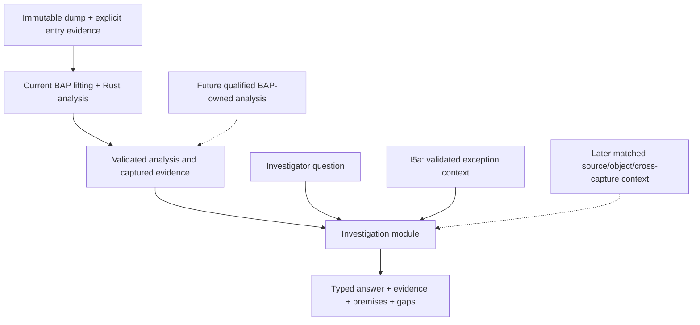

# Ariadne investigation layer

## Context and follow-up

**Status.** First question implemented and repaired through `c9eb4c5`; I5a is
implemented in the 2026-10-03 working tree. I4 remains qualified only at the
recorded fixture/Linux tier. Broader I5 and I6–I7 remain unimplemented.

**Why this document exists.** [Real-capture slice](priority-1-real-capture-validation.md) demonstrates useful possible origins but leaves their explanation to the investigator.

**What this document establishes.** The first question selects a captured memory-address operand and explains which earlier byte definitions could contribute to it. Answers preserve alternatives, evidence references and missing premises.

**Where to go next.**

- [Current stage plan](../../Plans/investigation-layer.md) — separates delivered I0–I3, open I4 qualification and later I5–I7 work.
- [I5a zero-address design](i5a-zero-address-design.md) — defines the implemented numeric hypothesis, its required exception context and its limited conclusions; [contracts](i5a-contracts.md) document the interface.
- [Implemented contracts](investigation-contracts.md) — define query identity, claim classes and evidence requirements.
- [First delivery](investigation-validation.md) — records the exercised tier and open Windows acceptance.
- [Investigation correctness-fix plan](../../Plans/completed/investigation-correctness-fixes.md) — scopes the limit-exhaustion and Windows I4 timing repairs; the [delivery record](investigation-correctness-validation.md) tracks implementation and validation.

**What remains unresolved.** Full original-Windows I4 and controlled real Windows I5a qualification remain open. Other hypothesis, object/source-context and cross-capture questions remain later work. A possible producer or a zero effective address does not prove a UAF, actual path or general root cause.

For the wider context, see the optional [documentation map](../documentation-map.md).

Originally proposed **2026-10-01** against `7de5a1e`; status refreshed
**2026-10-02** against `c9eb4c5`. I0–I3 are implemented, and the
[latest qualification/truncation repair record](investigation-correctness-validation.md)
retains the exercised fixture/Linux tier. The original-Windows I4 clause is
still unmet. The [stage plan](../../Plans/investigation-layer.md) now treats
I0–I4 requirements as delivered regression criteria plus an open qualification
obligation, not an instruction to begin implementation again at I0.

## Product position

Ariadne's current local recovery, reaching-definition and slicing algorithms
overlap BAP's analysis scope. BAP is an extensible binary-analysis framework
with disassembly, intermediate representations and analysis passes. Its
[standard-library overview](https://binaryanalysisplatform.github.io/bap/api/master/bap/Bap/Std/index.html)
and [graph solver](https://binaryanalysisplatform.github.io/bap/api/master/graphlib/Graphlib/Std/Graphlib/index.html)
support that characterization. The conclusion that these primitives can host
Ariadne's algorithms is an architectural inference, not a demonstration that
a standard BAP analysis reproduces Ariadne's exact contracts.

Ariadne is not a literal product subset: captured-only reads, immutable snapshot
identity, explicit uncertainty and source-bound validation are specialized
contracts. However, reproducing general analysis primitives should not be its
main product identity. The proposed direction is **crash investigation with
inspectable evidence and qualified explanations**, using BAP for analysis
mechanisms as they become accepted for the captured workload.



The current first-question implementation consumes the BAP/Rust pipeline's
completed facts. Dashed inputs in the diagram are proposed capabilities.
The separate [Stage 2 migration](../../Plans/bap-integration.md#stage-2-bap-analysis-core)
may later move low-level computation into BAP. Moving that computation is
infrastructure work; it does not itself add an investigation capability.

## First question: explain a fault-address operand

Given a captured faulting instruction, a selected memory operand and an
explicit earlier entry, answer:

> Which earlier definitions could contribute to this address, what captured
> evidence supports them, and what prevents a stronger conclusion?

The implemented first question reuses the normalized request, reaching-definition
map, slice, captured reads and semantic evidence. It adds neither another
CFG/dataflow solver nor a speculative entry-point detector.

For a store through `[RAX]`, the answer identifies its address inputs,
groups possible origins for the relevant RAX bytes, relates them to captured
producer instructions, and explains entry-origin or opaque-call alternatives.
For an indexed address, retain base/index/scale/displacement relationships.
An unsupported operand shape receives an explicit unavailable explanation;
the module must not guess from the last recorded register values.

This produces an explanation of possible dependencies, not an actual executed
instruction sequence or proof that the faulting memory operation committed.

## Investigation module and interface

The [Rust source-layout consolidation plan](../../Plans/completed/rust-source-layout.md)
places the implemented module in `src/investigation/` within the root Cargo
package. Its initial
interface consumes a bound normalized investigation context produced from the
validated prepared analysis and completed analyzer. The concrete adapter lives
in `src/input/`; investigation must not depend on input or reports. This preserves
the responsibility boundary when CLI and reporting modules use its results.

`AnalysisResult` stores snapshot identity without the complete query. The
implemented binding therefore compares the prepared request with the completed
analyzer's original request before consumption. Preparation now also retains
typed address-use evidence from admitted BIL. These I0–I1 prerequisites are
implemented; [the contracts](investigation-contracts.md) describe their checks.

The implemented interface is:

```text
bind_investigation(prepared, completed_analyzer) -> BoundInvestigation
explain_fault_address(bound_investigation, question, ExplainLimits) -> Explanation

question:
  instruction VA
  selected memory-access index

explanation:
  snapshot/query/tool identity
  question and supported scope
  address-expression facts
  possible producer origins grouped by location/byte
  claims with evidence references and premises
  unresolved alternatives and gaps
  evidence requirements for stronger answers
```

The contracts document distinguishes the actual first-question CLI from later
proposals. Explanation budgets preserve valid partial/unavailable output, including
zero budgets, as recorded in the [correctness repairs](investigation-correctness-validation.md). The
interface rejects mismatched snapshot/query identity and incomplete result
construction. It returns a typed result; formatting and file publication stay
with the existing reporting modules. Its tests use the same interface as callers.

This is intended to be a deep module: callers ask one domain question, while
the implementation handles provenance joins, location grouping, gap propagation
and explanation construction. Do not publish the internal graph traversal or
one interface per primitive operation. Do not introduce a general analysis
adapter interface with only a hypothetical BAP-core implementation behind it.
The current normalized requests/results are the initial input seam.

## Evidence and claims

| Record | Meaning |
| --- | --- |
| Evidence | An observed captured byte span, metadata/register observation, or explicitly supplied external artifact, with source identity and location. |
| Analysis fact | A derived graph, effect or origin fact, bound to the exact semantic producer, projection, query and stated assumptions. |
| Claim | A question-specific assertion supported by evidence/facts and explicit premises. |
| Alternative | A possible explanation not eliminated by the available evidence. |
| Gap | A missing capture, conflicting byte, unsupported lift, unresolved target, opaque call, uncertain memory alias or missing premise. |
| Evidence requirement | A concrete observation/artifact/semantic refinement required to strengthen or distinguish a claim. |

The implemented claim classification is **observed**, **derived under premises**,
or **unknown**. The [I5a assessment](i5a-contracts.md) uses separate
hypothesis conclusions in a new versioned assessment; it does not silently extend
the current strict v1 classification. Its numeric conclusion remains derived
under premises. Do not use unsupported numeric confidence or label a
model-relative conclusion as a historical fact.

The table describes the broader domain vocabulary. Current first-question
evidence is captured instruction/projection evidence. I5a adds explicit
exception-context observations, while matched external source/object
context remains later work.

Every claim must be traceable to stable evidence/fact IDs. These IDs include
the owning snapshot/artifact and scope; equal VAs in different captures must
not join. A complete byte-origin set does not prove that all bytes came from
one producer along one feasible path. Preserve joins and mixed-byte origins.
Generic `memory:any` dependencies cannot become object-specific lifetime facts.

Captured module metadata and matching symbols/source may explain identities
or supply an independently justified entry witness. They cannot fill missing
runtime instruction bytes or silently establish binary/source correspondence.
External context must record its match evidence and role.

## Higher-level questions after the first slice

| Question | Additional evidence or implementation needed |
| --- | --- |
| Does the selected access start at virtual address zero? | The [implemented I5a contract](i5a-contracts.md) binds validated exception-context operands and exact site/access association under the admitted scalar MOV profile. Controlled real Windows acceptance remains open. No null-pointer root-cause claim. |
| What about null-derived offsets, invalid arithmetic or noncanonical addresses? | Separate later hypotheses with their own definitions and architectural/context premises; I5a does not answer them. |
| Which possible producers and inputs contribute to the selected address operand? | Delivered by the [first-question contract](investigation-contracts.md). Selecting the actually executed alternative still needs additional evidence. |
| Is a use-after-free or object-lifetime violation supported? | Object identity and lifetime evidence such as retained allocator/runtime events; a suspicious pointer or slice alone is insufficient. |
| Which branch alternatives remain possible under known facts? | Accepted transition relations and completeness premises; retain unknown feasibility where these are absent. |
| What differs between two captures of the same investigation? | Explicit build/symbol/snapshot matching; no joins by naked address or assumed chronology. |
| What evidence would distinguish two explanations? | Concrete unresolved predicates and their required observations, not an invented historical trace. |

This roadmap adds domain questions above existing analyses. It does not claim
automatic root-cause proof, backward execution reconstruction or unbounded
cross-thread reasoning. Those require separately supported evidence and models.

## Acceptance

The delivered first slice retains the following regression criteria: an
independent observer must be able to verify every
producer claim against the retained inputs/results, and negative cases retain
their uncertainty. Required cases include different snapshots sharing a VA,
mixed partial-register origins, a branch join, a weak memory dependency, an
opaque call, missing seeds, unavailable/conflicting capture and an unsupported
address operand.

Mutations must detect fabricated actual execution, discarded alternatives,
cross-snapshot evidence joins, suppressed call/memory uncertainty and unsupported
root-cause labels. Rendering must preserve the same claim/evidence relationships
in text and machine-readable output. A retained case should show an actionable
explanation beyond the existing raw slice, with measured cost.

The [latest investigation repair evidence](investigation-correctness-validation.md)
records 17 passing gates, valid budget truncation and enforced Windows latency
qualification logic. It does not establish full original-Windows I4 acceptance.
I5a has separate [contracts](i5a-contracts.md) and a [delivery plan](../../Plans/i5a-zero-address.md).

The current [BAP-only source record](bap-only-removal-validation.md), open
98-instruction Windows qualification and Stage 2 prerequisite retain their
meanings. Stage D is [retired](semantic-assurance.md); removing that research
track does not promote the remaining qualification tiers.
