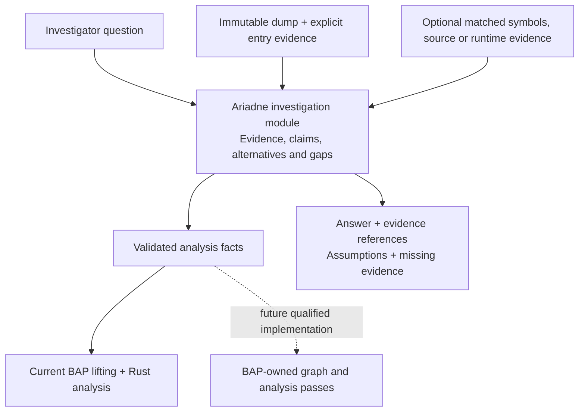

# Ariadne investigation layer

Proposed **2026-10-01**, against implementation `7de5a1e`.
Status: **I0–I3 implemented; I4 fixture/Linux tier qualified in the working tree.**
The [first-delivery record](investigation-validation.md) preserves the missing
original-Windows I4 clause; later I5–I7 capabilities are not implemented.
The [implemented contracts](investigation-contracts.md) define the actual first
interface and CLI; later hypothesis/context/comparison work remains planned.
The [I0–I4 implementation plan](../../Plans/investigation-layer.md) details the
first fault-address explanation, with later hypothesis/context/comparison work
separately gated as I5–I7.

## Product position

Ariadne's current local recovery, reaching-definition and slicing algorithms
overlap BAP's analysis scope. BAP is an extensible binary-analysis framework
with disassembly, intermediate representations and analysis passes. Its
[standard-library overview](https://binaryanalysisplatform.github.io/bap/api/master/bap/Bap/Std/index.html)
and [graph solver](https://binaryanalysisplatform.github.io/bap/api/master/graphlib/Graphlib/Std/Graphlib/index.html)
support that characterization. The conclusion that these primitives can host
Ariadne's algorithms is an architectural inference, not a demonstration that
a standard BAP analysis reproduces Ariadne's exact contracts.

Ariadne is not a literal product subset: captured-only reads, immutable snapshot
identity, explicit uncertainty and source-bound validation are specialized
contracts. However, reproducing general analysis primitives should not be its
main product identity. The proposed direction is **crash investigation with
inspectable evidence and qualified explanations**, using BAP for analysis
mechanisms as they become accepted for the captured workload.



The current BAP/Rust pipeline stays executable while this module is developed.
The separate [Stage 2 migration](../../Plans/bap-integration.md#stage-2-bap-analysis-core)
may later move low-level computation into BAP. Moving that computation is
infrastructure work; it does not itself add an investigation capability.

## First question: explain a fault-address operand

Given a captured faulting instruction, a selected memory operand and an
explicit earlier entry, answer:

> Which earlier definitions could contribute to this address, what captured
> evidence supports them, and what prevents a stronger conclusion?

The first implementation should reuse the existing normalized request,
reaching-definition map, slice, captured reads and semantic evidence. It should
not introduce another general CFG/dataflow solver or a speculative rooter.

For a store through `[RAX]`, the answer should identify its address inputs,
group possible origins for the relevant RAX bytes, relate them to captured
producer instructions, and explain entry-origin or opaque-call alternatives.
For an indexed address, retain base/index/scale/displacement relationships.
An unsupported operand shape receives an explicit unavailable explanation;
the module must not guess from the last recorded register values.

This produces an explanation of possible dependencies, not an actual executed
instruction sequence or proof that the faulting memory operation committed.

## Investigation module and interface

The [Rust source-layout consolidation plan](../../Plans/completed/rust-source-layout.md)
places the implemented module in `src/investigation/` within the root Cargo
package. Its initial
interface consumes a bound normalized investigation context produced from the
validated prepared analysis and completed analyzer. The concrete adapter lives
in `src/input/`; investigation must not depend on input or reports. This preserves
the responsibility boundary when CLI and reporting modules use its results.

The current result stores snapshot identity without the complete query. Binding
must compare the prepared request with the completed analyzer's original
request before that analyzer is consumed. Typed address-use evidence must be
retained from admitted BIL where current operands are only flattened facts.
The plan describes these two implementation prerequisites.

The proposed interface is:

```text
bind_investigation(prepared, completed_analyzer) -> BoundInvestigation
explain_fault_address(bound_investigation, question) -> Explanation

question:
  instruction VA
  selected memory operand

explanation:
  snapshot/query/tool identity
  question and supported scope
  address-expression facts
  possible producer origins grouped by location/byte
  claims with evidence references and premises
  unresolved alternatives and gaps
  evidence requirements for stronger answers
```

These module/adapter names are implemented for the first delivery; the
contracts document distinguishes the actual CLI from later proposals. The
interface rejects mismatched snapshot/query identity and incomplete result
construction. It returns a typed result; formatting and file publication stay
with the existing reporting modules. Its tests use the same interface as callers.

This is intended to be a deep module: callers ask one domain question, while
the implementation handles provenance joins, location grouping, gap propagation
and explanation construction. Do not publish the internal graph traversal or
one interface per primitive operation. Do not introduce a general analysis
adapter interface with only a hypothetical BAP-core implementation behind it.
The current normalized requests/results are the initial input seam.

## Evidence and claims

| Record | Meaning |
| --- | --- |
| Evidence | An observed captured byte span, metadata/register observation, or explicitly supplied external artifact, with source identity and location. |
| Analysis fact | A derived graph, effect or origin fact, bound to the exact semantic producer, projection, query and stated assumptions. |
| Claim | A question-specific assertion supported by evidence/facts and explicit premises. |
| Alternative | A possible explanation not eliminated by the available evidence. |
| Gap | A missing capture, conflicting byte, unsupported lift, unresolved target, opaque call, uncertain memory alias or missing premise. |
| Evidence requirement | A concrete observation/artifact/semantic refinement required to strengthen or distinguish a claim. |

The initial claim classification is **observed**, **derived under premises**,
or **unknown**. Later hypothesis support may add **consistent with evidence**
and **refuted under a specified model**. Do not use unsupported numeric
confidence or label a model-relative conclusion as a historical fact.

Every claim must be traceable to stable evidence/fact IDs. These IDs include
the owning snapshot/artifact and scope; equal VAs in different captures must
not join. A complete byte-origin set does not prove that all bytes came from
one producer along one feasible path. Preserve joins and mixed-byte origins.
Generic `memory:any` dependencies cannot become object-specific lifetime facts.

Captured module metadata and matching symbols/source may explain identities
or supply an independently justified entry witness. They cannot fill missing
runtime instruction bytes or silently establish binary/source correspondence.
External context must record its match evidence and role.

## Higher-level questions after the first slice

| Question | Additional evidence or implementation needed |
| --- | --- |
| Is the fault address consistent with null, invalid arithmetic or a noncanonical address? | Valid fault-time operands, addressing-mode/context facts and applicable architectural assumptions. |
| Which candidate pointer producer is relevant, and where do its inputs originate? | Typed address inputs, provenance-preserving dependency explanations and unresolved alternatives. |
| Is a use-after-free or object-lifetime violation supported? | Object identity and lifetime evidence such as retained allocator/runtime events; a suspicious pointer or slice alone is insufficient. |
| Which branch alternatives remain possible under known facts? | Accepted transition relations and completeness premises; retain unknown feasibility where these are absent. |
| What differs between two captures of the same investigation? | Explicit build/symbol/snapshot matching; no joins by naked address or assumed chronology. |
| What evidence would distinguish two explanations? | Concrete unresolved predicates and their required observations, not an invented historical trace. |

This roadmap adds domain questions above existing analyses. It does not claim
automatic root-cause proof, backward execution reconstruction or unbounded
cross-thread reasoning. Those require separately supported evidence and models.

## Acceptance

The first slice passes only when an independent observer can verify every
producer claim against the retained inputs/results, and negative cases retain
their uncertainty. Required cases include different snapshots sharing a VA,
mixed partial-register origins, a branch join, a weak memory dependency, an
opaque call, missing seeds, unavailable/conflicting capture and an unsupported
address operand.

Mutations must detect fabricated actual execution, discarded alternatives,
cross-snapshot evidence joins, suppressed call/memory uncertainty and unsupported
root-cause labels. Rendering must preserve the same claim/evidence relationships
in text and machine-readable output. A retained case should show an actionable
explanation beyond the existing raw slice, with measured cost.

The current [BAP-only source record](bap-only-removal-validation.md), open
98-instruction Windows qualification and Stage 2 prerequisite retain their
meanings. Stage D is [retired](semantic-assurance.md); removing that research
track does not promote the remaining qualification tiers.
