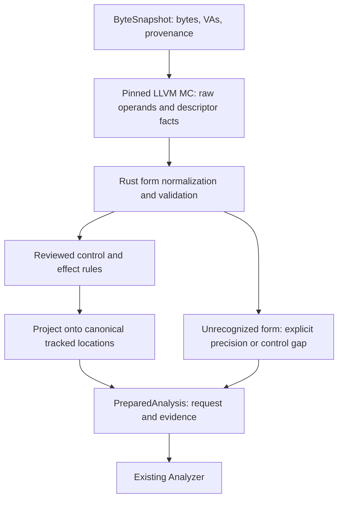

# Structured operands and conservative instruction effects

Design proposal, 2026-09-26. Source baseline: `fb7f142`.
The proposal below has now been implemented in the working tree; see the
[plan and delivery status](operand-effects-plan.md). This document itself does
not certify full instruction-step acceptance.

## Decision

Keep LLVM MC 20.1.2 as the decoder. Extend its native protocol to expose
structured decode facts, then normalize reviewed forms and summarize their
effects in Rust. Feed the existing `AnalysisRequest` without changing the
recovery, reaching-definition, or slicing algorithms.

The first deliverable is useful provenance for a small, explicit set of forms.
It does not require completing the 277-case user64 instruction-step milestone.
An effect rule has its own source review and tests; only independently accepted
user64 evidence can label a complete instruction step verified.



## Existing implementation and seam

`native/llvm_mc/decode.cpp` currently emits VA, status, length, control kind and
optional target. `src/llvm_mc.rs` constructs a total instruction map and assigns
every decoded instruction `uses = may_defs = locations`, `must_defs = {}`.
`src/engine.rs` already consumes more precise effects. The missing work belongs
at request preparation, before `Analyzer::new()`.

Use one new public preparation method, with immutable options and an owned
result. The following declarations are proposed interface sketches:

```rust
impl ByteSnapshot {
    pub fn prepare(
        &self,
        decoder: &Path,
        options: &PreparationOptions,
    ) -> Result<PreparedAnalysis, AdapterError>;
}

pub struct PreparedAnalysis {
    pub request: AnalysisRequest,
    pub instructions: BTreeMap<Address, InstructionEvidence>,
    pub gaps: Vec<PreparationGap>,
    pub identity: PreparationIdentity,
}
```

`PreparationOptions` selects the fixed `user64-effects-v1` environment and a
validated typed location catalogue. It does not expose arbitrary semantic
callbacks or caller-supplied "trusted" booleans. `PreparationIdentity` records
decoder/protocol version, normalization/rule-set revision and catalogue
identity. Each instruction record retains selected bytes, byte provenance,
normalized form/operands, chosen rule ID, control evidence and effect quality.

For this method, the catalogue's serialized keys must exactly equal
`ByteSnapshot.locations`; mismatches are errors. Provide a catalogue constructor
that supplies those keys, avoiding independently authored string aliases.
Keep existing `to_request()` behavior available as the legacy coarse interface;
it must not silently opt callers into a different location vocabulary. New
consumers use `prepare()` and retain its evidence alongside analyzer results.

A completed `scope_closed()` result still means only core recovery closure.
Preparation gaps are separate and must be displayed; no new overall
"fully analyzed" boolean is inferred from `scope_closed()`.

## Decode facts and normalization

Protocol v2 must distinguish its schema version from the LLVM release. Retain
the explicit helper executable and batched request/response exchange. Use a
bounded, line-framed tagged protocol with counted operand lists and one response
per VA; no assembly-text parsing and no new Rust serialization dependency are
needed. Unknown tags, duplicate/missing records, invalid counts or contradictory
fields reject the batch. Pin the exact grammar with fixtures before coding it.

The native response adds:

- Exact LLVM opcode name and raw ordered operands, tagged register/immediate or
  unsupported kind. Register names replace unstable numeric register IDs.
- Descriptor facts: explicit-definition count, implicit uses/defs, operand
  constraints, possible load/store and unmodeled-side-effect indicators.
- Selected input bytes, decode status/length and existing control facts remain
  associated by VA. The Rust side owns the original bytes and verifies spans.

These are decoder facts, not accepted effect summaries. In particular, a
descriptor definition does not establish an unconditional full-register kill.
Absence of a metadata flag does not certify preservation for an unreviewed form.

A private version-pinned form table converts raw operands to:

```text
RegisterView(bank, bit_offset, width)
Immediate(encoded_width, semantic_width, bits, extension_rule)
Memory(address_width, base, index, scale, displacement, segment, access_width)
RelativeTarget(displacement, resolved_target)
```

LLVM operand ordering, tied operands and memory-tuple layouts are interpreted
only by exact reviewed opcode/shape entries. There is no generic assumption
that operand zero is the destination or that every later operand is a source.
Widths, immediate extension and prefix restrictions come from the form entry
and byte evidence; reject unsupported combinations rather than guessing.
Record RIP-relative bases as the next instruction VA, with checked arithmetic.
An unrecognized raw register or operand kind prevents precise normalization.

Each rule binds mode, prefixes, opcode, operand shape, implicit resources,
source references and rule revision. LLVM opcode names are private adapter
identities, not replacements for AMD source-form IDs. LLVM upgrades require
rechecking the table and fixtures; they cannot silently reuse acceptance.

## Canonical location model

The engine treats locations as independent strings. Therefore the adapter must
resolve overlap before creating them. The default catalogue contains each of
the 16 GPRs as eight distinct byte cells, individual tracked flags, one memory
summary cell, and one opaque cell for FP/vector/opmask application data and status.
System/debug/control state (including RF/TF/IF) is outside this provenance
vocabulary and must not be reported as preserved.
String serialization is injective, for example `gpr:rax:0`, `flag:zf`,
`memory:any`, `state:other`. RIP/control is represented by graph evidence,
not an ordinary register cell in this first profile.

Never register RAX, EAX and AL as independent overlapping locations. Expand
views to byte cells internally and group them back into register names in
reports. Byte granularity is sufficient for the initially admitted GPR forms;
forms requiring finer distinctions stay conservative.

| Write view | Cells possibly/definitely replaced for an unconditional reviewed write |
| --- | --- |
| AL | RAX byte 0 |
| AH | RAX byte 1 |
| AX | RAX bytes 0–1 |
| EAX in long64 | RAX bytes 0–7, including upper-half zero extension |
| RAX | RAX bytes 0–7 |

Reads of EAX expand to bytes 0–3; they do not read the zero-extended upper half.
Untouched cells naturally retain their definitions in the existing engine.
The coarse opaque cell may be preserved only when a reviewed rule establishes
that none of its represented state is affected. Otherwise it is may-written,
never must-written as a whole. Requests for detailed SIMD/x87 provenance are
outside this catalogue and require a future explicit catalogue version.

## Effect rules

Rules produce `uses`, `may_defs`, `must_defs`, plus evidence and precision gaps.
Their scope is normal local continuation under the declared environment:
long64 user mode, ordinary instruction-boundary analysis, no signal-handler
edges or concurrent interference. Fault delivery and asynchronous execution
are not modeled by the existing core.

| Reviewed example | Uses | May definitions | Must definitions |
| --- | --- | --- | --- |
| `mov rax, rbx` | All RBX cells | All RAX cells | All RAX cells |
| `mov al, bl` | BL cell | AL cell | AL cell |
| `mov eax, imm32` | None | All RAX cells | All RAX cells |
| `add rax, rbx` | RAX and RBX cells | RAX and affected flag cells | Same, where rule establishes replacement |
| `cmp rax, rbx` | RAX and RBX cells | Affected flags | Same for defined, replaced flags |
| `lea rax, [rbx+8]` | RBX address cells | RAX cells | RAX cells |

ADC/SBB must include incoming CF. INC/DEC must preserve CF. Conditional writes
cannot become unconditional kills merely because LLVM reports a definition.
For initial conditional-write rules, leave destination `must_defs` empty and
record the loss of precision. Undefined flag results are may-definitions with
no must-kill initially, plus an explicit undefined-output annotation; they
must not be reported as concrete values. More precise treatment needs review.

The engine has one aggregate use set per instruction, not dependencies per
output. Thus a zeroed upper register cell can inherit unnecessary dependencies
through its producer instruction. Accept this overapproximation in v1; do not
change the core to pursue per-output precision during adapter work.

## Memory and calls

Initially all memory accesses use the same `memory:any` location. A reviewed
load reads address registers and that memory cell; a reviewed store reads
address registers and its source and may-defines the memory cell. A store
never must-defines all memory. LEA reads address registers without reading
memory. Segment-base dependencies must be included where applicable; forms
with unresolved segment behavior remain conservative.

This merges potentially unrelated memory origins but prevents missed aliases.
Do not add independent stack or absolute-address cells alongside `memory:any`:
an unknown-pointer store could alias them. A later disjoint region partition
must make unknown accesses touch every possibly overlapping cell. Crash-time
register values do not justify earlier concrete memory addresses.

A CALL summary edge includes possible callee execution and return, not just
the architectural push/transfer. Initially every call uses and may-defines all
tracked locations, with no must-definitions, even for a known direct target.
Do not infer callee-saved preservation from the target triple or a presumed ABI.
Indirect calls also retain their incomplete-target obligation. RET and stack
instructions need separate reviewed rules, including implicit stack memory.

## Unknown effects and unknown control

Effect precision and control certainty are independent decisions:

1. A reviewed control rule establishes normal successors but no precise effect
   rule applies: emit all-location reads/may-writes and no kills, and retain an
   `OpaqueEffects` gap. This computes possible origins; it does not preserve
   concrete machine-state facts or certify an instruction step.
2. No reviewed control rule establishes successors: keep byte/decode evidence,
   but do not invent a fallthrough. With the existing core vocabulary, leave
   the site undecodable and attach an `UnsupportedControl` preparation gap;
   a visited site produces the existing `DecodeFailed` obligation.
3. Missing bytes or an invalid instruction remains a distinct preparation
   reason. Never silently reinterpret either as a successful no-op or #UD.

The new preparation path therefore requires a positive, reviewed control
classification table. LLVM's negative "not a branch" result alone cannot
establish fallthrough for every unfamiliar instruction. This is intentionally
stricter than the current helper's opaque-control denylist. Known ordinary
forms may receive a control-only review without a precise effect rule.

Protocol corruption is a preparation error. A well-formed but unrecognized
instruction is an analysis gap. Keep those failure classes separate.

## Formal contract to implement

Add a small stateless `Specs/AriadneEffects.tla` contract and finite fixtures
during implementation; this document does not claim that module exists.
Reuse `MachineEffectWellFormed` and leave `Ariadne.tla` transitions unchanged.

For finite canonical locations L, let a reviewed relation supply conservative
sets `Reads(t)` and `Writes(t)` for each admitted normal continuation t. The
contract requires:

```text
Union_t Reads(t)  ⊆ uses ⊆ L
Union_t Writes(t) ⊆ may_defs ⊆ L
must_defs ⊆ Intersection_t Replaced(t)
must_defs ⊆ may_defs
```

`Replaced(t)` means the complete location has a new origin on that continuation;
it may still depend on its previous value, which must then occur in `uses`.
The admitted continuation set must be nonempty before deriving intersection
claims. Unavailable evidence cannot justify a vacuous universal kill. Control
soundness separately requires every admitted local successor to be represented
or an explicit unresolved-control obligation to remain.

Review reads/writes at the architectural location level before projecting to
cells. Whole-cell replacement is required for a must-definition; partial
overlap permits only a may-definition. Prove/check register alias expansion,
memory projection, fallback shape and no-kill preservation. This contract
checks abstract projection; it cannot prove LLVM decoding or the manual
interpretation. Accepted AMD64 semantics can discharge individual rule
obligations later without changing this interface.

## Implementation sequence and acceptance

| Stage | Files/responsibility | Acceptance |
| --- | --- | --- |
| 1. Contract and catalogue | New `Specs/AriadneEffects.tla`, fixtures and `src/effects.rs` | Alias/projection invariants; partial writes preserve untouched origins; full-memory kills rejected |
| 2. Protocol v2 | `native/llvm_mc/decode.cpp`, private parser in `src/llvm_mc/` | Real pinned LLVM fixtures cover raw operands, implicit operands and malformed response rejection; legacy interface remains usable |
| 3. First reviewed rules | Private normalization/rule tables under `src/effects/` | MOV register/immediate, LEA, ADD/SUB, CMP/TEST and selected logical forms at explicitly reviewed widths; no automatic whole-mnemonic coverage |
| 4. Control and memory | Same tables and preparation integration | Reviewed Jcc flag uses, direct/indirect transfers, opaque call summaries, common loads/stores; unknown control never fabricates fallthrough |
| 5. Public preparation | `ByteSnapshot::prepare`, docs and integration tests | End-to-end bytes → summaries → graph/reaching/slice, with evidence retained and all existing core tests passing |

Test behavior through `prepare()` and the actual analyzer. Include partial AL/AH
writes after a full RAX definition, EAX zero extension, tied read/write operands,
CF dependencies, flag preservation, load-after-unknown-store, calls that may
clobber any location, RIP-relative addressing and unsupported control.

Use manual-derived expectations rather than copying descriptor outputs into
the oracle. Negative controls must detect an AL write killing all of RAX,
missing address-register uses, omitted ADC carry, a store killing all memory,
an ABI-assumed call preservation and unknown-control fallthrough. The formal
fixtures and existing core MBT cover complementary scopes. New native gates
must execute the real decoder; missing LLVM dependencies are reported as
unavailable verification, never as passing tests.

A precision regression fixture should show an unrelated definition excluded
from a slice while necessary byte, flag and memory producers remain. Add batch
size/runtime measurements before choosing to replace the subprocess transport.

## Alternatives and references

Directly mapping LLVM definitions to `must_defs` is rejected because partial
and conditional writes need semantic interpretation. Whole-GPR cells are simpler
but force partial writes to preserve all old register origins; byte cells give
useful precision without changing the engine. A generic pluggable decoder trait
is deferred until a second actual decoder is needed. In-process LLVM linkage
is orthogonal to this design.

Local sources: [adapter](../llvm-mc-adapter.md),
[core correspondence](../implementation.md),
[user64 acceptance](../amd64-user64.md),
[shared effect contract](../../Specs/AriadneMachineCommon.tla), and
[existing native decoder](../../native/llvm_mc/decode.cpp).

LLVM's [MCOperand documentation](https://llvm.org/doxygen/classllvm_1_1MCOperand.html)
describes tagged operands. Its
[MCInstrDesc documentation](https://llvm.org/doxygen/classllvm_1_1MCInstrDesc.html)
describes definitions, implicit accesses, memory flags and unmodeled effects.
These online pages describe the current LLVM development version, not the
pinned 20.1.2 build. Exact 20.1.2 API availability and x86 operand layouts must
be checked against matching source/headers before implementing protocol v2;
this design does not assert that current documentation is version-matched.
