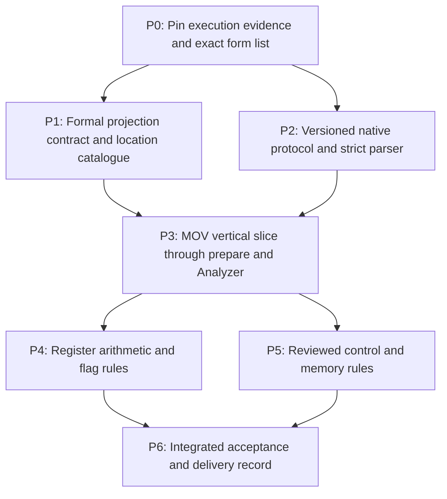

# Operand and effect implementation plan

Prepared 2026-09-26 against `fb7f142`.
Status: P0–P6 implemented and checked on 2026-09-26 in the working tree.
See the [delivery evidence](operand-effects-validation.md) and
[source-bound gate report](operand-effects-validation.json). No commit/push
has been performed. The sequence below is retained as the implementation plan.

| Stage | Delivery evidence |
| --- | --- |
| P0 | Matching LLVM headers/runtime, hash-verified AMD PDFs, baseline core/native checks, exact 137-row registry |
| P1 | Disjoint catalogue, two typechecked TLA+ modules, finite TLC fixture, projection/alias tests |
| P2 | Protocol v2 with strict bounded process/parser handling; all five v1 native tests preserved |
| P3 | Public prepare interface and MOV slice/partial-register regressions |
| P4 | Register arithmetic/logical/flag matrix, CF and undefined-AF handling |
| P5 | Reviewed controls, LEA, MOV memory forms, opaque calls and explicit control gaps |
| P6 | All eight integrated gates passed with stable source hashes; docs and checkpoint recorded |
Design: [Structured operands and conservative instruction effects](operand-effects-design.md).

## Outcome and scope

Deliver `ByteSnapshot::prepare()` returning a validated `AnalysisRequest` plus
per-instruction decode, control, effect and gap evidence. Reviewed forms produce
useful byte/flag dependencies; other forms remain explicitly conservative or
stop discovery when control is unresolved. Keep the current `to_request()`
behavior available and keep `Ariadne.tla` and `src/engine.rs` unchanged.

The first useful release is register MOV preparation end to end. The full v1
release adds the bounded arithmetic, control and common-memory cases below.
Neither release promotes AMD64 user64 instruction-step acceptance.

Out of scope: binary/dump readers, LLVM replacement or in-process linking,
precise memory alias analysis, ABI-based call summaries, SIMD/x87 precision,
machine-state execution, CLI/exporters and core algorithm optimization.

Dependency branches indicate independent work, not authorization to launch
agents. Implement in order by default. Each stage should be a reviewable change
with its own evidence; commit or push only when separately requested.

## P0 — Establish the baseline and freeze the first rule matrix

Read the matching LLVM 20.1.2 headers/source, the pinned AMD inventory and the
existing operand/register formalizations. Obtain a working native build using
the documented header/library overrides. The last local native check stopped
because matching dependencies were unavailable at configured paths; resolve
that prerequisite before claiming any decoder integration passes.

Record tool versions and run the existing core and native tests. Preserve
untracked checkpoint/design documents and unrelated files. Inspect existing
core MBT corpus source hashes before deciding whether a replay is applicable;
never regenerate oracle evidence merely to hide a freshness failure.

Create a rule matrix at `docs/Ariadne/operand-effects-rules.md` with stable rule
IDs, exact LLVM opcode/operand shapes, bytes, widths, prefix restrictions, AMD
source references, normal-continuation assumptions and expected effect/control
status. Every proposed matrix row starts pending; promotion requires its tests.

Freeze these families as candidate scope, admitting only individually reviewed
encodings and shapes:

- P3: MOV register-to-register and immediate-to-register, including low/high
  byte, word, dword and qword cases where valid in long64.
- P4: ADD/SUB/ADC/SBB, CMP/TEST, AND/OR/XOR, INC/DEC, register/immediate forms.
  No zero-idiom specialization is required; reading the old destination remains
  a safe overapproximation.
- P5: ordinary LEA, scalar MOV loads/stores, direct/indirect near JMP/CALL,
  selected Jcc and near RET. Calls use opaque effects; RET can initially use
  opaque effects with a reviewed terminal classification. PUSH/POP, far/system
  transfers, strings, conditional moves and atomics remain conservative or
  unsupported according to their separately reviewed control status.

Do not invent opcode identities or infer coverage from a mnemonic. Freeze
the exact rows after inspecting real output from the pinned decoder.

Exit: baseline results, pinned-source observations, explicit candidate matrix,
and an exact protocol-v2 grammar proposal are recorded. If native prerequisites
remain unavailable, P1 can proceed, but P2/P3 native acceptance stays pending.

## P1 — Implement the contract and canonical catalogue

Ownership: new `Specs/AriadneEffects.tla`, `Specs/AriadneEffectsChecks.tla`,
`Specs/Effects.cfg`, a focused check script, and `src/effects.rs` with private
`src/effects/locations.rs` and `src/effects/evidence.rs`. Export the public
catalogue/options/evidence types through `src/lib.rs` only as needed by prepare.

1. Define finite read/write/replacement projection contracts, explicit unknown
   evidence and the nonempty-continuation requirement. Reuse
   `MachineEffectWellFormed`; do not add analyzer phases or core obligations.
2. Implement the fixed catalogue: 128 GPR byte cells, an explicit frozen flag
   set, `memory:any` and `state:other`. Specify the flag list in code and the
   matrix rather than accepting arbitrary independent RFLAGS aliases.
3. Implement typed register views, checked expansion and injective string keys.
   Distinguish read width from replacement width, especially EAX writes.
4. Define `PreparationOptions`, `PreparedAnalysis`, `InstructionEvidence`,
   `PreparationGap` and `PreparationIdentity`. Include per-site control/effect
   quality and rule revision. Define deterministic ordering of gaps/evidence.
5. Reject catalogue/key mismatches rather than silently intersecting away
   untracked dependencies. Document the opaque cell and supported environment.

Exit: finite formal fixtures and Rust catalogue tests cover AL/AH/AX/EAX/RAX,
source views, untouched cells, memory no-kill, conservative fallback and invalid
views. Negative fixtures reject full-RAX kills for AL and vacuous must-writes.
Formal fixtures validate the abstract contract, not decoder correctness.

## P2 — Extend the native protocol without breaking v1

Ownership: `native/llvm_mc/decode.cpp`, private
`src/llvm_mc/protocol.rs`, native fixtures and protocol tests. Keep
`src/llvm_mc.rs` as the public module; its child modules are implementation
details, not a public pluggable decoder framework.

1. Preserve the default v1 invocation and version response used by
   `to_request()`. Add explicit v2 negotiation/invocation for `prepare()`;
   a missing v2 capability is a clear preparation error.
2. Pin the grammar, numeric ranges, record/list limits, terminators and
   unsupported operand representation. Bound total output by request size and
   per-record limits; avoid first reading unbounded output into memory.
3. Emit opcode names, ordered tagged raw operands, implicit registers and
   descriptor facts using matching LLVM APIs. Keep unsupported control records'
   decode facts available without advertising a successor.
4. Parse strictly in Rust. Validate every VA, record count, length, tag and
   status-dependent field; reject duplicate/missing/contradictory records.
5. Drain process streams without pipe deadlocks; terminate/reap on protocol
   limit failures. Keep subprocess failure distinct from a valid unsupported
   instruction response.

Exit: five existing native fixtures still pass on v1; real v2 fixtures establish
operand shapes for the first MOV rows. Parser tests cover malformed batches,
signed immediates, bounds and unsupported operands. Native tests must use the
actual helper; synthetic protocol producers test parsing only.

## P3 — Deliver MOV from bytes to a useful slice

Ownership: `src/effects/normalize.rs`, `src/effects/rules.rs`,
`src/llvm_mc.rs`, and new public integration tests in `tests/effects.rs`.

1. Implement exact form/shape matching with mode and prefix checks. Preserve
   source bytes and distinguish encoded immediates from semantic extensions.
2. Give each admitted MOV row a positive control rule and reviewed effects.
   An unrecognized control shape stays undecodable in the core request and
   receives `UnsupportedControl` evidence.
3. Implement `ByteSnapshot::prepare()` using the new catalogue and v2 decoder.
   Reuse byte selection and request validation without altering v1 behavior.
4. Preserve one evidence entry for every requested/candidate start, including
   byte gaps and rejected forms. Keep placeholders for graph target addresses
   absent from the supplied span maps, as the existing adapter does.
5. Ensure instruction evidence survives use of the request with `analyze()`;
   document how callers retain the remaining prepared fields beside the result.

Exit: real bytes pass through prepare and the existing Analyzer. A slice seeded
at `mov rsi, rax` includes an earlier `mov rax, rbx` but excludes an intervening
`mov rcx, rdx`. Further fixtures prove that AL/AH writes preserve unrelated RAX
origins while EAX writes replace all RAX cells. Catalogue mismatch and unknown
control produce the specified errors/gaps. This is the first useful checkpoint.

## P4 — Add reviewed register and flag effects

Ownership: normalization/rule tables, rule matrix and effect integration tests.

Add the P0 arithmetic/logical rows in small family-sized changes. Implement
tied read/write operands, implicit CF inputs for ADC/SBB, preserved CF for
INC/DEC and precise defined-flag writes. Undefined flag outputs remain annotated
may-writes with no initial must-kill. Unreviewed forms with reviewed control
use all-location effects and an `OpaqueEffects` gap.

Exit: tests trace carry and compare/branch flag origins, demonstrate no register
write for CMP/TEST, and retain CF across INC/DEC. Negative controls detect an
omitted carry use and an unjustified flag kill. Report coverage by exact row;
do not claim all encodings of a mnemonic from one passing fixture.

## P5 — Add control, LEA and conservative memory rules

Ownership: normalization/rule tables, preparation integration and native tests.

1. Normalize reviewed address tuples, scales, displacement and address sizes.
   Validate RIP-relative next-IP arithmetic. Segment behavior outside reviewed
   forms forces conservative effects rather than silently dropping dependencies.
2. LEA reads address inputs without reading memory. MOV loads/stores include
   address-register uses, source/destination views and `memory:any` as designed.
   No store is permitted to must-define the memory summary cell.
3. Add positive normal-control rules for the exact JMP/Jcc/CALL/RET rows.
   Jcc reads relevant flags; indirect transfers read their target operands or
   receive opaque effects until that operand form is reviewed.
4. Every CALL remains an all-location read/may-write with no must-kill on its
   summary edge. Directness certifies the known target, not callee behavior.
5. Keep incomplete indirect targets, unavailable bytes and unsupported control
   visible. New targets still require caller-supplied byte spans; this work
   does not turn the adapter into a file reader or dynamic byte provider.

Exit: load-after-unknown-store retains the store origin; LEA excludes memory
origins; address-register definitions remain in memory slices. Call-only targets
remain outside local discovery, callees cannot be assumed to preserve registers,
and unknown control has no fabricated fallthrough. Check binary/dump precedence
and captured decode failure through both legacy and new preparation paths.

## P6 — Integrate, validate and record the delivered scope

Ownership: focused check runner, documentation and final acceptance report.

Run each gate after its relevant changes, then one final integrated run:

| Gate | Required evidence |
| --- | --- |
| Core regression | `cargo test --offline`, formatting and Clippy pass; engine/model behavior remains unchanged |
| New public behavior | Catalogue/rules/protocol tests and real bytes → prepare → Analyzer fixtures pass |
| Native integration | `bash native/llvm_mc/check.sh` extended to execute both v1 and v2 fixtures against the pinned helper |
| Projection model | Focused Apalache typecheck and TLC checks of the new effects contract/fixtures |
| Negative controls | Wrong partial-register kill, missing address/CF read, memory-wide kill, call preservation and invented fallthrough each rejected by the intended assertion |
| Existing MBT | Run its freshness/replay gate with prepared dependencies; a stale corpus or missing tool is reported separately, never repaired silently |
| Precision comparison | Selected fixtures lose unrelated producers compared with v1 and retain all independently expected producers |

For negative controls use isolated copies; parser failures, unavailable tools
and timeouts do not count as semantic mutant rejection. Record source and rule
identities with the final evidence so subsequent edits cannot inherit a pass.
No full AMD64 proof-suite claim follows from the focused projection gate.

Record basic batch/runtime observations with catalogue size and fixture size.
Byte cells enlarge reaching-definition sets; measurements inform future work,
not an unsolicited core optimization in this change.

Update the adapter guide, implementation guide, this plan's stage statuses and
`CHECKPOINTS.md`. Link the reviewed rule matrix and report exact supported rows,
remaining conservative cases and unavailable verification. Keep user64
instruction-step acceptance unchanged unless separate accepted evidence exists.

## Completion criteria

The v1 feature is complete when P0–P6 evidence is available, every advertised row
has a reviewed control/effect disposition, legacy callers retain their behavior,
and callers can explain each prepared summary or gap from its evidence record.
Partial delivery should name its completed stage (for example, P3 MOV), not
claim completion of the whole plan.
