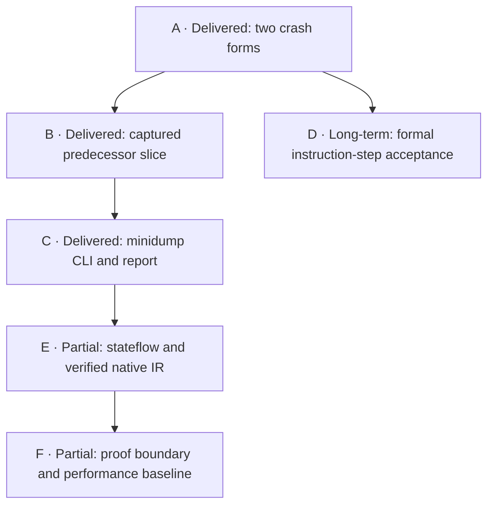

# Ariadne remaining implementation plan

Prepared 2026-09-28 against `a9dc41a`. **Plan only; no implementation or
acceptance change is made by this document.** Scope follows the user's current
decision: Windows/Linux AMD64 minidumps are enough for input. PE/ELF images and
ELF cores remain deferred.

Progress update **2026-09-29 10:16 CST**: A, B and C are delivered with
[source-bound B/C validation](stage-b-c-validation.md). D remains pending at
0/49 accepted register-core cases despite the later
[first-case D0–D3 progress](stage-d-progress.md); see its
[acceptance audit](stage-d-acceptance-audit.md).
E has [two implemented, fixture-validated paths](stage-e-validation.md) but
model-based replay remains open. F has a [proof-boundary record and measured
baseline](stage-f-proof-and-performance.md), not a Rust refinement proof or
qualified optimization. The [19-gate progress report](stage-b-f-validation.json)
keeps these distinctions explicit.

Priority decision **2026-09-29**: the [practical assurance queue](practical-assurance-priorities.md)
drives minidump investigations. Stage D's unchanged 49-case gate is a
**long-term formal research purpose**, not a dependency for the CLI, reviewed
conservative effects, Stage E's separate machines or workload measurement.

## Objective and current boundary

Produce a reproducible **minidump → decoded local graph → possible value origins
→ backward data slice → evidence-bounded report** for representative crashes.
Keep the existing `Specs/Ariadne.tla`/Rust analyzer core and its call-edge policy
stable unless a separately reviewed contract change is necessary.

At plan inception: pinned LLVM MC decoding, the minidump reader, local CFG
recovery, reaching definitions, backward data slices, 137 exact LLVM opcode
identities with reviewed/opaque effects, and text/DOT rendering were delivered.
The two retained real crash fixtures then stopped at their first instruction.
The [Stage A delivery](stage-a-validation.md) now expands the registry to 139
identities and decodes both faulting instructions. It does not yet demonstrate
a predecessor slice from an earlier real entry. The scoped user64 semantics
gate still reports 49 paired register bodies
and **0/49 accepted instruction steps**; the later 72 control/stack and 156 RAM
cases remain unaccepted.

D can advance as a formal research track. E's two specification paths are
independent of D acceptance and of PE/ELF readers. F's performance work follows
measured minidump needs; its universal Rust proof remains a separate research
boundary.

| Stage | Current status | Acceptance decision |
| --- | --- | --- |
| A | Delivered: two scoped memory-immediate MOV summaries | Both historical dumps decode their first instruction; no ISA-step acceptance |
| B | Delivered: tool-produced captured predecessor fixture | Windows/Linux pinned dumps give a decoded seed, address-producer slice and visible opaque return gap |
| C | Delivered: minidump investigator CLI | One query publishes matching text, parsed DOT and JSON v1 with byte provenance and uncertainty |
| D | Long-term formal research: 0/49 accepted `register-core` cases | Existing profile milestone gate passes only after all 49 source-bound cases close; it does not gate practical minidump work |
| E | Separate optional paths: two Rust machines implemented and fixture-validated | Generated model-based replay and independent result contracts remain open before production use of these paths |
| F | Performance path conditional on measured need; proof boundary recorded | No universal Rust-refinement claim; no solver optimization qualified yet |

The practical priorities are tracked in the
[assurance decision](practical-assurance-priorities.md). Standalone execution
plans now cover [Priority 1, a real captured predecessor slice](priority-1-real-capture-plan.md),
[Priority 2, exact path-driven effects](priority-2-path-driven-effects-plan.md),
and [Priority 4, workload-sized performance](priority-4-workload-performance-plan.md).
Their respective designs are the [real-capture evidence design](priority-1-real-capture-design.md),
[structured-effects design](operand-effects-design.md), and
[workload-performance design](priority-4-workload-performance-design.md).
Priority 1 now has a [qualified controlled Chromium/Linux case](priority-1-real-capture-validation.md)
with an independently established captured boundary and possible RBX producer.
This is additional to Stage B's tool-produced fixture; it does not change the
long-term formal gate or complete the later practical priorities.
Priority 2 has a [scoped no-change decision](priority-2-effects-validation.md)
for that path; opaque calls remain explicit. Priority 3 now has a
[readable text overview and Linux/Windows examples](priority-3-presentation-validation.md).
Priority 4 has [bounded measurements](priority-4-performance-validation.md)
but remains open until a larger real capture qualifies its scale decision.

## A — Unblock the real minidump instructions

The [Stage A implementation plan](stage-a-memory-immediate-mov-plan.md) gives
exact rule, fixture, negative-control and validation steps.
Its [completed source-bound record](stage-a-validation.md) leaves
instruction-step acceptance and Stage B's predecessor slice open.

The Linux fixture's first opcode is LLVM `MOV32mi` (`mov dword ptr [rax], imm32`);
the Windows fixture's is `MOV64mi32` (sign-extended imm32 to a 64-bit memory
operand). They correspond to source forms `AMD64-F-0502` and `AMD64-F-0503`
(Volume 3 PDF page 283) **for the memory alternative**. Those forms also
contain register alternatives; the Rust rule must match the exact decoded
memory shape rather than accept a whole mnemonic. These are currently planned
`ram-data` cases, not part of the 49-case `register-core` milestone.

Own the narrow change in `src/effects/rules.rs`, `src/effects/forms.txt`, the
frozen native observations, targeted tests and the rule matrix. Reuse the
existing memory-tuple normalizer. Review operand width, immediate sign
extension, base/index address reads, applicable prefixes, segment handling,
implicit resources and faulting-store behavior against the pinned AMD source.
Under the current single `memory:any` alias cell, a normal-continuation store
**may define** that cell but does not definitely replace all memory; it does
not read the old memory value merely to compute an address. Use of base/index
GPR cells is required. Flags and unrelated registers are preserved only where
the reviewed form justifies it.

Keep `UnknownInstructionFallback` and positive control classification for
unreviewed shapes. A successful normal-continuation effect summary is **not** a
claim that a crashing store committed. The current core does not deliver a
fault or reconstruct the faulting execution. No user64 instruction-step case
is promoted by these Rust summaries alone.

Acceptance: the two hash-pinned Breakpad dump fixtures decode the first
instruction with the expected addresses, selected byte provenance, operand
shape, `uses`, `may_defs`, empty `must_defs` for `memory:any`, and no invented
fault outcome. Run both Windows/Linux native decoder profiles. Add a fixture
where an earlier address-register definition enters the slice and a prior
possible memory origin survives a later store. Mechanical negative variants
must fail when address reads are omitted, all memory is killed, or an
unsupported prefix receives this rule. Re-run the existing effects/native,
minidump, model and MBT gates affected by the changed source hashes. Regenerate
the frozen decoder corpus only after reviewing its exact native diff; do not
refresh oracles to silence failures.

## B — Establish a useful real-dump backward slice

The crash IP is a suitable **seed**, but using it as the only entry cannot
recover earlier producers. Construct one pinned fixture with an independently
established earlier instruction start in captured memory and a path of reviewed
control forms to the crash instruction. Record how that entry was established
(e.g. tool-produced fixture source and matching captured bytes); never infer a
function start merely by decoding arbitrary bytes backward from RIP.

Use the existing `FileSnapshot::prepare()` with distinct `entry_points` and
`slice_seeds`. A real captured predecessor path must reach a decoded seed. The
expected slice should identify at least one producer of a faulting memory
address register and exclude an unrelated write. Check byte-range provenance,
exact VAs, intermediate graph edges, reaching definitions **before** the seed,
and missing-seed/obligation behavior. If the two currently pinned dumps contain
no suitable captured predecessor path, keep them as honest first-instruction
regressions and add a separate small tool-produced Windows or Linux minidump
with known code and expected address dependencies. Do not add executable-file
fallback or synthesize code pages to make the test pass.

A failing, faulting instruction may have read its address operands without
completing its write; label the slice as possible input provenance under the
normal-continuation analysis. Do not infer the historical path or a crash root
cause from may-reaching definitions alone.

Acceptance: the fixture's seed is decoded, its slice includes the expected
address producer(s), call-only targets are not entered unless separately rooted,
and every unresolved region/control/effect gap stays in the result/evidence.

## C — Investigator CLI and versioned output

Add a small binary in the separate `input/` package; keep the root `ariadne`
crate dependency-free and its `render()` functions pure. The first interface
accepts one minidump path, one or more explicit entry VAs, and explicit slice
seed VAs. A convenience `--seed-exception-rip` may use a valid captured context
RIP, but the reported fault address is not a substitute and the exception RIP
is not automatically treated as an earlier entry. Preserve Windows/Linux
profile selection from the parsed dump, regardless of host OS.

Use one internal report view built from:

- Snapshot/query identity, selected file hash, decoder/ruleset/profile identity,
  tool versions and resource limits.
- `InputEvidence` and `MaterializationReport`: captured byte spans, source
  offsets, conflicts/holes, attempted versus unattempted references, budgets.
- `PreparedAnalysis`: opcode, length, normalized operands, rule/quality,
  undefined flags and preparation gaps at each candidate.
- Full `AnalysisResult`: graph kinds, byte-source status, reaching-origin tags,
  data slice, recovery obligations and missing seeds.

Text and DOT may reuse `ariadne::render` for core facts, with clearly linked
input/preparation evidence alongside them. Do not attempt to reconstruct
per-output dependencies from reaching sets alone: `AnalysisResult` lacks uses.
The existing DOT graph may be converted to SVG by an explicitly requested
Graphviz step. Annotated assembly can display decoded opcode/operands and exact
captured bytes with a known rule/unknown label; no `llvm-mc` disassembly string
is invented from the core result.

Put stable JSON export in this input/report layer rather than making the core
library depend on a serializer. Define a versioned schema before coding it.
Serialize semantic VAs as canonical full-width hex strings so consumers cannot
round high `u64` values through IEEE-754 numbers. Distinguish `not captured`,
`decode failed`, `unsupported semantics`, `architecturally undefined`, and
`unvisited reference` as typed states. Include actual bytes only with their
snapshot/source provenance; never label an unaccepted rule as a verified ISA
step. Generate text/DOT/JSON from the same frozen query/result identities.

Acceptance: a single command over the pinned fixture emits text, DOT and JSON
that agree on every VA/edge/obligation and link a displayed producer to its
captured bytes and effect rule. Malformed formats/options, output I/O failure,
missing decoder, and resource exhaustion fail without publishing a misleading
complete report. Independently parse JSON, parse DOT with Graphviz, verify
schema/version and exact high-address round trips, and assert stable byte/hash
fixtures. A dump with zero decoded instructions must still produce a useful
partial report and nonzero-gap summary. Document limits and release examples
for Linux-host use with both Windows and Linux dumps.

## D — Close the scoped AMD64 semantics gate separately

The standalone [Stage D register-core implementation plan](stage-d-register-core-implementation-plan.md)
gives the case-first sequence, exact evidence bindings and milestone exit
criteria. [First-case progress](stage-d-progress.md) is bounded and the
[current audit](stage-d-acceptance-audit.md) remains 0/49.
The [assurance priority decision](practical-assurance-priorities.md) places
this unchanged gate in the long-term formal track; practical analysis may
continue with reviewed effects and explicit gaps.

The active deliverable is the existing
[`amd64-user64-v1` profile](../amd64-user64.md): 49 `register-core` cases first,
then 72 `near-control-stack` and 156 `ram-data` cases. The accepted no-trust
fallback foundation is retained. A paired instruction body, a successful
component check, or a useful analyzer effect rule cannot become an accepted
instruction step merely by changing a status field.

For each exact register-core case, use its `source_form_sha256` and profile case
hash to review legality and decoded payload, actual read/write effects and
register aliases, values/flags/undefinedness, complete state framing, possible
faults and commit/restart behavior, and the next-IP/instruction boundary.
Compose fetch, resolved synchronous events and the profile's asynchronous
boundary assumptions. Compare the authoritative TLA+ rule with the Lean
formalization and its explicit correspondence mapping. Prove the conservative
analysis projection and retain fallback when any obligation remains. Record
source citations and executable positive/negative cases in the existing
coverage ledger. The first source-reviewed family should close a **single**
case end to end before parallelizing the remaining exact form/width variants;
report accepted-case counts separately from paired-body counts at every gate.

Run `python3 tools/amd64_profile.py check --require-milestone register-core`
and `bash Specs/check-amd64.sh --require-milestone register-core` only as a
passing acceptance claim after all 49 cases close. Before that, focused case
checks may pass while the milestone gate remains intentionally failing. Run the
Lean build and axiom audit, TLA+ typechecks/executable TLC fixtures,
source-freshness/correspondence locks, focused mutations and the unchanged old
register-only regressions. A changed profile/source hash invalidates earlier
case acceptance until reviewed again. The MOV memory cases from A belong to
`ram-data` and must not bypass the active register-core gate.

This formal library is not yet a Rust ISA executor. Connecting accepted cases
to runtime effect precision later needs a separately validated decoder/payload
binding and must preserve explicit unknown outcomes for unsupported forms.

## E — Implement the other two formal analysis machines

Implement the proposed [`machine_state` Rust module](../machine-state-design.md)
against `Specs/AriadneMachineState.tla`. Feed it a **frozen** recovered local
CFG, finite abstract states and a trusted semantic-step relation. Its phases,
state IDs, terminal outcomes and obligations remain separate from
`AnalysisState`. Keep every structural edge in the report; classify feasibility
under stated entry facts as feasible, proven infeasible, or unknown, without
retrospectively pruning it from crash-time register values. First reproduce the
small model fixture, then test joins, loops, missing semantics, terminal states,
unknown targets and deliberately broken transitions. Do not label the existence
of a finite stateflow implementation as proof of its ISA semantics.

Independently implement the **native LLVM IR** path from directly supplied,
verifier-accepted `.ll`/`.bc` according to `Specs/AriadneLLVMIR.tla`. It has a
block CFG derived from terminators, instruction-level SSA uses, predecessor-
sensitive phi inputs, conservative adapter-supplied memory predecessors and
visible call obligations. It does not reconstruct original LLVM IR from a
binary or prove a correspondence between IR values and machine VAs. Pin LLVM
integration before adding a verified IR adapter; reject failed verification
before analysis. Begin with the formal four-block fixture, then missing-memory
and incomplete-call cases. Keep artifact/function/value identity distinct from
`SnapshotId`/machine VA identity.

Acceptance for each: its Rust input validator enforces the model's assumptions;
focused transition/fixture tests and model-based replay compare all observable
state fields; deliberately broken local-policy/phi/edge/terminal cases fail for
the intended reason. Give each result its own report contract before adding it
to the CLI. The machine and IR paths do not share an analyzer phase enum merely
because both reach fixed points.

## F — Proof boundary and scalability

For `Ariadne.tla`, the core Rust implementation already covers its transitions.
A stronger refinement claim requires an explicit `u64` representation relation,
proof obligations for validated fixed inputs, initialization, each Rust `step()`
action, deterministic schedule as a permitted TLA+ choice, result views, and
finite termination. Mechanizing an abstract-machine invariant is useful but is
**not a mechanical proof about the compiled Rust code** unless the Rust-to-proof
connection is itself checked and trusted. The existing 12-trace/168-state MBT
result and generated-request oracles remain conformance evidence, not universal
refinement proof. Record every remaining trusted boundary if direct Rust proof
is infeasible; do not promote a correspondence sketch to achieved proof.

Benchmark representative recovered graphs and memory/flag location sets before
changing the solver. Include loops, joins, opaque calls, dense alias sets and a
minidump path that B/C exercise. The current engine scans the frozen edge set
for predecessor queries; measure time, allocations, state growth and number of
transfer evaluations, with source/tool identities. If that cost blocks the
investigator workflow, add private predecessor indexes or a dirty worklist
while preserving the public result and the `Analyzer::step()` observable
schedule—or explicitly revise the replay contract before changing it. Re-run
core unit/generated tests, the six-fixture MBT gate and its five implementation
mutants after any solver change. Performance acceptance should use repeatable
workload/operation-count evidence; one debug timing is not a release claim.

## Release and scope controls

The stages can be reviewed and delivered incrementally. Each completed stage
needs exact source hashes, fixtures, relevant checker versions, positive and
negative evidence, and a note about what remains uncertain. Treat sandbox,
network, cache and tool failures as unavailable verification, not semantic
counterexamples or passes. Do not commit/push as part of plan authoring.

Deferred input formats stay deferred by user choice. A CLI over minidumps and a
useful but incomplete analyzer result are legitimate deliverables; neither
requires the 49-case register-core gate, all 277 user64 cases, full Volume 3
coverage, matched interprocedural returns, or a mechanically verified runtime
ISA library first.

Source map: [roadmap](../../ROADMAP.md),
[core implementation](../implementation.md),
[minidump validation](minidump-validation.md),
[renderer](result-rendering.md),
[effect rules](operand-effects-rules.md),
[user64 case ledger](../../Specs/AMD64/user64-coverage.json),
[AMD64 validation](../amd64-validation.md),
[machine-state design](../machine-state-design.md),
[native IR model](../../Specs/AriadneLLVMIR.tla).
