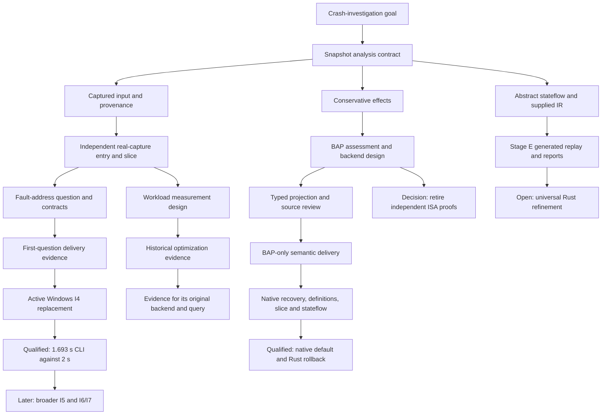

# Ariadne documentation network

This map connects the questions behind the documents to designs, implementations,
delivery evidence and remaining work. Each document has a **Context and follow-up**
section near its beginning. That section explains the document's own problem,
contribution and remaining limits, with direct links to its origin and successors.
You can follow the subject without returning to this map.

## Reading the relationships

- **Status** distinguishes current contracts, historical delivery evidence,
  completed plans and retired research. A retired objective was dropped from
  scope; its obligations were not proved by retirement.
- **Why this document exists** explains the problem or prerequisite locally and
  links directly to its origin. This is a conceptual relationship, not necessarily
  a claim about publication order.
- **What this document establishes** states the contribution and its scope before
  asking the reader to open another document.
- **Where to go next** links directly to implementation, validation, replacement
  decisions or active plans, explaining what each destination contributes.
- **What remains unresolved** distinguishes current open requirements from
  historical gaps or retired obligations. A linked plan is not a completed result.

Use the [documentation index](Ariadne/README.md) for APIs and usage, the
[plan index](../Plans/README.md) for pending work, and the
[evidence guide](../evidence/Ariadne/README.md) for recorded tests and measurements.
Dates, source hashes and qualification limits in older records retain their
original meaning.

## Main problem-to-delivery paths

The arrows show how a question leads to another document or workstream; they
do not assert that every destination is complete.

| Question | Motivation and design | Where the question is addressed | What remains |
| --- | --- | --- | --- |
| How can captured instructions reveal possible value origins? | [Project overview](../README.md), [analysis model](../Specs/README.md) | [Rust implementation](implementation.md), [core replay](../mbt/README.md) | [Universal refinement boundary](Ariadne/stage-f-proof-and-performance.md) |
| Where do trustworthy bytes and instruction starts come from? | [Byte-span adapter limitations](llvm-mc-adapter.md), [reader design](Ariadne/file-reader-design.md) | [Input module](Ariadne/modules/input.md), [predecessor fixture delivery](Ariadne/stage-b-c-validation.md) | PE/ELF image and ELF-core input remain deferred in the [roadmap](../ROADMAP.md). |
| How are register and memory dependencies derived? | [Original effects contract](Ariadne/operand-effects-design.md), [BAP assessment](Ariadne/bap-core-refactor-assessment.md) | [Backend design](Ariadne/bap-semantic-backend-design.md), [source review](Ariadne/bap-projection-source-review.md), [BAP-only delivery](Ariadne/bap-only-removal-validation.md) | Unsupported BIL stays explicit. The [admission/coverage extension](../Plans/bap-projection-admission.md) is accepted with current remote evidence on the [selected Windows corpus](Ariadne/real-capture-repin-79938.md); remaining historical real-Linux clauses are excluded. The [documentation audit](Ariadne/bap-documentation-sync.md) preserves its earlier v2 inventory. [Native Stage 2 qualification](Ariadne/bap-core-qualification.md) passes on its recorded corpus; universal refinement, lifter correctness and packaged release qualification remain separate. |
| Does a real capture contain an earlier possible producer? | [Independent-entry evidence design](Ariadne/priority-1-real-capture-design.md) | [Selected Windows replacement](Ariadne/real-capture-repin-79938.md), [historical Chromium/Linux case](Ariadne/priority-1-real-capture-validation.md) | P4 is accepted with remaining historical real-Linux clauses excluded. Possible producers do not establish executed history or universal coverage. |
| Which definitions may contribute to this fault address? | [Investigation design](Ariadne/investigation-layer-design.md) | [Contracts](Ariadne/investigation-contracts.md), [API](Ariadne/modules/investigation.md), [first delivery](Ariadne/investigation-validation.md) | [Native I4 performance qualification](Ariadne/i4-performance-validation.md) passes for its exact query; broader I5 and I6–I7 remain in the [investigation plan](../Plans/investigation-layer.md). |
| Does the selected access begin at address zero under captured exception context? | [I5a design](Ariadne/i5a-zero-address-design.md) | [Implemented contracts](Ariadne/i5a-contracts.md), [source review](Ariadne/i5a-source-review.md), [H0–H5 execution plan](../Plans/i5a-zero-address.md). | Qualified controlled Windows I5a and fixed-budget native I4 remain separate; see the [current I5a stage](../Plans/investigation-layer.md#i5a--zero-address-consistency). |
| Did the selected base-plus-signed-displacement address calculation wrap? | [I5c design](Ariadne/i5c-address-wrap-design.md) | [W0–W5 plan](../Plans/i5c-address-wrap.md) specifies the next implementation and independent oracle/model work. | Every stage is pending; the first profile keeps mathematical underflow unknown under lower-range fault admission. |
| Is the encoded base zero with a nonzero displacement at the fault site? | [I5b design](Ariadne/i5b-zero-base-offset-design.md) | [Implemented contracts](Ariadne/i5b-contracts.md), [source review](Ariadne/i5b-source-review.md), [B0–B5 plan](../Plans/i5b-zero-base-offset.md). | [Aggregate qualification](Ariadne/i5b-validation.md) passes within the declared finite corpus; indexed, Linux and historical-provenance questions remain outside its first profile. |
| How can an investigator read and consume the output? | [Core rendering](Ariadne/result-rendering.md), [presentation design](Ariadne/priority-3-investigator-presentation-design.md) | [Minidump report contract](Ariadne/stage-c-report-schema.md), [presentation delivery](Ariadne/priority-3-presentation-validation.md), [examples](Ariadne/minidump-investigator-examples.md) | Additional result families retain [separate contracts](Ariadne/stage-e-report-contracts.md). |
| What about abstract states and supplied LLVM IR? | [Stateflow design](machine-state-design.md), [typed replay design](Ariadne/stage-e-mirrorrust-design.md) | [Stage E completion](Ariadne/stage-e-completion.md), [IR usage](Ariadne/modules/ir.md), [replay guide](../mbt/stage-e/README.md) | Supplied semantics remain premises; Stage E does not reconstruct original IR from machine code. |
| Does the tool meet a realistic performance budget? | [Baseline](Ariadne/stage-f-proof-and-performance.md), [workload design](Ariadne/priority-4-workload-performance-design.md) | [Historical LLVM-backed optimization](Ariadne/priority-4-performance-validation.md), [benchmark guide](Ariadne/modules/bench.md) | [Native core qualification](Ariadne/bap-core-qualification.md) uses its own unlimited policy; [native Windows I4](Ariadne/i4-performance-validation.md) meets its unchanged 2 s limit; [controlled I5a](Ariadne/i5a-native-qualification.md) passes its fixed budgets. |
| Why is there an AMD64/Lean tree if BAP supplies semantics? | [Historical ISA design](amd64-semantics-design.md), [former profile](amd64-user64.md) | [Retirement and trust-boundary decision](Ariadne/semantic-assurance.md) | The research is retired. BAP lifter correctness remains a trust assumption, not a discharged ISA proof. |

## Maintaining the network

When changing a document's scope or completing a stage, update its local
explanations and the upstream document that previously left the question open.
Link a design to its plan and a completed plan to its delivery record. Preserve
the distinction between an implemented feature, exercised qualification and an
open requirement. Archived documents should point to their successor without
rewriting old validation results.

The context links in individual documents are the detailed relationships.
This map is an optional overview; it does not replace local explanations,
contracts, plans or evidence. An origin or next-step link must lead directly to
the relevant document, not send the reader back here to search again.
Run `python3 tools/check_doc_links.py` after changing navigation. The check verifies
local link destinations and section anchors, context-section coverage and reachability from this map;
the correctness of each relationship still requires editorial review.

## Document catalogue

The catalogue below provides an entry to every document with contextual
navigation, including completed plans and retired research.

The [investigation correctness-fix plan](../Plans/completed/investigation-correctness-fixes.md)
addresses two reviewed gaps in the first-question implementation: full Windows
latency enforcement and valid answers when explanation limits are exhausted.
Its [delivery record](Ariadne/investigation-correctness-validation.md) separates
implemented repairs and exercised checks from real-Windows qualification.

### Project and active plans

- [BAP projection admission and coverage plan](../Plans/bap-projection-admission.md) —
  accepted form validation, capability admission and conservative ordinary
  continuation, with qualified finite-corpus exits and excluded historical real-Linux clauses.

- [I5c address-wrap implementation plan](../Plans/i5c-address-wrap.md).
- [I4 native performance implementation](../Plans/i4-performance-implementation.md).
- [I5b zero-base-plus-displacement implementation plan](../Plans/i5b-zero-base-offset.md).
- [Windows I4 replacement plan](../Plans/i4-windows-repin.md).
- [I5a zero-address implementation plan](../Plans/i5a-zero-address.md).
- [Native I5a qualification plan](../Plans/i5a-native-qualification.md).

- [Ariadne checkpoints](../CHECKPOINTS.md).
- [Ariadne plans](../Plans/README.md).
- [BAP integration plan: semantic backend, then analysis core](../Plans/bap-integration.md).
- [Ariadne investigation-layer implementation plan](../Plans/investigation-layer.md).
- [Ariadne](../README.md).
- [Ariadne roadmap](../ROADMAP.md).

### Analysis, interfaces and delivery documents

- [Ariadne architecture](Ariadne/architecture.md) — main pipeline, native helpers, completed-analysis binding and separate IR/stateflow paths.
- [Selected I5c address-wrap design](Ariadne/i5c-address-wrap-design.md).
- [I4 native performance design](Ariadne/i4-performance-design.md).
- [I4 native performance qualification](Ariadne/i4-performance-validation.md).
- [Selected I5b zero-base-plus-displacement design](Ariadne/i5b-zero-base-offset-design.md).
- [I5b source and independent admission review](Ariadne/i5b-source-review.md).
- [I5b implemented contracts](Ariadne/i5b-contracts.md).
- [I5b qualification](Ariadne/i5b-validation.md).
- [I5a zero-address consistency](Ariadne/i5a-zero-address-design.md).
- [I5a implemented contracts](Ariadne/i5a-contracts.md).
- [I5a source and finite admission review](Ariadne/i5a-source-review.md).
- [I5a source/fixture delivery and validation](Ariadne/i5a-validation.md).
- [Native I5a qualification and dependency isolation](Ariadne/i5a-native-qualification.md).
- [Native Windows capture with crashpad-nzsn](Ariadne/crashpad-demo-validation.md).
- [Crashpad demo build and capture recipe](../native/crashpad-demo/README.md).

- [Ariadne documentation](Ariadne/README.md).
- [Could BAP become Ariadne's core?](Ariadne/bap-core-refactor-assessment.md).
- [LLVM semantic-backend removal](Ariadne/bap-only-removal-validation.md).
- [BAP workload qualification repair and source refresh](Ariadne/bap-windows-workload-validation.md).
- [Controlled Crashpad replacement for the BAP Windows workload](Ariadne/bap-windows-repin-validation.md).
- [BAP workload qualification with unlimited latency](Ariadne/bap-unlimited-validation.md).
- [BAP-owned analysis: Stage 2 contract](Ariadne/bap-analysis-core-design.md).
- [Complete Stage 2 qualification](Ariadne/bap-core-qualification.md) — native default, rollback, exact corpus and retained evidence.
- [Complete Stage 2 execution plan](../Plans/bap-stage2-implementation.md).
- [Stage 2 A0 plan](../Plans/bap-stage2-a0.md).
- [OCaml foundation qualification plan](../Plans/bap-ocaml-qualification.md).
- [Stage 2 A0 validation](Ariadne/bap-stage2-a0-validation.md).
- [Native BAP analysis core](../native/bap-core/README.md) — default algorithms and separately labeled historical A0 probe.
- [Historical BAP documentation synchronization](Ariadne/bap-documentation-sync.md) — earlier v2 source/evidence audit and its accepted v3 successor.
- [BAP Windows workload replacement plan](../Plans/bap-windows-repin.md).
- [BAP Stage 1 projection: pinned source review](Ariadne/bap-projection-source-review.md).
- [Stage 1 BAP semantic backend protocol and projection](Ariadne/bap-semantic-backend-design.md).
- [BAP v3 admission contract](Ariadne/bap-admission-contract.md) — frozen independent expectations, typed capability admission, ordinary opaque continuation and explicit profile migration.
- [Historical BAP admission execution checkpoint](Ariadne/bap-admission-checkpoint.md) — initial P0–P3 checks and P4 failures before the accepted successor.
- [BAP admission resume record](Ariadne/bap-admission-resume.md) — recovered dependencies, preserved failures and progression to accepted P4.
- [File readers and immutable address-space preparation](Ariadne/file-reader-design.md).
- [Installed ModelMirrors and MirrorRust compatibility](Ariadne/installed-modelmirrors-compatibility.md).
- [Windows I4 replacement validation](Ariadne/i4-windows-repin-validation.md).
- [Fault-address investigation contracts](Ariadne/investigation-contracts.md).
- [Ariadne investigation layer](Ariadne/investigation-layer-design.md).
- [First fault-address investigation delivery](Ariadne/investigation-validation.md).
- [Minidump investigator examples](Ariadne/minidump-investigator-examples.md).
- [Minidump input delivery and validation](Ariadne/minidump-validation.md).
- [BAP minidump semantic backend](Ariadne/modules/bap.md).
- [Analyzer baseline benchmark](Ariadne/modules/bench.md).
- [Ariadne minidump input](Ariadne/modules/input.md).
- [Ariadne investigation module](Ariadne/modules/investigation.md).
- [Native LLVM IR input](Ariadne/modules/ir.md).
- [Stage E inputs and reports](Ariadne/modules/reports.md).
- [Structured operands and conservative instruction effects](Ariadne/operand-effects-design.md).
- [LLVM MC protocol 2](Ariadne/operand-effects-protocol.md).
- [Operand/effect rule matrix](Ariadne/operand-effects-rules.md).
- [Operand/effects delivery evidence](Ariadne/operand-effects-validation.md).
- [Ariadne assurance priorities](Ariadne/practical-assurance-priorities.md).
- [Priority 1 design: evidence-linked predecessor slice from a real minidump](Ariadne/priority-1-real-capture-design.md).
- [Accepted P4 real-capture replacement](Ariadne/real-capture-repin-79938.md) — exact Windows pin, remote gates, fixed budgets and excluded historical real-Linux clauses.
- [Priority 1: controlled Chromium real-capture investigation](Ariadne/priority-1-real-capture-validation.md).
- [Priority 2: path-driven effect decision for the first real case](Ariadne/priority-2-effects-validation.md).
- [Priority 3 design: readable minidump investigation reports](Ariadne/priority-3-investigator-presentation-design.md).
- [Priority 3: readable minidump reports and release examples](Ariadne/priority-3-presentation-validation.md).
- [Priority 4 real-path control review](Ariadne/priority-4-control-source-review.md).
- [Priority 4: qualified workload and performance decision](Ariadne/priority-4-performance-validation.md).
- [Priority 4 design: workload-based performance decision](Ariadne/priority-4-workload-performance-design.md).
- [Rendering analyzer outcomes](Ariadne/result-rendering.md).
- [Rust source layout consolidation](Ariadne/rust-source-layout.md).
- [Semantic assurance and retirement of independent ISA proofs](Ariadne/semantic-assurance.md).
- [Stage A source and decoder review: memory-immediate MOV](Ariadne/stage-a-source-review.md).
- [Stage A memory-immediate MOV delivery](Ariadne/stage-a-validation.md).
- [Stages B and C: captured predecessor slice and investigator report](Ariadne/stage-b-c-validation.md).
- [Stage C minidump investigator report schema](Ariadne/stage-c-report-schema.md).
- [Stage D D1 review: MOV reg64, imm32](Ariadne/stage-d-mov-reg64-imm32-review.md).
- [Stage E completion: replay and investigator reports](Ariadne/stage-e-completion.md).
- [Stage E typed MirrorRust integration](Ariadne/stage-e-mirrorrust-design.md).
- [Stage E result contracts](Ariadne/stage-e-report-contracts.md).
- [Stage F proof boundary and measured core baseline](Ariadne/stage-f-proof-and-performance.md).
- [Learning the theory behind Ariadne's assembly analysis](Ariadne/static-analysis-learning.md).
- [Rust machine-analysis implementation](implementation.md).
- [LLVM MC byte-span adapter](llvm-mc-adapter.md).
- [Rust design for abstract machine-state analysis](machine-state-design.md).

### Formal-model, native-tool and evidence guides

- [AMD64 source and coverage inventory](../Specs/AMD64/README.md).
- [Ariadne formal model](../Specs/README.md).
- [Retained Ariadne evidence](../evidence/Ariadne/README.md).
- [AMD64 Lean formalization](../lean/README.md).
- [Model-based tests for Ariadne](../mbt/README.md).
- [Stage E generated MirrorRust replay](../mbt/stage-e/README.md).
- [Pinned BAP instruction helper](../native/bap/README.md).

### Completed plans

- [Stage 1 follow-up: remove the LLVM semantic backend](../Plans/completed/bap-only-semantics.md).
- [Operand and effect implementation plan](../Plans/completed/operand-effects-plan.md).
- [Priority 1 implementation plan: a real-capture predecessor slice](../Plans/completed/priority-1-real-capture-plan.md).
- [Priority 2 implementation plan: effects demanded by captured paths](../Plans/completed/priority-2-path-driven-effects-plan.md).
- [Priority 3 implementation plan: investigator presentation and examples](../Plans/completed/priority-3-investigator-presentation-plan.md).
- [Priority 4 implementation plan: workload-sized performance decision](../Plans/completed/priority-4-workload-performance-plan.md).
- [Consolidate Rust sources and Cargo targets](../Plans/completed/rust-source-layout.md).
- [Stage A implementation plan: memory-immediate MOV effects](../Plans/completed/stage-a-memory-immediate-mov-plan.md).
- [Stage E completion plan](../Plans/completed/stage-e-completion.md).
- [Stage E: first MirrorRust integration stage](../Plans/completed/stage-e-mirrorrust-integration.md).

### Retired ISA research

- [AMD64 architectural CPU state](amd64-architectural-state.md).
- [AMD64 atomic CPU and memory execution](amd64-atomic-execution.md).
- [AMD64 concrete memory and captured knowledge](amd64-concrete-memory.md).
- [AMD64 control-transfer foundation](amd64-control.md).
- [AMD64 external and profile-dependent instructions](amd64-external.md).
- [AMD64 instruction-form catalogue and legality boundary](amd64-instruction-forms.md).
- [AMD64 mul/div execution worktree checkpoint](amd64-integer-muldiv-execution.md).
- [AMD64 integer semantic kernels](amd64-integer-semantics.md).
- [AMD64 shift and rotate execution binding](amd64-integer-shift-execution.md).
- [AMD64 port-I/O foundation](amd64-io.md).
- [AMD64 Lightweight Profiling control-block layout](amd64-lwp-layout.md).
- [AMD64 machine access boundary](amd64-machine-access.md).
- [AMD64 memory and exception foundation](amd64-memory-exceptions.md).
- [AMD64 WB/WC memory ordering](amd64-memory-ordering.md).
- [AMD64 memory types and atomic RMW foundation](amd64-memory-types-atomics.md).
- [AMD64 MONITORX and MWAITX](amd64-monitor.md).
- [AMD64 executable operands and form coupling](amd64-operands.md).
- [AMD64 page-walk certificates](amd64-page-walk.md).
- [AMD64 semantics and Lean correspondence](amd64-semantics-design.md).
- [AMD64 delivery tasks](amd64-semantics-tasks.md).
- [AMD64 string and repetition foundation](amd64-strings.md).
- [AMD64 raw system controls and execution guards](amd64-system-state.md).
- [Typed AMD64 register-view foundation](amd64-typed-foundation.md).
- [Conservative unsupported-semantics analysis contract](amd64-unsupported.md).
- [Verified 64-bit user-mode semantics](amd64-user64.md).
- [AMD64 foundation validation, 2026-09-22](amd64-validation.md).
- [Executable x86-64 instruction semantics](x86-64-semantics.md).
