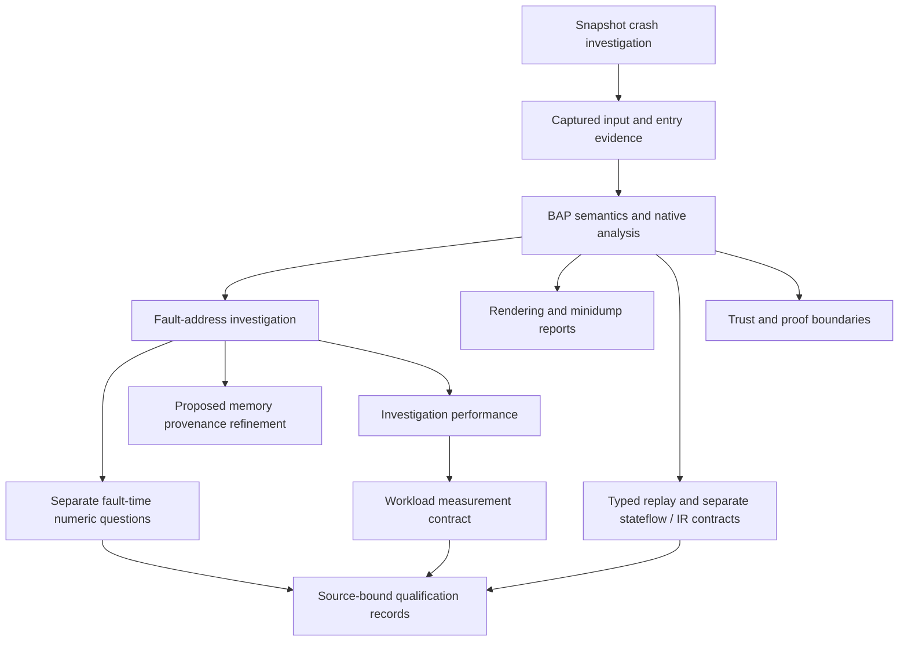

# Ariadne documentation network

Designs are organized by feature: one canonical document owns each design's
decisions and contracts. Implementation stages live in [Plans](../Plans/README.md);
source-review and validation summaries stay with their owning feature, while
raw evidence retains its original identities and scope. Use the
[design index](Ariadne/README.md#canonical-designs) to find the canonical owner.

Each document's **Context and follow-up** section explains its status,
motivating problem, contribution, direct next reading and unresolved limits.
Readers can follow the subject without returning to this map.

The [terminology convention](terminology.md) defines shared words and required
qualifiers across active contracts, reports, plans and retired research.

## Main problem-to-delivery paths

```mermaid
flowchart TD
    Goal[Snapshot crash investigation] --> Input[Captured input and entry evidence]
    Input --> BAP[BAP semantics and native analysis]
    BAP --> Explain[Fault-address investigation]
    Explain --> Numeric[Separate fault-time numeric questions]
    Explain --> Memory[Proposed memory provenance refinement]
    BAP --> Reports[Rendering and minidump reports]
    BAP --> Replay[Typed replay and separate stateflow / IR contracts]
    Explain --> Performance[Investigation performance]
    Performance --> Workload[Workload measurement contract]
    BAP --> Assurance[Trust and proof boundaries]
    Numeric --> Evidence[Source-bound qualification records]
    Replay --> Evidence
    Workload --> Evidence
```

| Question | Canonical design or contract | Implementation and evidence | Remaining boundary |
| --- | --- | --- | --- |
| How do captured instructions yield possible origins? | [Analysis model](../Specs/README.md), [BAP design](Ariadne/bap-analysis-core-design.md) | [Rust reference](implementation.md), [native qualification](Ariadne/bap-analysis-core-design.md#native-qualification) | [Universal refinement and trusted lifting](Ariadne/semantic-assurance.md). |
| Which bytes and instruction entries are justified? | [File-reader design](Ariadne/file-reader-design.md) | [Input guide](Ariadne/file-reader-design.md#public-interface), [selected capture](Ariadne/file-reader-design.md#windows-replacement-capture-and-bounded-query) | Capture-only production reader; further file formats remain deferred. |
| Can captured data resolve an indirect jump? | [Indirect-target resolution](Ariadne/indirect-target-resolution.md) | [R0–R6 plan](../Plans/indirect-target-resolution.md), [captured table inspection](Ariadne/indirect-target-resolution.md#motivating-windows-capture) | Implemented finite profile with source-bound qualification; incoming-state coverage and captured-memory premises remain explicit. |
| How are instruction dependencies projected? | [BAP projection](Ariadne/bap-analysis-core-design.md#projection) | [Pinned source review](Ariadne/bap-analysis-core-design.md#pinned-projection-source-review), [accepted admission plan](../Plans/bap-projection-admission.md) | Unsupported semantics remain explicit; the accepted corpus is finite. |
| Which definitions contribute to a fault address? | [Investigation design](Ariadne/investigation-design.md) | [API](Ariadne/investigation-design.md#investigation-module-and-interface), [validation](Ariadne/investigation-design.md#retained-delivery-evidence) | Possible dependencies do not establish execution or a root cause. |
| Can a memory writer be narrowed to the selected load? | [Memory provenance proposal](Ariadne/memory-provenance-refinement.md) | [Retained Scanner query](Ariadne/bap-analysis-core-design.md#admission-resume) | Bounded alias assessment and output-specific refinements remain proposed. |
| Does the fault-time access begin at zero? | [Zero-address design](Ariadne/zero-address-design.md) | [Source review](Ariadne/zero-address-design.md#source-and-finite-admission-review), [native qualification](Ariadne/zero-address-design.md#native-qualification) | Captured-context and finite admission premises apply. |
| Is the encoded base zero with a nonzero displacement? | [Zero-base-offset design](Ariadne/zero-base-offset-design.md) | [Source review](Ariadne/zero-base-offset-design.md#decoded-record-and-independent-oracle), [qualification](Ariadne/zero-base-offset-design.md#retained-qualification) | First-profile forms and source-bound acceptance remain distinct from historical provenance. |
| Did base plus signed displacement wrap? | [Address-wrap design](Ariadne/address-wrap-design.md) | [Implementation plan](../Plans/i5c-address-wrap.md) | Model, implementation and qualification remain pending. |
| How are analysis results presented? | [Rendering and minidump report design](Ariadne/result-rendering.md) | [Presentation validation](Ariadne/result-rendering.md#presentation-acceptance), [examples](Ariadne/result-rendering.md#investigator-cli-examples) | Each result family retains its own meaning and completeness rules. |
| How do replay, supplied IR and stateflow fit? | [Typed replay](Ariadne/typed-replay-design.md), [stateflow](machine-state-design.md) | [Replay guide](../mbt/stage-e/README.md), [completion evidence](Ariadne/typed-replay-design.md#finite-corpus-and-claim-boundary), [IR guide](Ariadne/typed-replay-design.md#direct-verified-ir) | Supplied semantics remain premises; binary input does not reconstruct original LLVM IR. |
| How is performance assessed and improved? | [Workload measurement](Ariadne/workload-performance-design.md), [investigation optimization](Ariadne/workload-performance-design.md#investigation-performance) | [Native investigation qualification](Ariadne/workload-performance-design.md#native-investigation-qualification), [historical workload result](Ariadne/workload-performance-design.md#historical-llvm-workload-qualification) | Budgets and measurements apply to their exact backend, host and workload. |
| Why are old ISA models retained? | [Semantic assurance](Ariadne/semantic-assurance.md) | [Retired ISA reference](amd64-semantics-design.md), [retained evidence](../evidence/Ariadne/README.md) | The independent ISA proof track is retired; its obligations were not proved by retirement. |

## Maintaining the network

- Extend the canonical feature design when later work changes its decisions or
  contracts. Keep stage execution in its linked plan and dated progress in
  [checkpoints](../CHECKPOINTS.md).
- Give every design a direct origin link and useful next readings. A map link
  supplements these relationships; it does not replace them.
- State whether a document describes implemented behavior, a proposal, a
  historical result or retired work. Preserve source/tool/corpus qualifications.
- Preserve unique contracts when removing an absorbed document, and redirect
  live references to the canonical owner. Do not leave a stage-design stub.
- Fold module usage, source reviews and dated validation narratives into the
  owning feature document. Preserve recorded evidence bytes, source hashes,
  timestamps and pass flags.
  Historical inventory paths refer to their original Git revisions, even when
  live design paths have been consolidated.
- Link new implementation plans from their owning design in the same change.
- Run `python3 tools/check_doc_links.py` after navigation changes. The check
  verifies local paths, anchors, context fields and reachability; editorial
  review still establishes whether the relationships are meaningful.

## Document catalogue

The catalogue below provides an entry to every document with contextual
navigation, including completed plans and retired research.

The [investigation correctness-fix plan](../Plans/completed/investigation-correctness-fixes.md)
addresses two reviewed gaps in the first-question implementation: full Windows
latency enforcement and valid answers when explanation limits are exhausted.
Its [delivery record](Ariadne/investigation-design.md#qualification-and-truncation-repairs) separates
implemented repairs and exercised checks from real-Windows qualification.

### Project and active plans

- [Captured indirect-target resolver plan](../Plans/indirect-target-resolution.md)
  — R0–R6 contract, evidence, discovery, native admission and qualification.

- [Active specification synchronization](../Plans/specification-sync.md) —
  source/model audit, preserved replay bindings and qualification boundaries.

- [BAP projection admission and coverage plan](../Plans/bap-projection-admission.md) —
  accepted form validation, capability admission and conservative ordinary
  continuation, with qualified finite-corpus exits and excluded historical real-Linux clauses.

- [I5c address-wrap implementation plan](../Plans/i5c-address-wrap.md).
- [I4 native performance implementation](../Plans/i4-performance-implementation.md).
- [I5b zero-base-plus-displacement implementation plan](../Plans/i5b-zero-base-offset.md).
- [Windows I4 replacement plan](../Plans/i4-windows-repin.md).
- [I5a zero-address implementation plan](../Plans/i5a-zero-address.md).
- [Native I5a qualification plan](../Plans/i5a-native-qualification.md).

- [Ariadne checkpoints](../CHECKPOINTS.md).
- [Ariadne plans](../Plans/README.md).
- [BAP integration plan: semantic backend, then analysis core](../Plans/bap-integration.md).
- [Ariadne investigation-layer implementation plan](../Plans/investigation-layer.md).
- [Ariadne](../README.md).
- [Ariadne roadmap](../ROADMAP.md).

### Feature documents

- [Ariadne architecture](Ariadne/architecture.md).
- [File readers and immutable address-space preparation](Ariadne/file-reader-design.md).
- [Captured indirect control target resolution](Ariadne/indirect-target-resolution.md).
- [BAP semantic and analysis integration](Ariadne/bap-analysis-core-design.md).
- [Fault-address investigation design](Ariadne/investigation-design.md).
- [Zero-address assessment design](Ariadne/zero-address-design.md).
- [Zero-base-plus-displacement assessment design](Ariadne/zero-base-offset-design.md).
- [Fault-time address-wrap assessment design](Ariadne/address-wrap-design.md).
- [Memory provenance refinement for Scanner](Ariadne/memory-provenance-refinement.md).
- [Analysis result rendering and minidump reports](Ariadne/result-rendering.md).
- [Typed replay and analysis result contracts](Ariadne/typed-replay-design.md).
- [Workload performance design](Ariadne/workload-performance-design.md).
- [Structured operands and conservative instruction effects](Ariadne/operand-effects-design.md).
- [Semantic assurance and proof boundaries](Ariadne/semantic-assurance.md).

### Implementation and runtime references

- [Repository terminology convention](terminology.md).
- [Crashpad demo build and capture recipe](../native/crashpad-demo/README.md).
- [Complete Stage 2 execution plan](../Plans/bap-stage2-implementation.md).
- [Stage 2 A0 plan](../Plans/bap-stage2-a0.md).
- [OCaml foundation qualification plan](../Plans/bap-ocaml-qualification.md).
- [Native BAP analysis core](../native/bap-core/README.md) — default algorithms and separately labeled historical A0 probe.
- [BAP Windows workload replacement plan](../Plans/bap-windows-repin.md).
- [Rust machine-analysis implementation](implementation.md).
- [LLVM MC byte-span adapter](llvm-mc-adapter.md).
- [Rust design for abstract machine-state analysis](machine-state-design.md).

### Formal-model, native-tool and evidence guides

- [Archived AMD64 source and coverage inventory](https://github.com/NzSN/Ariadne/blob/01ae404e8c8556966e219118945082ff8e213f7e/Specs/AMD64/README.md)
  — removed from the checkout; see the [removal and retained-reference policy](Ariadne/semantic-assurance.md#dependency-audit-and-retained-references).
- [Ariadne formal model](../Specs/README.md).
- [Retained Ariadne evidence](../evidence/Ariadne/README.md).
- [AMD64 Lean formalization](../lean/README.md).
- [Model-based tests for Ariadne](../mbt/README.md).
- [Stage E generated MirrorRust replay](../mbt/stage-e/README.md).
- [Pinned BAP instruction helper](../native/bap/README.md).

### Completed plans

- [Stage 1 follow-up: remove the LLVM semantic backend](../Plans/completed/bap-only-semantics.md).
- [Operand and effect implementation plan](../Plans/completed/operand-effects-plan.md).
- [Priority 1 implementation plan: a real-capture predecessor slice](../Plans/completed/priority-1-real-capture-plan.md).
- [Priority 2 implementation plan: effects demanded by captured paths](../Plans/completed/priority-2-path-driven-effects-plan.md).
- [Priority 3 implementation plan: investigator presentation and examples](../Plans/completed/priority-3-investigator-presentation-plan.md).
- [Priority 4 implementation plan: workload-sized performance decision](../Plans/completed/priority-4-workload-performance-plan.md).
- [Consolidate Rust sources and Cargo targets](../Plans/completed/rust-source-layout.md).
- [Stage A implementation plan: memory-immediate MOV effects](../Plans/completed/stage-a-memory-immediate-mov-plan.md).
- [Stage E completion plan](../Plans/completed/stage-e-completion.md).
- [Stage E: first MirrorRust integration stage](../Plans/completed/stage-e-mirrorrust-integration.md).

### Retired ISA research

- [AMD64 architectural CPU state](amd64-architectural-state.md).
- [AMD64 atomic CPU and memory execution](amd64-atomic-execution.md).
- [AMD64 concrete memory and captured knowledge](amd64-concrete-memory.md).
- [AMD64 control-transfer foundation](amd64-control.md).
- [AMD64 external and profile-dependent instructions](amd64-external.md).
- [AMD64 instruction-form catalogue and legality boundary](amd64-instruction-forms.md).
- [AMD64 mul/div execution worktree checkpoint](amd64-integer-muldiv-execution.md).
- [AMD64 integer semantic kernels](amd64-integer-semantics.md).
- [AMD64 shift and rotate execution binding](amd64-integer-shift-execution.md).
- [AMD64 port-I/O foundation](amd64-io.md).
- [AMD64 Lightweight Profiling control-block layout](amd64-lwp-layout.md).
- [AMD64 machine access boundary](amd64-machine-access.md).
- [AMD64 memory and exception foundation](amd64-memory-exceptions.md).
- [AMD64 WB/WC memory ordering](amd64-memory-ordering.md).
- [AMD64 memory types and atomic RMW foundation](amd64-memory-types-atomics.md).
- [AMD64 MONITORX and MWAITX](amd64-monitor.md).
- [AMD64 executable operands and form coupling](amd64-operands.md).
- [AMD64 page-walk certificates](amd64-page-walk.md).
- [AMD64 semantics and Lean correspondence](amd64-semantics-design.md).
- [AMD64 delivery tasks](amd64-semantics-tasks.md).
- [AMD64 string and repetition foundation](amd64-strings.md).
- [AMD64 raw system controls and execution guards](amd64-system-state.md).
- [Typed AMD64 register-view foundation](amd64-typed-foundation.md).
- [Conservative unsupported-semantics analysis contract](amd64-unsupported.md).
- [Verified 64-bit user-mode semantics](amd64-user64.md).
- [AMD64 foundation validation, 2026-09-22](amd64-validation.md).
- [Executable x86-64 instruction semantics](x86-64-semantics.md).
