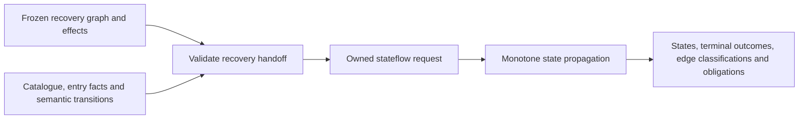

# Rust design for abstract machine-state analysis

Status: proposed implementation design; no machine-state implementation is
introduced by this document. Source baseline: `62d7c57ac88336d1defd4bd121e9976470cf704f`.

The specification is [AriadneMachineState.tla](../Specs/AriadneMachineState.tla),
with shared facts in [AriadneMachineCommon.tla](../Specs/AriadneMachineCommon.tla)
and an executable fixture in
[AriadneMachineStateExample.tla](../Specs/AriadneMachineStateExample.tla).
The existing Rust [recovery engine](../src/engine.rs) and
[public types](../src/model.rs) establish the integration constraints below.

## 1. Module and scope

Add `ariadne::machine_state` as a separate module. Its interface accepts an
owned, finite request and exposes propagation, observations, and an owned
completed result. Keep its phases, obligations, and mutable state separate from
the recovery/reaching-definition/slicing analyzer.

The module consumes a frozen local CFG, entry facts, a finite abstract-state
catalogue, and a supplied semantic relation. It computes possible states before
each instruction and classifications of the existing edges. Instruction
semantics remain an adapter responsibility: the engine does not calculate CPU
arithmetic, read binary bytes, discover targets, or reconstruct past execution.



Reuse `Address`, `AddressIdentity`, `Location`, `Edge`, `EdgeKind`, and their
ordered collections. `Address = u64` retains the existing implementation's
representation restriction. Do not add `Stateflow` to the existing recovery
`Phase` enum or merge the two obligation vocabularies.

Share only stateless knowledge that both modules actually use: the address-space
contract, local-edge allowlist, and normalized effect checks. A generic worklist
engine or a callback-based ISA interface is unnecessary for this fixed-relation
model. Private indexes may improve execution without expanding the interface.

## 2. Input representation

Use ordered collections for reproducible scheduling, diagnostics, and results.
Identity and transition records used as keys or set members derive equality and
ordering over all their fields. Proposed names below live under `machine_state`:

```rust
pub struct StateId(pub String);
pub struct AbstractValue(pub String);
pub type StateSet = BTreeSet<StateId>;
pub type ValueSet = BTreeSet<AbstractValue>;
pub type Valuation = BTreeMap<Location, ValueSet>;

pub enum Status { Running, Faulted, Returned, Stopped }
pub enum TerminalOutcome { Faulted, Returned, Stopped }

pub struct AbstractState {
    pub status: Status,
    pub valuation: Valuation,
}

pub struct Effects {
    pub uses: LocationSet,
    pub must_defs: LocationSet,
    pub may_defs: LocationSet,
}

pub struct StateStep {
    pub edge: Edge,
    pub before: StateId,
    pub after: StateId,
}

pub struct TerminalTransition {
    pub site: Address,
    pub before: StateId,
    pub after: StateId,
    pub outcome: TerminalOutcome,
}

pub struct Request {
    pub snapshot_id: String,
    pub nodes: AddressSet,
    pub structural_edges: EdgeSet,
    pub value_domain: BTreeMap<Location, ValueSet>,
    pub catalogue: BTreeMap<StateId, AbstractState>,
    pub entry_states: BTreeMap<Address, StateSet>,
    pub effects: BTreeMap<Address, Effects>,
    pub steps: BTreeSet<StateStep>,
    pub terminal_transitions: BTreeSet<TerminalTransition>,
    pub complete_sites: AddressSet,
    pub adapter_obligations: BTreeSet<AdapterObligation>,
}
```

These are proposed declarations, not existing exported Rust types. IDs and
abstract values are distinct Rust types but retain the model's string payloads;
do not introduce a nonempty-string restriction on them. Only `snapshot_id` has
that restriction in the specification.

Several redundant TLA+ tables become one native representation:

| TLA+ input | Rust correspondence |
| --- | --- |
| `Locations`, `ValueDomain` | Keys and values of `value_domain` |
| `StateIds`, `Valuation`, `StateStatus` | Keys, valuations, and statuses of `catalogue` |
| `EntryPoints` | Keys of the sparse `entry_states` map |
| `InitialStates` | Total map over `nodes`: supplied entry sets, empty sets elsewhere |
| `Uses`, `MustDefs`, `MayDefs` | Fields of the total `effects` map |
| `StateSteps` | `StateStep`, with the full structural edge grouped into one field |

Deriving these domains prevents contradictory parallel tables. An explicitly
provided entry with an empty state set is invalid; an entirely empty
`entry_states` map is valid under this specification. Do not silently remove
empty supplied entries to make them valid.

State identity must remain distinct from valuation equality. Keep different IDs
even when their valuations are equal: their semantic transitions can differ.
For example, IDs for `(x=0,y=0)` and `(x=1,y=1)` must remain alternatives instead
of becoming one pointwise join that admits `(x=0,y=1)`.

Retain the catalogue with completed results so state IDs remain interpretable.
The model's external identity is `(snapshot_id, state_id)`. It does not establish
uniqueness across independently constructed catalogues for the same snapshot;
providers must namespace such IDs or retain the catalogue's external identity.

## 3. Validation before initialization

`Request::validate()` and `Analyzer::new()` enforce the input contract before
creating mutable analysis state. Report structured errors identifying the
relevant field, site, state, and location; frame errors identify both state IDs.

| Area | Required checks |
| --- | --- |
| Graph | Nonempty snapshot and node set; both endpoints of every structural edge belong to `nodes`; every edge kind is local |
| Location domains | At least one location; every value domain is nonempty |
| Catalogue | Nonempty; each valuation has exactly the location domain; every location's value set is nonempty and contained in its declared domain |
| Entry facts | Sites belong to `nodes`; each supplied set is nonempty; all IDs exist and have `Running` status |
| Effects | Exactly the node domain; `uses` and `may_defs` are location subsets; `must_defs` is a subset of `may_defs` |
| Running transitions | Both IDs exist and are running; the full `edge` record occurs in `structural_edges`; source and destination belong to `nodes`; frame preservation holds at the source |
| Terminal transitions | Site belongs to `nodes`; before-state is running; after-state status equals the terminal outcome; frame preservation holds at the site |
| Certificates and obligations | Complete sites and obligation sites belong to `nodes`; adapter obligations use only the four allowed adapter reasons |

`AdapterObligationReason` contains `UnknownMemory`, `UnmodeledException`,
`UnmodeledSystemCall`, and `UnmodeledConcurrency`. The engine derives
`IncompleteSemantics` for every node outside `complete_sites`, including nodes
that are never reached. Keep this derived reason out of the adapter-input enum.

For every running or terminal transition at site `a`, enforce:

```text
for every location outside MayDefs[a]:
    Valuation[before][location] == Valuation[after][location]
```

Use the source instruction's effects, not the destination's. A definite write
may leave the same abstract value, so no inequality check follows from
`must_defs`. `uses` and `must_defs` do not independently execute instructions or
kill state IDs during propagation; the supplied relation owns those semantics.

The equality frame rule also constrains abstract knowledge. A branch with no
writes cannot change an unmodified flag's valuation from `{false,true}` to
`{true}` merely by selecting its taken edge. The current model requires suitable
before-state partitioning or unchanged valuations. Supporting general
assumption-based narrowing requires a separate specification change.

Empty value sets are invalid, whereas an empty `states_at[a]` means no reached
before-state. Unknown values must be represented explicitly by the adapter's
abstract values or value sets, never by inventing zero or an empty valuation.

## 4. Recovery handoff

Add a narrow helper with this proposed interface:

```rust
pub fn prepare_from_recovery(
    recovery: &crate::Analyzer,
    semantics: SemanticInputs,
) -> Result<RecoveryHandoff, HandoffError>;
```

`SemanticInputs` contains the snapshot identity, value domains, catalogue, entry
facts, relations, completeness assertions, and adapter obligations. The helper
supplies nodes, local edges, and effects from the existing analyzer.

Borrow the existing `Analyzer`, which exposes its corresponding request and
state through shared references. This avoids accepting an independently supplied
request/result pair whose instructions might not correspond. Require recovery
to have reached `Dataflow`, `Slice`, or `Done`; `Recover` has not frozen its graph.
The caller can finish the independent reaching-definition/slicing pipeline later.

The helper must:

1. Check that semantic inputs identify the same snapshot.
2. Use exactly the decoded-node set and the local projection of the recovered
   edges. Excluding `call` edges follows the existing model's policy; retaining
   `summary` edges is required.
3. Reject an empty decoded set. Reject every local edge with an endpoint outside
   that set, reporting the actual offending edges and targets.
4. Copy each decoded instruction's normalized effects. Require the value-domain
   locations to equal the recovery request's location set; extending that
   abstraction requires explicitly supplying compatible recovery summaries.
5. Validate the assembled request and return it with owned recovery context.

`RecoveryHandoff` contains the stateflow request and recovery context: snapshot,
full recovered graph, byte provenance, recovery obligations, and missing slice
seeds. This context remains separate from the stateflow model's obligations and
must accompany combined reporting. The borrowed recovery analyzer remains usable
even when the handoff fails.

The endpoint check is necessary: `Ariadne.tla` preserves edges to unavailable or
undecodable targets, but `AriadneMachineState.tla` requires every structural edge
endpoint to be in `Nodes`. Do not silently discard those edges, invent decoded
nodes, or reinterpret them as infeasible. A caller can improve recovery or
explicitly define a different analysis scope in a new request.

An endpoint-closed graph can still have incomplete indirect targets or unknown
callees. Preserve those recovery obligations in the handoff context. The core
instruction's `complete` field certifies target enumeration; it must never be
used to infer a machine-state `complete_sites` certificate.

Stateflow entry points describe where its supplied before-states apply. They
can be decoded interior sites and need not equal the CFG discovery roots. A
crash observation cannot be moved to an earlier instruction. A seed outside the
decoded domain requires a new recovery request rather than stateflow discovery.

## 5. State machine and interface

Keep precisely two semantic mutable fields:

```rust
pub enum Phase { Stateflow, Done }

pub struct AnalysisState {
    pub phase: Phase,
    pub states_at: BTreeMap<Address, StateSet>,
}
```

The proposed behavioral interface follows the existing analyzer:

```rust
pub fn analyze(request: Request) -> Result<AnalysisResult, InvalidRequest>;

impl Analyzer {
    pub fn new(request: Request) -> Result<Self, InvalidRequest>;
    pub fn request(&self) -> &Request;
    pub fn state(&self) -> &AnalysisState;
    pub fn observations(&self) -> Observations;
    pub fn step(&mut self) -> bool;
    pub fn finish(self) -> AnalysisResult;
}
```

`Analyzer` owns validated immutable inputs. `AnalysisResult` privately owns those
inputs, the completed state, and final observations, with shared-reference
accessors. No mutable result accessor may invalidate the classification or its
catalogue. `observations()` derives model outputs from actual implementation
state for ordinary callers and MBT alike; the MBT adapter must not recreate the
classification algorithm.

Initialization expands sparse entry facts into a total `states_at` map over
every node, including unreachable nodes. Reached facts identify running states
**before** the corresponding instruction.

```text
ReachedSteps = { t in StateSteps | t.before in states_at[t.edge.src] }
Incoming(a)  = InitialStates[a]
               union { t.after | t in ReachedSteps and t.edge.dst = a }
```

One `step()` performs exactly one model action:

1. Return `false` without mutation when already `Done`.
2. Find the lowest VA whose incoming set contains a missing state ID. Union
   its entire current `Incoming(a)` into that node's set and return `true`.
3. If no node can grow, change the phase to `Done` and return `true`.

Step 2 is one `Propagate(a)`; step 3 is the separate `FinishStateflow` action.
The order is an implementation choice permitted by nondeterministic `Next`.
Use it in the replay wrapper. Updating one destination with only one of several
already-enabled incoming states would not match the specified atomic action.

Private destination indexes can avoid scanning unrelated transition rows. They
index immutable data and must not change the chosen destination or batch.
State IDs are never synthesized, merged, or removed; valuations are never
updated by the engine. Terminal IDs never enter `states_at`.

Starting from the entry facts and adding only enabled transition results computes
the least fixed point above those facts. Propagation is monotone over the finite
product of nodes and running state IDs.
With `N` nodes, `R` running IDs, and `I` initially present pairs, at most
`N * R - I` propagation steps are possible, followed by one completion step.
This bounds analyzer progress, even if the modeled program contains loops and
has no terminal outcome. No silent truncation or widening is part of v1.

## 6. Observations and interpretation

`Observations` returns the following derived sets. Keep the structural graph
unchanged and expose it through the retained request.

| Observation | Exact rule |
| --- | --- |
| `feasible_edges` | Full structural edge of every reached running transition |
| `reached_terminal_transitions` | Terminal rows whose before-state occurs at their site |
| `provably_infeasible_edges` | Only at `Done`: structural edges from reached, certified-complete sources with no reached transition witness |
| `unknown_feasibility_edges` | Structural edges outside the preceding feasible/infeasible sets |
| `not_reached_nodes` | Empty before `Done`; then nodes whose state set is empty, corresponding to TLA+ `UnreachableNodes` |
| `obligations` | Adapter obligations union derived incomplete-semantics obligations |

An edge can already be feasible in the initial analysis state: its before-state
may be seeded at the source even though its after-state has not yet been
propagated to the destination. The same applies to reached terminal outcomes.
Do not delay either observation until a destination update or invent a terminal
execution action.

Before completion, every unwitnessed edge is unknown. At completion, an edge
from an unreached source remains unknown even when that source is certified
complete. An incomplete source can still have witnessed feasible edges. Edge
identity includes its kind: parallel taken and fallthrough edges can receive
different classifications despite sharing endpoints.

The three edge sets must be disjoint and their union must equal the supplied
structural graph. Excluded call edges are outside this partition and remain
callee references in the recovery context.

These labels describe the supplied finite model. `CompleteSites` is a trusted
local assertion, not a proof produced by the engine. In particular, an
incomplete upstream relation can omit an incoming state at a locally complete
downstream site. The current formula can classify a downstream edge as
`ProvablyInfeasibleEdges` relative to that supplied relation; it does not establish
impossibility in the real program. Preserve obligations and entry facts when
reporting the result, and render this as model-relative infeasibility. Stronger
global completeness tracking would require a specification revision.

Similarly, `not_reached_nodes` does not prove concrete unreachability when entry
facts or semantics are incomplete. Do not use these sets to prune the original
CFG or silently rerun reaching definitions on a reduced graph.

## 7. Existing fixture as the first acceptance case

The current fixture must end with:

```text
states_at[1] = {entry}
states_at[2] = {rax-five}
states_at[3] = {zf-true}
states_at[4] = {zf-true}
states_at[5] = {}

feasible:             1 --next--> 2 --next--> 3 --taken--> 4
provably infeasible:  3 --fallthrough--> 5
unknown:             {}
not reached:         {5}
terminal witness:    (site=4, before=zf-true, after=returned, outcome=returned)
```

Both branch edges remain in the structural graph. The unused terminal row at
site 5 remains an input but is not a reached outcome. The expected schedule is
initialization, propagation at 2, 3, and 4, then completion: four transitions and
five analyzer states. The catalogue separately contains four abstract machine
state IDs; those are not the analyzer's five execution states.

For this design review, the unmodified `MachineState.cfg` fixture was executed
with TLC revision `1476e7f`: safety and fair termination passed, with five
generated states, five distinct states, and search depth five. This is existing
model evidence, not validation of a future Rust implementation.

## 8. Verification design

Test through the same public interface used by callers. Validation tests cover
every representable contract violation and distinguish constraints enforced by
Rust's representation from runtime checks. Include unchanged values after a
must-write, non-running terminal states, empty entry facts, and invalid empty
value sets. Validation failures are not behavioral MBT mutant kills.

Behavioral cases beyond the existing fixture must cover:

- Multiple entry points, joins, loops, and nondeterministic after-states.
- Distinct IDs with equal valuations but different transitions, and correlated
  state alternatives that must not be joined pointwise.
- A transition whose before-state has not reached its source; use schedules and
  alternative IDs that reveal premature propagation.
- A feasible witness at an incomplete site, absent edges at a complete reached
  site, and absent edges at a complete unreached site.
- No infeasibility or not-reached result before the explicit completion action.
- Fault, return, and stop witnesses; unreached terminal rows; and simultaneous
  running and terminal alternatives for one before-state.
- Empty entry facts: immediate completion, no feasible edges, all structural
  edges unknown, and all nodes not reached.
- Sparse VAs, parallel edge kinds, summary edges, and rejection of call edges.
- Recovery handoff with unknown local targets, incompatible location domains,
  snapshot mismatch, and separately retained recovery obligations.

An independent oracle performs reachability over pairs `(address, state_id)`,
starting from entry pairs and following `StateSteps`. Compare its reached-pair
set with the engine's fixed point. It must not reuse the implementation's
destination-wise propagation loop or infer new state IDs from valuations.

Add a separate stateflow MBT suite using the existing
[generated Rust binding workflow](../mbt/README.md). Its wrapper instantiates
`AriadneMachineState.tla`, chooses the same deterministic schedule, and records
derived observations by calling the specification's operators. It must not
duplicate their equations in the adapter. Observe classifications throughout
propagation as well as at completion, so premature conclusions are detectable.

Generate a `mirrorrust-v1` port and binding. The application adapter resets a real
stateflow analyzer, invokes `step()`, and converts `state()` and `observations()`
into generated native types. The `statesAt` integer-keyed map needs a reversible
set-of-address-records wire projection, preserving every node and empty set.
Keep raw traces, type evidence, projection receipts, and generated ownership
metadata. The present recovery corpus must remain an independent regression.

Required negative controls include premature completion, propagation without a
reached before-state, collapsing state alternatives, early/uncertified
infeasibility, classifying unreached sources as infeasible, reporting unreached
terminal rows, and dropping structural alternatives. Select fixtures that
activate each mutation. Only genuine model mismatches with the unchanged
observer count as behavioral kills. Require repeated reset, exact negotiation,
wrong-digest rejection before construction, generated-file freshness, and
actual port `Drop`, following the existing MBT ownership rules.

## 9. Implementation sequence

1. Add `src/machine_state/mod.rs`, `model.rs`, and `engine.rs`, exporting the new
   namespace from `src/lib.rs`. Implement data types and complete input
   validation first; preserve existing recovery public types.
2. Implement initialization, one-action stepping, and completion. Port the
   existing fixture and the independent reached-pair oracle.
3. Implement all derived observations and phase-sensitive classification tests.
   Keep result inputs and the catalogue owned and immutable.
4. Add `src/machine_state/handoff.rs` and integration tests against the real
   recovery analyzer, including partial-graph rejection and retained context.
5. Add the independent stateflow MBT suite with generated bindings, reviewed
   traces, negative controls, and an execution report. Reuse neutral tooling
   where possible without rewriting the current recovery corpus or creating a
   new general framework as part of this implementation.

Completion requires Rust tests, formatting/Clippy, generated binding freshness,
the stateflow MBT gate, and preservation of the existing recovery MBT gate.
Changes to the frame rule, global certainty, graph extension, ISA semantics,
widening, or historical-state reconstruction require their own specification
and design work.
